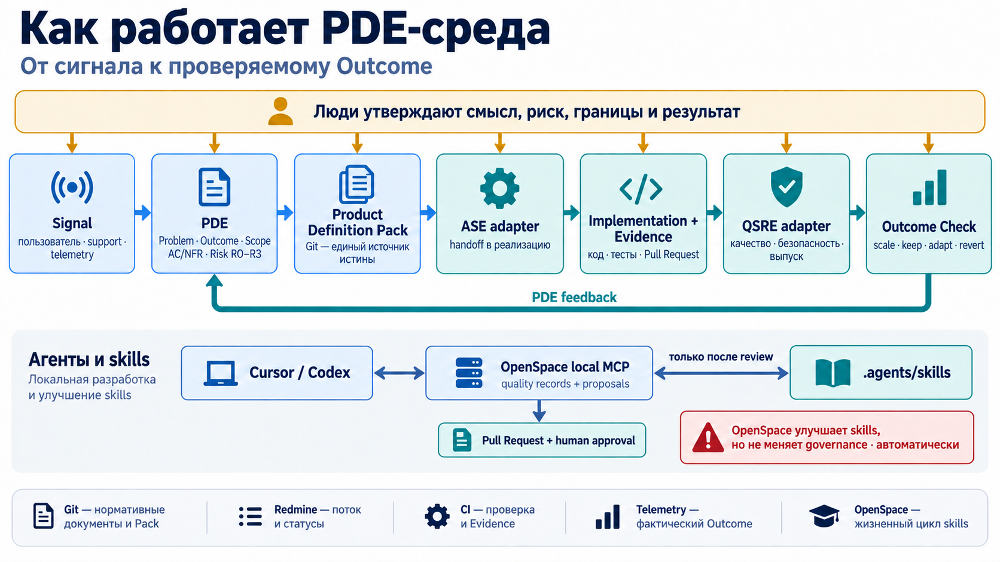
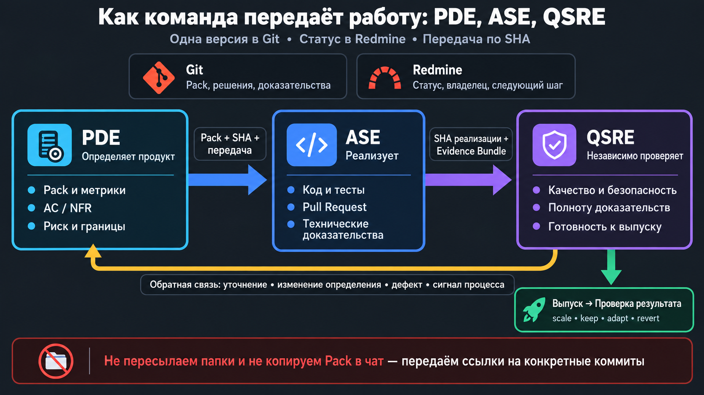

# PDE operating environment

Этот репозиторий — отправная точка для организации рабочей среды **PDE — Product Definition Engineering** в продуктовой команде, которая разрабатывает и поддерживает программное обеспечение для умных домов, бизнес-центров и гражданской инфраструктуры.

Документы написаны на русском языке. Имена файлов, каталогов, полей и технические идентификаторы — на английском, чтобы структура одинаково хорошо читалась человеком и обрабатывалась инструментами.

> **Статус среды:** `0.1.0-draft`. Репозиторий готовится к первому контролируемому пилоту, но ещё не является утверждённым production-контуром. CODEOWNERS, Redmine, владельцы ролей и нормативные документы необходимо настроить и утвердить перед рабочим запуском.

## Основной принцип

PDE превращает сигнал о проблеме в проверяемое определение продукта. Git хранит нормативные документы, Product Definition Pack, решения и доказательства. Redmine управляет потоком работы. Cursor и Codex используют `AGENTS.md`, rules и skills. OpenSpace находится между агентной средой и библиотекой skills: он помогает находить, оценивать и улучшать skills, но не имеет права автоматически менять нормативные документы.



Схема читается сверху вниз: основной цикл показывает путь продуктового определения и обратную связь после выпуска; нижний контур показывает, как Cursor/Codex используют локальный OpenSpace и библиотеку skills. OpenSpace может формировать quality records и предложения, но изменение skills проходит через Pull Request и одобрение человека.

ASE и QSRE пока не развёрнуты как отдельные среды. Репозиторий содержит явные контракты и адаптеры, чтобы подключить их позже без изменения базовой модели PDE.

## Быстрый старт

### Предварительные требования

- Git;
- PowerShell 7 или новее с командой `pwsh`;
- GitHub-аккаунт и права на создание или настройку репозитория;
- Redmine для рабочего процесса либо решение использовать репозиторий только для локального ознакомления до её подключения.

Склонируйте репозиторий и перейдите в его корень:

```powershell
git clone https://github.com/J4mes0n-04/PDE_ENVIRONMENT.git
Set-Location PDE_ENVIRONMENT
```

Все команды ниже выполняются из корня репозитория.

1. Прочитайте [PDE charter](governance/01-pde-charter.md), [глоссарий](governance/02-glossary.md) и [жизненный цикл](governance/09-lifecycle-and-gates.md).
2. Выполните `pwsh ./scripts/doctor.ps1` и `pwsh ./scripts/validate-repository.ps1`.
3. Назначьте роли в `governance/document-control.yaml`. Одновременно обновите совпадающие `Owner`, `Approver`, `Status`, `Version` и `Review cycle` в заголовках соответствующих нормативных документов — validator требует их синхронности.
4. Настройте `.github/CODEOWNERS`, branch protection и Redmine по инструкции ниже.
5. Создайте рабочий проект только внутри `workspaces/projects/` по инструкции из [workspaces/README.md](workspaces/README.md).
6. Выберите Mini Pack для R0–R1 либо Full Pack для R2–R3, затем создайте согласованные `pack.md` и `pack.json` из шаблонов. Выполните `pwsh ./scripts/validate-pack.ps1`.
7. После активации Redmine создайте Outcome и свяжите его с конкретным commit SHA Pack. Полный Pack в Redmine не копируется.
8. После готовности Pack проведите Ready Review и сформируйте ASE handoff. Как устроена передача между PDE, ASE и QSRE — в разделе [Как команда передаёт работу](#как-команда-передаёт-работу-pde-ase-qsre).
9. Перед выпуском соберите Evidence Bundle, выполните `pwsh ./scripts/validate-evidence.ps1`, получите QSRE feedback и проведите Outcome Check.

> Обратите внимание: репозиторий включает демонстрационный Outcome в `workspaces/examples/`, однако этот пример не используется для непосредственной работы над реальными продуктами. Все реальные Outcome и рабочие файлы можно размещать только в каталоге `workspaces/projects/` по правилам PDE.

## Работа сотрудника через fork

Сотрудник работает не напрямую в главном репозитории, а через собственный fork — связанную рабочую копию на GitHub. Доступ к главному репозиторию нужен для чтения и создания Pull Request; прямое изменение `main` не требуется.

Короткий порядок работы:

1. Создайте fork главного репозитория в разрешённой владельцем учётной записи или организации. Если кнопка Fork недоступна, обратитесь к владельцу — не создавайте несвязанную копию и не меняйте видимость репозитория самостоятельно.
2. Клонируйте свой fork, а главный репозиторий добавьте как удалённый источник `upstream`.
3. Перед каждой задачей синхронизируйте локальную ветку `main` с `upstream/main`, затем создайте отдельную рабочую ветку по правилам из `CONTRIBUTING.md`.
4. Продуктовые файлы изменяйте только в `workspaces/projects/`. Улучшения навыков OpenSpace вносите только в `.agents/skills/` и оформляйте отдельным Pull Request. Не изменяйте `governance/`.
5. Проверьте `git diff`, запустите соответствующие скрипты из `scripts/`, отправьте рабочую ветку в свой fork и откройте Pull Request в `main` главного репозитория.
6. Дождитесь проверок и решения владельца. Не объединяйте Pull Request самостоятельно и не обходите запрос на изменения.

Команды, правила синхронизации, порядок работы OpenSpace и решение типовых проблем описаны в [подробной инструкции для сотрудника](integrations/github/README.md#работа-сотрудника-через-fork).

## Режимы среды

Обязательное ядро работает без Unleash, OpenTelemetry, Grafana и OpenSpace. Состояние интеграций задаётся в `config/features.yaml`.

- `core` — Git, GitHub Actions, Redmine, Cursor/Codex, Pack и Evidence.
- `openspace-local` — добавляется локальный OpenSpace MCP; облачный обмен запрещён.
- `release-control` — добавляется Unleash.
- `observability` — добавляются OpenTelemetry и Grafana.
- `future-engineering` — подключаются отдельные ASE и QSRE среды через стабильные handoff-контракты.

Включение feature flag не устанавливает инструмент автоматически. Значение `enabled: true` фиксирует решение использовать компонент в целевой конфигурации, но само по себе не доказывает его готовность. Интеграция считается рабочей только после удаления placeholders, назначения владельца, проверки подключения и успешного прохождения соответствующих validators. Для ещё не настроенного внешнего инструмента следует сохранять `enabled: false`.

## Структура репозитория

- `governance/` — нормативные документы. Это первичный источник обязательных правил.
- `architecture/` — описание устройства среды, границ и потоков данных.
- `operations/` — инструкции запуска, сопровождения и проверки готовности среды.
- `templates/` — шаблоны рабочих артефактов.
- `schemas/` — машиночитаемые схемы. Текущая строгая JSON Schema Pack v2 разделяет `outcome_state` и `pack_status`, запрещает неизвестные поля и проверяет условия риска, Ready, release, Evidence Bundle, telemetry, test plan и threat analysis.
- `workspaces/` — единственное место для проектов, Outcome и Evidence конкретной работы. Платформа влияет на `workspaces/`; работа в `workspaces/` не изменяет платформу. Реальные проекты только в `workspaces/projects/`.
- `integrations/` — отключаемые адаптеры GitHub, Redmine, OpenSpace, ASE, QSRE, Unleash и observability.
- `.agents/skills/` — пять начальных skills PDE.
- `.cursor/rules/` — короткие правила, автоматически применяемые Cursor.
- `.codex/config.toml` — безопасная проектная конфигурация Codex; OpenSpace объявлен, но выключен.
- `.github/workflows/` — четыре базовых workflow GitHub Actions.
- `scripts/` — локальные проверки, используемые также в CI.
- `docs/file-catalog.md` — назначение каждого файла репозитория.

Полный каталог с расшифровкой находится в [file catalog](docs/file-catalog.md).

## Источники истины

- Нормативные правила — `governance/`.
- Состояние и приоритет — Redmine.
- Определение Outcome — `workspaces/projects/<project-id>/outcomes/<outcome-id>/pack.md` и `pack.json`.
- Реализация — репозиторий продукта и связанные Pull Request.
- Доказательства — Evidence Bundle и CI artifacts.
- Фактический результат — Outcome Check и ссылки на telemetry/support data.
- Инструкции агента — `AGENTS.md`, `.cursor/rules/` и `.agents/skills/`; они реализуют нормы, но не заменяют их.

## Как команда передаёт работу: PDE, ASE, QSRE

Этот раздел нужен, если несколько человек склонировали репозиторий и спрашивают: «кому что отправлять и куда класть файлы?»

Короткий ответ: **никому не пересылайте папки и не копируйте Pack в чат или Redmine.** Все смотрят одну версию в Git по ссылке на конкретный commit. Статус работы живёт в Redmine. Код продукта — в репозитории продукта. Передача между ролями — это короткие документы рядом с Outcome плюс ссылки на SHA.



Пока **ASE** и **QSRE** не отдельные программы. Это роли людей (или будущие среды) с одним и тем же контрактом:

| Роль | Зачем она нужна | Что делает |
| --- | --- | --- |
| **PDE** | Чтобы команда одинаково понимала, *что* считается успехом | Пишет Pack, проводит Ready Review, принимает обратную связь после проверки |
| **ASE** | Чтобы реализовать согласованное определение, а не «как получится» | Пишет код, тесты, PR; собирает технические доказательства |
| **QSRE** | Чтобы выпуск не зависел только от автора реализации | Независимо смотрит evidence, безопасность и готовность к выпуску |

Зачем так разделять: иначе определение «плывёт» в чатах, каждый клон расходится, а зелёные тесты принимают за готовый продукт.

### Что не передают файлами «из рук в руки»

1. Полный Pack не копируют в Redmine, wiki или мессенджер. В карточке Redmine — ссылка на Pack URL и **commit SHA**.
2. Локальный клон — только рабочая копия. Нормативная версия появляется после merge в Git.
3. ASE не правит смысл Outcome, AC, NFR или риск «заодно» в коде. Для этого нужен Definition Change в PDE.
4. QSRE не переписывает Pack сам. Он пишет обратную связь, а PDE решает: уточнить, изменить определение, завести дефект или governance RFC.

### Три передачи по шагам

**1. PDE → ASE: «можно реализовывать»**

После Ready Review PDE кладёт в каталог Outcome файл по шаблону [`templates/ase-handoff.md`](templates/ase-handoff.md) и указывает неизменяемую ссылку на Pack (commit SHA), риск и автономию, срезы поставки, AC/NFR, ограничения и ожидания по evidence.

ASE обязан **принять передачу (ACK)** или сразу вернуть конкретный список вопросов. Без ACK реализация по контракту ещё не начата. Детали — в [контракте PDE–ASE–QSRE](governance/19-ase-qsre-interface-contract.md).

**2. ASE → QSRE: «проверьте, можно ли выпускать»**

ASE реализует изменение в **репозитории продукта**, открывает Pull Request и собирает Evidence Bundle в каталоге Outcome. QSRE получает не «папку с проектом», а ссылки: Pack SHA, SHA реализации, карту AC/NFR → тесты, план выпуска и отката, известные ограничения.

**3. QSRE → PDE: «вот что увидели»**

QSRE оформляет файл по шаблону [`templates/qsre-feedback.md`](templates/qsre-feedback.md). Тип сигнала один из четырёх:

- `clarification` — определение непонятно, нужно уточнение;
- `definition-change` — нужно менять Pack (scope, AC, NFR);
- `defect` — реализация не соответствует действующему Pack;
- `governance-signal` — проблема процесса или нормы, не одной фичи.

PDE отвечает в срок, фиксирует решение и при необходимости открывает Definition Change, дефект для ASE или RFC на governance. После выпуска Outcome не закрыт, пока нет Outcome Check (`scale`, `keep`, `adapt` или `revert`).

Практический пример заполнения смотрите в [`workspaces/examples/DEMO-001-device-offline-alert/`](workspaces/examples/DEMO-001-device-offline-alert/). Рабочие файлы команды создаются только в `workspaces/projects/`.

## Что требуется настроить перед первым рабочим Outcome

- заменить временные команды-владельцы в `.github/CODEOWNERS`;
- определить Redmine URL, project key и custom fields;
- назначить PDE Lead, Delivery Lead, Outcome Owner и временных владельцев ASE/QSRE функций;
- утвердить документы со статусом `Draft`;
- выбрать R1 как рекомендуемый первый пилот; R2 допускается только в ограниченном test/non-production контуре после назначения владельцев риска и независимого review;
- проверить branch protection и четыре workflow;
- решить, нужен ли OpenSpace в shadow mode для пилота.

## Активация обязательного review в GitHub и трассировки Redmine

После скачивания или создания нового репозитория временные значения нужно заменить реальными. Пока в конфигурации остаются `@your-org/...`, `TBD` или `redmine.example.invalid`, CODEOWNERS и интеграция Redmine считаются подготовленными, но не работающими.

### 1. Настроить CODEOWNERS

1. Определите, кто будет проверять изменения. Для личного репозитория достаточно GitHub username, например `@username`. Для организации создайте или выберите GitHub Teams, например `@organization/pde-governance`.
2. Замените все значения `@your-org/...` в [`.github/CODEOWNERS`](.github/CODEOWNERS) на существующих пользователей или команды. Указанные владельцы должны иметь доступ на запись в репозиторий.
3. В GitHub откройте `Settings → Rules → Rulesets` или настройки branch protection для `main` и включите:
   - обязательный Pull Request перед merge;
   - обязательное одобрение Code Owners;
   - обязательное прохождение GitHub Actions checks;
   - запрет прямого push в `main`, если он поддерживается выбранным типом репозитория.
4. Создайте тестовый Pull Request с изменением в `governance/` и убедитесь, что GitHub автоматически назначил указанного владельца и не разрешает merge без его одобрения.

Пример для одного владельца:

```text
* @username
/governance/ @username
/.github/ @username
/.agents/skills/ @username
/integrations/openspace/ @username
/workspaces/projects/ @username
```

### 2. Настроить Redmine

1. Создайте или выберите проект Redmine. Найдите его технический identifier: обычно это последняя часть адреса `/projects/<project-key>`.
2. В [`integrations/redmine/field-mapping.yaml`](integrations/redmine/field-mapping.yaml) замените:
   - `project_key: TBD` на технический identifier проекта;
   - `base_url: https://redmine.example.invalid` на адрес вашей Redmine без пути проекта.
3. Создайте или сопоставьте в Redmine trackers `Outcome`, `Delivery Slice`, `Definition Change`, `Risk or Blocker` и `Service`.
4. Создайте или сопоставьте custom fields, перечисленные в секции `custom_fields`: Outcome ID, Pack URL, Pack Version, Pack Commit SHA, Pack Status, Risk Level, Autonomy Level, Outcome Scope, Outcome Owner, Baseline, Target, Validation Window и Next Gate.
5. Настройте состояния и переходы workflow по секции `states`. Права переходов должны соответствовать ролям и gates из `governance/09-lifecycle-and-gates.md` и `governance/18-redmine-workflow.md`.
6. Создайте тестовый Outcome в Redmine, добавьте ссылку на конкретный commit SHA Pack и проверьте обратную ссылку из Pack на Redmine issue.

Пример минимальной конфигурации:

```yaml
project_key: smart-home
base_url: https://redmine.company.example
```

Не сохраняйте Redmine API token, GitHub token или другие credentials в репозитории. Если автоматическая синхронизация будет добавлена позже, передавайте секреты только через GitHub Actions Secrets или утверждённое локальное хранилище секретов.

### 3. Проверить готовность

Перед первым рабочим Outcome убедитесь, что:

- в `CODEOWNERS` не осталось `@your-org`;
- в `field-mapping.yaml` не осталось `TBD` и `redmine.example.invalid`;
- тестовый PR требует review Code Owner;
- GitHub Actions checks обязательны для merge;
- тестовая карточка Redmine содержит Pack URL и Pack Commit SHA;
- команда не копирует полный Pack в Redmine, а хранит там только ссылку на версию в Git.

## Важные ограничения

- Нельзя хранить полную независимую копию Pack в Redmine.
- Нельзя считать release завершением Outcome.
- Нельзя автоматически менять governance по результатам работы OpenSpace.
- Нельзя включать облачный обмен OpenSpace без отдельного изменения политики.
- Нельзя считать ASE или QSRE подключёнными только потому, что существуют каталоги адаптеров.
- Будущие требования ИБ, персональных данных и аудита регистрируются в `governance/20-compliance-obligations-register.md` до превращения в обязательные controls.
- Нельзя запускать R3 Outcome до заполнения compliance register, утверждения security controls, независимой проверки и подтверждённого rollback.

## Версия

Начальная версия пакета: `0.1.0-draft`.

Лицензия намеренно не добавлена. До выбора и добавления файла `LICENSE` условия использования, изменения и распространения репозитория третьими лицами не определены; перед публичным повторным использованием необходимо отдельно согласовать лицензионные условия.
