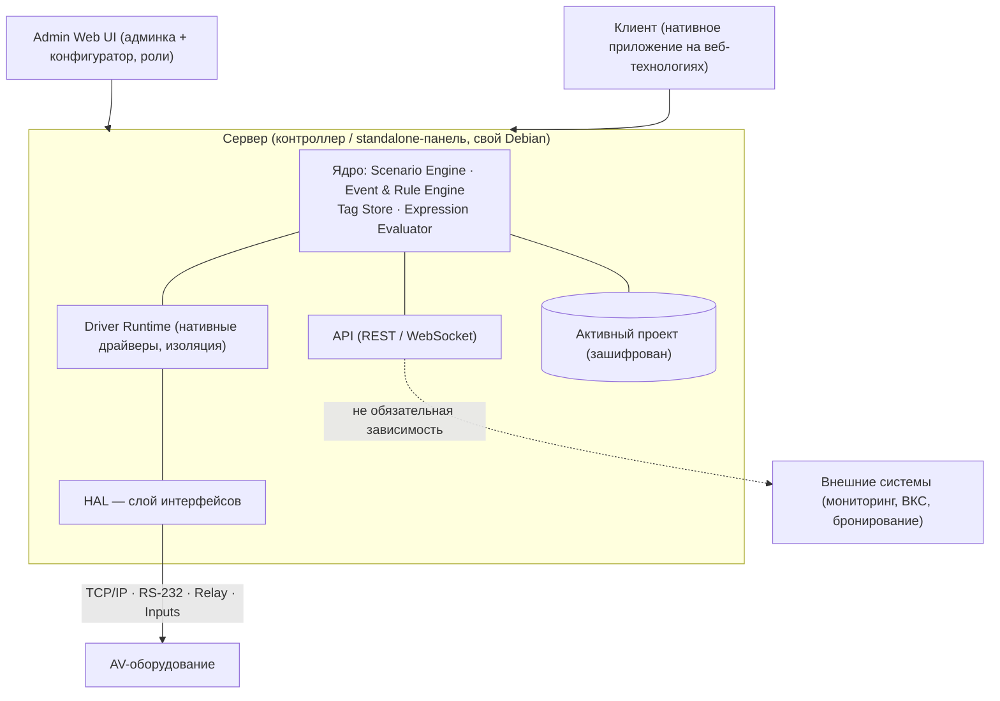
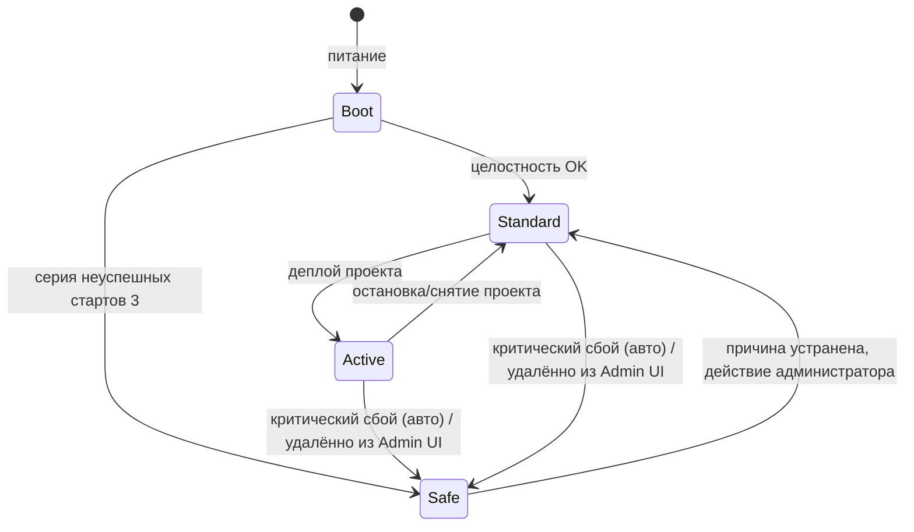

# Product Specification Document (PSD) — AV Control

---

## 1. System Architecture

> **Стык блока.** Закрыто в PRD: offline-first, активный проект, тег. Передано сюда: Core/Client, физ. интерфейсы, транспорт, HAL, среда исполнения JS. Не включать: RBAC «что» (`M-SEC`), контракт API (Core & API), lifecycle драйвера (Core & API).

### 1.1 Архитектурные принципы и системные гарантии

_Отказоустойчивость и изоляция_

- **Event-driven ядро с инкапсуляцией модулей:** модули общаются через события; падение модуля локализовано и не роняет систему.
- **Изоляция драйверов в продакшене:** каждый драйвер запускается/останавливается/перезапускается независимо; сбой или зависание драйвера не влияет на ядро и другие драйверы (`FR-DRV-01`).
- **Изоляция API-запросов и клиентских сессий:** некорректный API-запрос или сбойный клиент не могут уронить ядро.
- **Ограничение «радиуса поражения»:** сбой одной подсистемы не каскадирует на остальные.
- **Защита ядра от ресурсного голодания:** «сбежавший» драйвер/модуль не отнимает CPU/RAM у ядра.
- **Корректная деградация:** при потере локальной зависимости комната работает по last-known-good.
- **Самовосстановление / watchdog:** автоперезапуск сбойных компонентов без выезда, где возможно.
- **Crash-safe хранение:** активный проект и persist-теги переживают потерю питания без повреждения.

_Событийность и состояние_

- **Единый источник истины:** состояние на Сервере, Клиент — представление.
- **Идемпотентность команд и безопасные повторы:** повтор команды не даёт вредного эффекта; семантика «set», а не «toggle».
- **Согласованное состояние при нескольких клиентах:** панели одной комнаты видят сходящееся состояние.
- **Устойчивый разбор обратной связи + backpressure:** слой обратной связи терпит частичные/незапрошенные/битые ответы и не каскадирует; под потоком — схлопывание/ограничение, а не «захлёбывание».

_Жизненный цикл и безопасное состояние_

- **Атомарный деплой проекта с откатом;** хранится предыдущая рабочая версия.
- **Детерминированный старт:** автозапуск при питании, автозагрузка проекта после проверки целостности.
- **Определённое безопасное состояние оборудования при сбое** (не оставлять в неизвестном/опасном состоянии).
- **Корректность времени** (NTP/таймзона/летнее-зимнее) для аудита и расписаний.

_Безопасность by design_

- **Secure by default:** TLS, авторизация, наименьшие привилегии, аудит — как базовый слой.
- **Ролевое ограничение везде,** включая API и удалённое управление.
- **Аудит чувствительных действий.**
- **Целостность цепочки поставки:** подписанные и проверяемые пакеты и драйверы.
- **Tamper-evident логи** (защита от незаметного удаления).
- **Защита данных** at rest / in transit.
- **Compliance-by-design:** требования сертификации (ФСТЭК) заложены с самого начала.

_Наблюдаемость, предсказуемость, расширяемость_

- **Observable by default;** понятная подача ошибок (пользователю — действие, инженеру — детали в диагностику).
- **Предсказуемое поведение на пределах:** превышение лимита блокирует публикацию проекта, не роняя runtime.
- **HAL для переносимости;** драйверы «конфигурация вместо кода»; интеграции опциональны.
- **Дисциплина совместимости версий:** диапазоны совместимости, без тихих breaking changes, обратимые миграции.

### 1.2 Слои и компоненты

**Сервер** (контроллер или standalone-панель):

- **Ядро (Core)** — Scenario Engine, Event & Rule Engine, Tag Store, Expression Evaluator (нативные преобразования).
- **HAL** — единый слой доступа к интерфейсам (Ethernet, RS-232, Relay, Inputs).
- **Driver Runtime** — исполнение нативных драйверов; изоляция; независимое обновление.
- **API** — REST/WebSocket (контракт → Core & API).
- **Security & Licensing** — TLS, авторизация, аудит, проверка лицензии.
- **Update & Backup** — offline-обновления с откатом, бэкап/восстановление.
- **Monitoring & Diagnostics** — health, логи, diagnostic bundle, статус устройств.
- **Watchdog / Recovery** — контроль зависаний (механика → тех. лид).

**Admin Web UI** — единый веб-интерфейс: администрирование контроллера/ПО **и** конфигуратор проекта/драйверов; единая авторизация; разделы ограничены ролями.

**Клиент** — нативное приложение на веб-технологиях под основные мобильные платформы/панели. Не управляет оборудованием напрямую: **Клиент → Сервер → устройства**.

**Не выделены как отдельные компоненты:** Provisioning Service (лицензия активируется на производстве) и Эмулятор (отдельная Windows-сборка с отдельной лицензией — см. блок 6).

### 1.3 Диаграмма «как живёт система внутри»

Облако не используется (см. §1.7).

### 1.4 Поток управления (End User)

### 1.5 Безопасность и наблюдаемость by design

**Безопасность (техническая сторона, без дублирования `M-SEC`/Data Schema).** Передача между Клиентом, Сервером и API — по TLS; конфигурация и аудит защищены при хранении (алгоритм → Data Schema); поддержка загрузки корпоративных TLS-сертификатов; логи безопасности защищены от незаметного удаления (tamper-evident); API — авторизация по токенам/ключам. Требования сертификации (ФСТЭК) учитываются как ограничение проектирования с самого начала. Детали политики прав — `M-SEC`/Access Control Model.

**Мониторинг состояния оборудования.** Сервер ведёт агрегированный статус управляемых устройств: Online / Offline / Error.

** Оповещения (v1).** Возникновение ошибок уровня **Error / Critical** формирует уведомление (механизм доставки в offline-контуре — см. §7.6).

**Health-дашборд (направление).** В идеале — централизованный удалённый просмотр метрик и состояния в вебе; необходимость заходить в админку только ради метрик — антипаттерн. На этом уровне фиксируем намерение, без деталей реализации.

**Доступ к логам.** Просмотр и фильтрация в Admin Web UI, выгрузка лог-файлов, экспорт diagnostic bundle. (Владелец требований — `M-MON`.)

### 1.6 Топологии развёртывания

1. **Сервер + Клиенты (стандартная).** Сервер на контроллере, Клиенты на панелях/в браузере.
2. **Standalone-панель (serverless).** Сервер и Клиент в одном Linux-устройстве (P8/P10/P10-tt). Не входит в MVP; после v1.0.

### 1.7 Облако

AV Control не использует облако ни в каком виде: нет облачного runtime, портала доставки, телеметрии и SaaS-зависимости.

---

## 2. Protocol Specifications

> **Стык блока.** Категории — в `M-DRV`. Здесь — что поддерживается и как. Конкретные модели → блок 4 / этап драйверов. Контракт API → Core & API.

### 2.1 Физические интерфейсы контроллера (MVP)

TCP/IP (Ethernet) · RS-232 · Relay · Inputs (Dry Contact / Button).

**USB (примечание).** 2 USB-порта: один — внешние стики типа Zigbee (вне scope: домашнюю автоматизацию игнорируем), второй — ПК/отладка на уровне ОС. Ни один не используется нашим ПО.

### 2.2 Драйверный механизм

Драйверы создаются **нативной конфигурацией** (JSON или подобной), без программирования; референс — Kramer Driver Builder. Это даёт быструю разработку/доставку и независимость от релизов ядра. Часть драйверов (сложные/низкоуровневые) может поставляться в составе ядра — суть не меняется.

**JavaScript как опциональное расширение.** JS и **JS API** реализуются для доступа к нативному функционалу ядра — как **опция для сложных случаев и интеграторов, привыкших писать самостоятельно**. JS не обязателен: типовые драйверы и сценарии собираются без него. JS-расширение изолировано (как и драйверы) и не является зависимостью для работы комнаты. (Согласуется с PRD: «JS — управляемое расширение, не необходимость», `M-AUT`.) Статус по версиям — `[? — продукт]`.

**Keep-Alive (требование уровня драйвера).** Драйвер периодически проверяет живость устройства (Keep-Alive) и публикует состояние Online/Offline (питает мониторинг §1.5).

### 2.3 Уровни поддержки протоколов (L1–L4)

|Уровень|Что означает|
|---|---|
|L1. Transport|Открыть соединение и обмениваться данными (TCP, RS-232)|
|L2. Generic Protocol|Универсальная модель команд/ответов (VISCA, PJLink, raw TCP)|
|L3. Concrete Device|Поддержана конкретная модель (нативной конфигурацией)|
|L4. Integration Template|Готовый шаблон интеграции с внешней системой (API Connector)|

### 2.4 Матрица протоколов

|Протокол|Тип|Транспорт|MVP|v1.0|v1.5+|Уровень|
|---|---|---|---|---|---|---|
|TCP/IP (raw socket)|базовый|IP|✅ MUST|✅|✅|L1/L2|
|HTTP / REST|базовый|IP|✅ MUST|✅|✅|L1/L2/L4|
|RS-232|базовый|посл.|✅ MUST|✅|✅|L1/L2|
|VISCA / VISCA over IP|проприет.|посл./IP|✅ MUST|✅|✅|L2/L3|
|API Connector|интегр.|IP|✅ MUST|✅|✅|L4|
|**[~ ИЗМЕНЕНО · PRD-сверка]** PJLink|стандарт|IP|✅ **MUST**|✅|✅|L2/L3|
|MQTT|стандарт|IP|— SHOULD|✅|✅|L2/L4|
|RS-485|базовый|посл.|за рамками MVP|—|⚪|—|
|IR IN/OUT|базовый|ИК|за рамками MVP|—|⚪|—|
|Modbus TCP / RTU over TCP|стандарт|IP|за рамками MVP|—|⚪|—|
|MJPEG / RTSP (отображение в клиенте)|медиа|IP|за рамками MVP|—|⚪|—|
|KNX/IP · DALI · BACnet|BMS|IP|NOPE (вне продукта)|—|—|—|

### 2.5 Принципы расширения и интеграции

- Новый протокол/устройство — драйверным потоком, без релиза ядра (`FR-DRV-02`).
- Generic-протокол — обязательный нижний слой; конкретные устройства — поверх (`FR-DRV-05`).
- Объём интеграций ВКС и бронирования (запуск ВКС, звонок, mute, камера; чтение событий, текущая встреча, начать/продлить/закончить) описывается в **Use Case Spec**; здесь — только через API Connector.

---

## 3. OS & Runtime Compatibility

> Tier 1 — официально поддерживаем, тестируем в каждом релизе. Tier 2 — работает, без гарантий. Tier 3 — не поддерживается.

| Компонент                        | ОС / среда                                                                                               | Tier | Примечание                                      |
| -------------------------------- | -------------------------------------------------------------------------------------------------------- | ---- | ----------------------------------------------- |
| Сервер                           | свой Debian `[→ тех. лид: версия/ядро]`                                                                  | 1    | базовая платформа ПАК                           |
| Сервер на standalone-панели      | свой Debian                                                                                              | 2    | после v1.0                                      |
| Клиент                           | нативное приложение на веб-технологиях под осн. моб. платформы/панели `[→ тех. лид: платформы/браузеры]` | 1    | основной интерфейс                              |
| Эмулятор                         | Windows (отдельная сборка)                                                                               | 1    | dev/демо, не production (блок 6)                |
| Доступ через браузер на отеч. ОС | Astra / Альт / РЕД                                                                                       | 2    | только клиент/админка; сервер на отеч. ОС — нет |

**Требования:**

- **offline web-assets:** веб-интерфейсы работают в локальной сети без внешних CDN/шрифтов/API.
- **kiosk-режим:** Клиент на панели — на весь экран, «заперт»: нет выхода в системные настройки/ОС панели.
- **Отечественные ОС:** сервер — не поддерживается; доступ клиента/админки через браузер — да (реестровая совместимость — горизонт v2.0).
- **Эмулятор и сеть:** в отличие от контроллера, эмулятор не ограничен закрытым контуром — допускается опциональный доступ в интернет (для удобства разработки и, после v1, онлайн-доставки — см. §7).

---

## 4. Hardware Compatibility Matrix

> **Принцип.** Наличие TCP/IP, REST или RS-232 **не означает** поддержки устройства — она фиксируется только после проверки при разработке драйвера. На этом этапе фиксируем **типы устройств и вендоров**, а не конкретные модели/драйверы.

### 4.1 Своё железо

| Поле                              | ProAV Control Processor Basic                                                                                                                                                                                                                                                                                                                                     | ProAV Control Processor Advanced                                                                                                                                                                                                                                                                                                                                                                                                           | AV Essential Controller                                                                                            | Панели P8 / P10 / P10-tt                           |
| --------------------------------- | ----------------------------------------------------------------------------------------------------------------------------------------------------------------------------------------------------------------------------------------------------------------------------------------------------------------------------------------------------------------- | ------------------------------------------------------------------------------------------------------------------------------------------------------------------------------------------------------------------------------------------------------------------------------------------------------------------------------------------------------------------------------------------------------------------------------------------ | ------------------------------------------------------------------------------------------------------------------ | -------------------------------------------------- |
| Назначение                        | Enterprise-перепаковка текущего железа                                                                                                                                                                                                                                                                                                                            | Enterprise-перепаковка текущего железа                                                                                                                                                                                                                                                                                                                                                                                                     | Бюджетные проекты                                                                                                  | Standalone (Сервер+Клиент) и/или Клиент            |
| ТТХ (CPU/RAM/Storage/порты/экран) | RK3399 Rockchip   2 x Cortex-A72 2000 МГц,   4 x Cortex-A53 2 Gb, DDR4 16 Gb, eMMC Flash                                                                                                                                                                                                                                                              | RK3399 Rockchip   2 x Cortex-A72 2000 МГц,   4 x Cortex-A53 2 Gb, DDR4 16 Gb, eMMC Flash                                                                                                                                                                                                                                                                                                                                       | RK3399 Rockchip   2 x Cortex-A72 2000 МГц,   4 x Cortex-A53 2 Gb, DDR4 16 Gb, eMMC Flash`[→ тех. лид]` | Rockchip rk3399 2 Gb, DDR4 16 Gb, eMMC Flash |
| Интерфейсы                        | Ethernet 10/100/1000 Мбит/с   USB Type-A (USB 3.0)   CAN (Bus77)   KNX TP1-256   RS-485/232 (комбинированный, до 115 200 Бод)   2 шт. RS-232 (до 115 200 Бод)   2 шт. универсальных входа R и V (0-50кОм, 0-12VDC)   2 шт. слаботочных реле (NO, 3А, 24V DC / 250V AC)   2 шт. ИК выхода   ИК вход для обучения командам (36 кГц ± 5%) | Ethernet 10/100/1000 Мбит/с   USB Type-A (USB 2.0)   Конфигурационный разъем MicroUSB для подключения к ПК   2 шт. CAN (Bus77)   KNX TP1-256   2 шт. RS-485/232 (комбинированный, до 115 200 Бод)   6 шт. RS-232 (до 115 200 Бод)   10 шт. универсальных входа R и V (0-50кОм, 0-12VDC)   10 шт. слаботочных реле (NO, 3А, 24V DC / 250V AC)   8 шт. ИК выхода   ИК вход для обучения командам (36 кГц ± 5%) | Ethernet 10/100/1000 Мбит/с                                                                                        | Ethernet 10/100 Мбит/с CAN                      |

### 4.2 Типы устройств и вендоры (направление поддержки)

> Источник приоритезации вендоров — **Приложение H**. Таблица сверяется с ним и не является самостоятельным реестром.

|Тип устройства|Приоритетные вендоры|Типовые протоколы|Приоритет|
|---|---|---|---|
|Дисплеи|Samsung, LG, LUMIEN|RS-232, TCP/IP|MUST|
|Коммутаторы / матрицы|Kramer, Intrend, Lightware; Extron|TCP/IP, RS-232|MUST (Extron — SHOULD)|
|Камеры / PTZ|Generic VISCA (Panasonic/Digis/AVONIC/Infobit)|VISCA, VISCA over IP|MUST|
|Видеобары|Yealink; Logitech, Poly|TCP/IP, API|MUST (прочие — SHOULD)|
|BYOD|Barco; BenQ, NEARITY|REST, TCP/IP|MUST (прочие — SHOULD)|
|Микрофоны (потолочные)|Shure|TCP/IP|SHOULD|
|Аудио / DSP|Yamaha, BSS, dbx|TCP/IP|COULD|
|ВКС (ПО/железо)|IVA, TrueConf|REST, TCP/IP, SIP|SHOULD|
|Бронирование|BOOCO, Microsoft, Generic|REST, EWS/Graph, CalDAV|SHOULD|
|Проекторы|Generic PJLink|PJLink|MUST|
|Свет / BMS (KNX, DALI, Modbus, BACnet)|—|—|NOPE (вне продукта)|

### 4.3 Примерные границы типовой комнаты

Описательно (не лицензионный лимит): типовая переговорная — ориентировочно до 10–30 устройств, несколько источников и пользовательских сценариев. Это контекст проектирования; лицензионный потолок и тех. пределы — §6 и блок 7 соответственно.

---

## 5. System State Matrix

> **Стык блока.** Продуктовые гарантии — в `M-LCM`. Здесь — продуктовая модель режимов и переходов. Детальная state-machine и механика watchdog — тех. лиду.

### 5.1 Режимы работы

|Режим|Описание|Управление оборудованием|
|---|---|---|
|**Boot**|Старт ОС и Сервера, проверка целостности|нет|
|**Стандартный**|Доступна вся конфигурация; активного проекта нет|нет|
|**Активный**|Проект задеплоен, система управляет оборудованием|да|
|**Безопасный (Safe Mode)**|Только диагностика и восстановление|нет|

Offline — штатный режим (offline-first), не отдельный режим. Деградация = потеря локальных зависимостей (сеть/устройства/панель/лицензия/проект).

### 5.2 Flow переходов

**Вход в Safe Mode без аппаратной кнопки.** У пользователя может не быть доступа к аппаратным кнопкам, поэтому переход не зависит от физического действия:
(а) **автоматически** — при критическом сбое или серии неуспешных стартов 3;
(б) **удалённо** — командой администратора из Admin Web UI. `[→ тех. лид]` реализация удалённого входа/выхода и порога.

### 5.3 Safe Mode — что доступно

Цель — выявить причину сбоя и восстановить работу ПО; доступны только помогающие компоненты (админка/диагностика/restore/rollback). Активные сценарии выключены; Клиент показывает понятную заглушку; доступ к оборудованию в Safe Mode запрещён (в MVP — без тестовых команд). Обоснование: у ПО много слоёв (API, подключённые клиенты), которые могут валить систему, — стандартного режима для локализации причины недостаточно.

### 5.4 Offline / деградация

|Ситуация|Поведение|
|---|---|
|Нет интернета|Все функции помещения работают; онлайн-операции недоступны|
|Нет сети до устройств|Команды к IP-устройствам недоступны; UI показывает понятную ошибку|
|Нет связи Клиент → Сервер|Клиент показывает потерю связи; Сервер продолжает работу|

---

## 6. Licensing & Provisioning Logic

> **Стык блока.** Коммерческая модель — `M-LIC`. Здесь — криптопривязка (PRD § формат лицензии), типы, лимиты, состояния.

### 6.1 Модель

Лицензия активируется на производстве, вшита в устройство, **не переносится**. Расширение лимита возможно только через **add-on на стороне производства** (без удалённого обновления). Действий пользователя для активации не требуется. Работает offline.

### 6.2 Криптопривязка

Лицензия привязана к встроенному аппаратному USB-ключу контроллера (устанавливается на производстве) и подписана ключом iRidi. На старте Сервер **offline** проверяет: **подпись** (защита от подделки) и **привязку к устройству** (защита от копирования). Лимиты и add-on закодированы в подписанной лицензии; add-on — переиздание лицензии с бóльшим лимитом на производстве. Алгоритм и схема ключей → Data Schema / тех. лид.

### 6.3 Типы лицензий и ограничения

| Тип            | Назначение                                         | Ограничения                                                                                                                                                                                                                                                                                              |
| -------------- | -------------------------------------------------- | -------------------------------------------------------------------------------------------------------------------------------------------------------------------------------------------------------------------------------------------------------------------------------------------------------- |
| **Production** | Реальные проекты                                   | Привязана к контроллеру, offline, лимиты (см. 6.4)                                                                                                                                                                                                                                                       |
| **Emulator**   | Разработка, демо, предпроверка (pre-commissioning) | Полный функционал рабочей лицензии, кроме: (1) через ~20 мин сервер снимает активный проект и прекращает работу с оборудованием — нужен повторный деплой; (2) подключённый клиент показывает оверлей с таймером остатка. Отдельная Windows-сборка и лицензия, без аппаратного ключа, production запрещён |

### 6.4 Лимиты

Лимит **только на устройства**: базово **50 устройств** на лицензию; расширение — через add-on на производстве. **1 лицензия = 1 контроллер** (в перспективе — standalone-панели). Правило: превышение лимита блокирует публикацию проекта предсказуемо, не ломая runtime. (Числа как тех-пределы — блок 7.)

### 6.5 Состояния лицензии (для диагностики)

-  `Valid` (production разрешён)
- `Invalid` (не сошлась подпись/привязка) 
- `LimitsExceeded` (блок публикации)
- `EmulatorActive` (идёт отсчёт сессии)
- `Missing` (ключ не обнаружен).

---

## 7. Version & Releases Flow

> **Стык блока.** Доставка/откат/журнал — `M-UPD`. Здесь — модель потоков и продуктовая логика. CI/CD-механика — Прил. Б.

### 7.1 Потоки и каналы

Два независимых потока: **Ядро (Сервер)** и **Драйверы** (обновляются независимо; драйвер объявляет диапазон совместимых версий ядра).
Хотфикс не выделяется в отдельную сущность (обновляет бинарник целиком = обычный релиз).
Каналы — пара **Beta / Stable** на каждый поток; Beta отдаём по согласию пользователя, под его ответственность.

Доставка — offline-first.** Контроллер работает в **закрытой сети**; доступ в интернет не требуется, в том числе опционально.
Онлайн-доставку обновлений/драйверов **исключаем в v1**; как направление — после v1.0. Эмулятор не ограничен закрытым контуром (см. §3).

### 7.2 Версионируемые артефакты — **(кандидат, финальный список режет владелец продукта)**

| Артефакт               | Версионируется       | Откат             | Обновляется отдельно              |
| ---------------------- | -------------------- | ----------------- | --------------------------------- |
| Ядро (Сервер, .deb)    | да                   | да                | основной поток                    |
| Драйверы               | да                   | да                | да, независимо от ядра            |
| Клиент                 | да                   | —                 | отдельная поставка                |
| Проект                 | да                   | да (откат деплоя) | да, при каждом сохранении проекта |
| Эмулятор (Windows)     | да                   | —                 | отдельная поставка                |
| Конфигурация/настройки | — (в составе backup) | —                 | —                                 |
| OS image / firmware    | отдельный процесс    | —                 | —                                 |
|                        |                      |                   |                                   |

### 7.3 Backup & Restore

Полный бэкап и восстановление контроллера, в т.ч. на случай замены из ЗИП (`FR-UPD-04/05`).

- **Содержимое:** проект, настройки, роли, драйверы, критичные параметры.
- **Формат:** единый защищённый файл (защита IP интегратора), пригодный для хранения, передачи и тиражирования.
- **Восстановление:** проверяемо до применения; работает на совместимом устройстве, в т.ч. при замене контроллера, без ручной донастройки (или минимальной).
- Формат проекта/бэкапа не должен ложно срабатывать у антивирусов (`NFR-COMP-01`); конкретика формата — Data Schema.

### 7.4 Update flow (продуктовый)

Загрузка пакета → проверка целостности → точка восстановления → установка → проверка работоспособности → при успехе фиксация версии в журнале, при сбое — откат → запись в журнал и diagnostic bundle.

### 7.5 Driver release flow (продуктовый)

Запрос драйвера → подготовка нативным инструментом (JSON) → стендовая проверка команд/ответов/возможностей → присвоение Driver ID, версии и диапазона совместимости с ядром → упаковка и offline-доставка → установка без обновления ядра → проверка совместимости → каталог + журнал. 

### 7.6 Патчноут и обратная связь

Перед установкой система показывает **патчноут, вшитый в .deb-пакет** (версия, дата, содержимое/changelog). В закрытом offline-контуре обратная связь и аварийные данные собираются вручную — через экспорт **diagnostic bundle** (штатное поведение, отдельный flow не нужен).

---

## §0. Правила документа

**Уровень и авторство.** Продуктово-технический документ, который ведёт продакт-менеджер. Технические решения здесь не принимаются — формулируются как предложения и выносятся в **Приложение Б «Вопросы тех. лиду»**. В теле — состав, назначение, границы, логика.

**Закрыто в PRD (не пересматривать):** offline-first; «активный проект»; единая сущность «тег»; нативные преобразования без обязательного JS; защита проекта = сдерживание копирования, не DRM; персоны и направления прав; функциональные требования по модулям; NFR, North Star, DoD/GAC.

**Что НЕ включать:** сценарии — Use Case Specification; матрица прав — Access Control Model; ER-модель и хранение — Data Schema; полный контракт API и Driver Engine/SDK — Core & API Specs; CI/CD-механика — Приложение Б.

**Маркеры контента:** `[? — продукт]` — открытый продуктовый вопрос · `[→ тех. лид]` — вынесено в Приложение Б · `(Формат)` — шаблон · `[подтвердить]` — значение-кандидат.

**Терминология.** **Сервер** — серверная часть ПО (ядро/runtime) на контроллере или standalone-панели. **Клиент** — клиентская часть; **нативное приложение на веб-технологиях** под основные мобильные платформы/панели. Не вводим раздельно «клиент» и «веб-клиент».