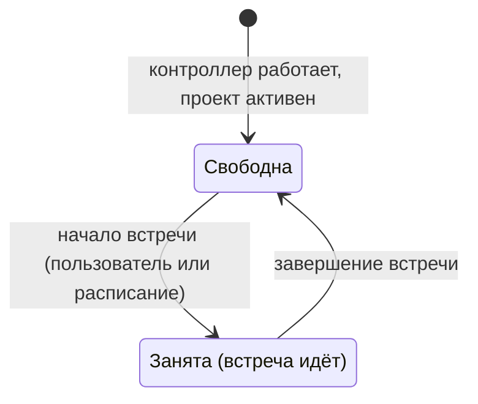
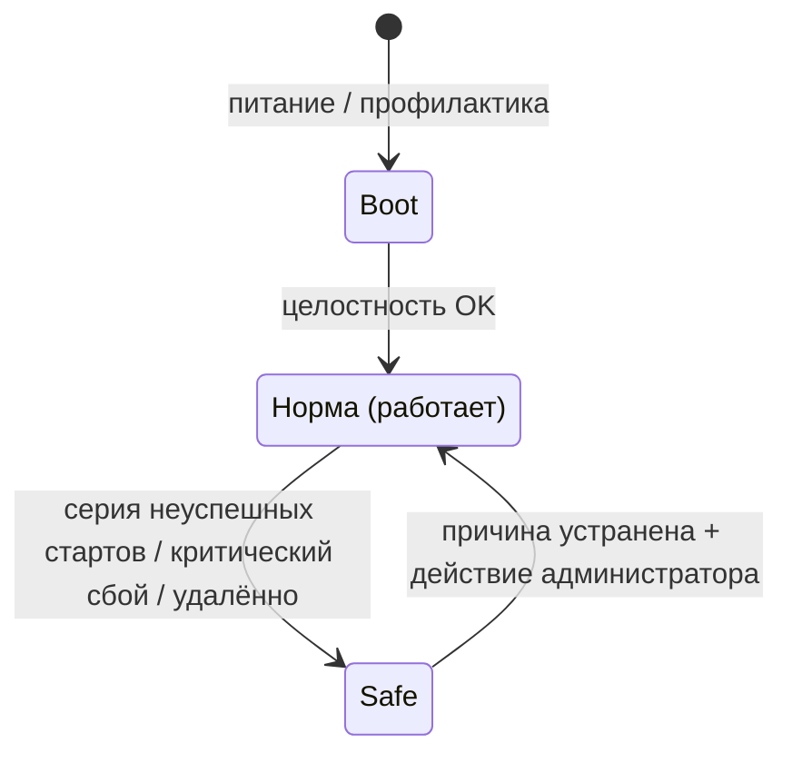
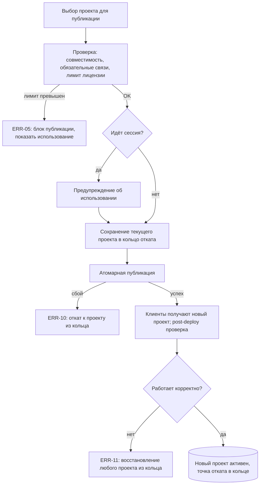
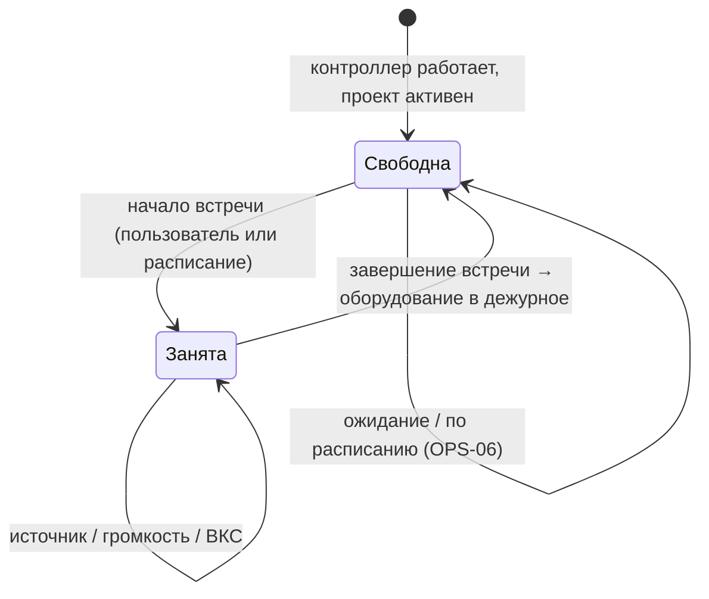
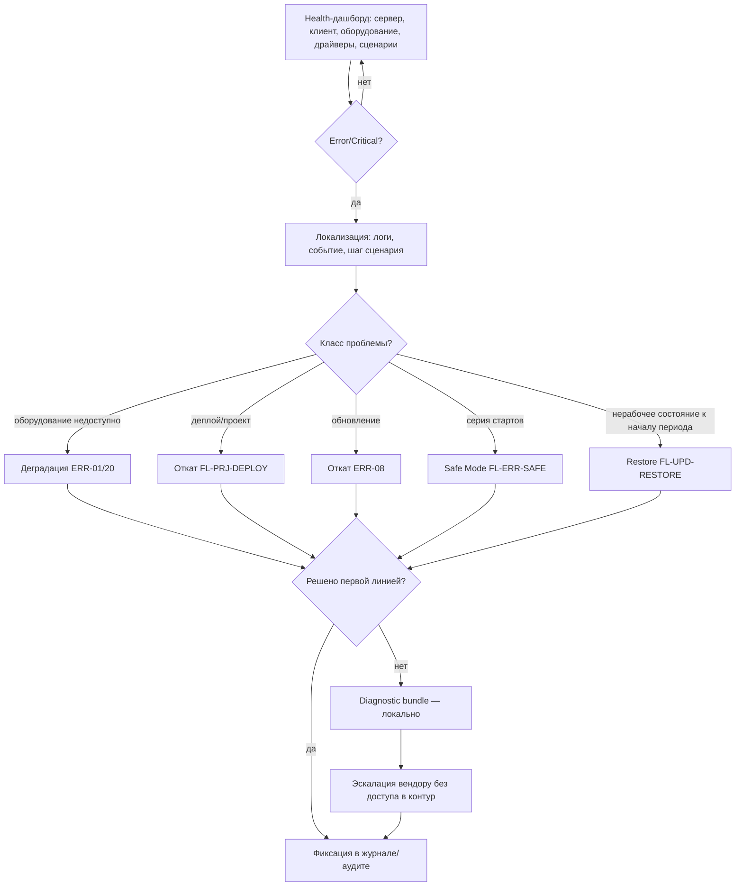
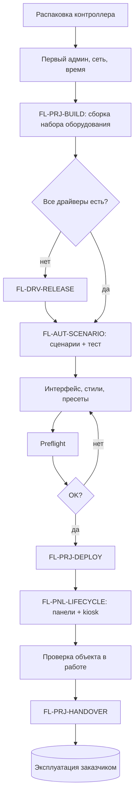

# Logic & User Flows — AV Control

## §1. Объектная модель и состояния

> Хребет документа: дальше потоки и матрица ссылаются на эти сущности и состояния, а не на «комнату».

### 1.1 Сущности

- **Оборудование** — управляемые устройства; доступ только через драйверы и HAL.
- **Сессия** — период использования объекта: старт сценарием → завершение. Не сущность «комната», а временной интервал поверх активного проекта.
- **Панель (клиент)** — отображает состояние и принимает действия; оборудованием напрямую не управляет (`Клиент → Сервер → устройства`).
- **Драйвер** — независимо обновляемый модуль управления устройством.
- **Лицензия** — вшита в контроллер; в runtime влияет на публикацию и режим работы.

### 1.2 Состояние переговорки и режимы контроллера

Это две независимые оси. Связь односторонняя: при неработающем контроллере нет централизованного управления, но занятость переговорки на режим контроллера не влияет.

**Состояние переговорки** (ежедневные переходы; в PSD §5 — «Стандартный» = свободна, «Активный» = занята):

- **Свободна** (встречи нет) — оборудование в дежурном состоянии.
- **Занята** (встреча идёт) — оборудование выведено из дежурного и под управлением.

Во всех состояниях переговорки активный проект загружен, а оборудование под контролем сервера. Завершение встречи возвращает оборудование в дежурное; проект не снимается. Чем сопровождается начало/завершение — настройка интегратора на уровне сценариев (FL-AUT-SCENARIO).

**Режимы контроллера** (редкие переходы — профилактика или сбой; в остальное время контроллер в uptime):

Механизм входа в Safe Mode (без конкретных порогов — продуктовое требование, реализация `[→ §9]`):

- Серия неуспешных стартов, фиксируемая watchdog → Safe Mode.
- Критический сбой → Safe Mode автоматически.
- Удалённая команда администратора из Admin UI → Safe Mode.

В Safe Mode тестовые команды на оборудование запрещены. Выход — только действием администратора после устранения причины. В норме контроллер обслуживает оба состояния переговорки.

### 1.3 Состояния сущностей

- **Проект:** Нет активного · Активен · Невалиден · Кандидат отката (хранится в кольце).
- **Оборудование:** Доступно · Недоступно · Деградировано.
- **Сессия:** Нет · Идёт · Завершается.
- **Лицензия:** Valid · Invalid · LimitsExceeded · EmulatorActive · Missing.

### 1.4 Кольцо откатов (сквозной механизм)

Продуктовое требование:

- Система хранит **ограниченное число** последних задеплоенных серверных проектов.
- Восстановиться можно на **любой** из сохранённых.
- При переполнении дамп очищается циклически, начиная с самого раннего.

Из этого следует: «откат деплоя» и «возврат к исправному проекту» — не два объекта, а выбор любого из сохранённых. Глубина кольца и алгоритм выбора при автоматическом откате — `[→ §9]`.

---

## §2. Стейт/экшн-матрица

> Поведенческий ролевой разрез режимов: что разрешено и запрещено, что видно, что логируется, как восстанавливаемся. Мост к ACM и QA. Не переопределяет переходы PSD и не задаёт права (права → ACM).

### 2.1 Действия по режимам контроллера

> Матрица описывает режимы контроллера, а не использование переговорки. Действия эксплуатации (начало, ведение, завершение встречи) от режима контроллера не зависят и описаны в FL-OPS-DAY.

| Режим         | Триггер входа                               | Разрешено (роли)                                                                                                           | Запрещено                                  | Видит пользователь | Логи / события                                  | Recovery                              |
| ------------- | ------------------------------------------- | -------------------------------------------------------------------------------------------------------------------------- | ------------------------------------------ | ------------------ | ----------------------------------------------- | ------------------------------------- |
| **Boot**      | Питание / профилактика                      | —                                                                                                                          | Управление оборудованием                   | Загрузка           | Старт, целостность                              | → Норма или Safe                      |
| **Норма**     | Целостность OK                              | Управление оборудованием по проекту; правка проекта (Инж); оперативные изменения (Инж/IT); деплой и обновление (по правам) | —                                          | Рабочее состояние  | Команды, обратная связь, изменения конфигурации | Деградация → продолжение на доступном |
| **Safe Mode** | Серия стартов / критический сбой / удалённо | Диагностика, restore, rollback, обновление (IT)                                                                            | Команды на оборудование; активные сценарии | Заглушка           | Critical + crash dump                           | Устранение → выход администратором    |

### 2.2 Классы событий и реакция

Поведенческая (не текст сообщений и не severity-реестр):

|Класс|Реакция системы|Пользователю|Инженеру / IT|
|---|---|---|---|
|**Info**|Норма|Состояние|В журнале|
|**Warning**|Продолжение, пометка|Подсказка при необходимости|В журнале|
|**Error**|Деградация или блок операции|Понятное состояние + действие|Детали + эскалация в мониторинг|
|**Critical**|Безопасное состояние / Safe Mode|Заглушка|Эскалация + crash dump|

Принцип: необязательная зависимость недоступна → продолжение с предупреждением; критичная (помечена интегратором при проектировании) недоступна → деградация или останов по настройке сценария.

---

## §3. Формат описания flow

### Карточка flow

| Поле                              | Содержание                              |
| --------------------------------- | --------------------------------------- |
| **ID / Название**                 | `FL-<область UC>-NN` + действие         |
| **Метаданные**                    | Тип · Приоритет · Глубина · Акторы      |
| **Связанные UC**                  | ID кейсов                               |
| **Цель**                          | Конечная цель потока                    |
| **Триггер / начальное состояние** | Что запускает; состояние до старта      |
| **Основной поток**                | Шаги                                    |
| **Ветвления / guards**            | Условия, альтернативы, запреты          |
| **Что видит актор**               | Пользователь / инженер / IT             |
| **Логи / события**                | Что фиксируется (хэндофф в Data Schema) |
| **Критерии приёмки**              | Для P0: 3–7 проверяемых условий         |
| **Конечное состояние**            | Чем завершается                         |
| **BPMN-приложение**               | Нужно / не нужно                        |
| **Трассировка**                   | UC / FR / OBJ → смежные документы       |

### Типы

- **Role** — последовательность действий роли.
- **System** — внутренняя логика (деплой, откат, совместимость).
- **Runtime** — поведение в исполнении.
- **Error / Recovery** — ошибки, деградация, rollback, Safe Mode.
- **Integration** — API / внешняя система / машинный актор.

### Глубина

- **Полная** — P0 и многоветочные потоки (включая критерии приёмки).
- **Краткая** — линейные потоки: цель, поток, ветвления, итог.

### Коды областей

Префикс `FL-` + код рабочей области UC (`PRJ`, `AUT`, `DRV`, `PNL`, `OPS`, `UPD`, `MON`, `ERR`, `BVC`, `SEC`). Собственные коды не вводятся.

---
## §4. Каталог flow

### 4.1 Перечень

|ID|Название|UC|Тип|Прио|Глубина|BPMN|
|---|---|---|---|---|---|---|
|FL-PRJ-BUILD|Сборка проекта|PRJ-01/02/03/04/06|Role+System|P0|Полная|—|
|FL-PRJ-DEPLOY|Деплой и откат|PRJ-07/08, ERR-05/10/11|System+Recovery|P0|Полная|да|
|FL-AUT-SCENARIO|Сценарий: создание, тест, исполнение|AUT-01/02, OPS-01/05, ERR-02|Runtime|P0|Полная|—|
|FL-OPS-DAY|Эксплуатация: маршрут типового дня|OPS-01..07, BVC-01/02/04, ERR-01/07/20|Runtime|P0|Полная|—|
|FL-OPS-OPER|Оперативный слой без редеплоя|AUT-03, ADM-03, PRJ-05|Runtime|P0|Полная|—|
|FL-DRV-RELEASE|Драйвер: запрос, выпуск, установка|DRV-01/02/03, ERR-04/09|Integration|P0|Полная|да|
|FL-PNL-LIFECYCLE|Панель: подключение, синхронизация, замена|PNL-01/02/03/04|Role+Runtime|P0|Краткая|—|
|FL-UPD-CORE|Обновление ядра|UPD-01/02, ERR-08|System+Recovery|P0|Полная|—|
|FL-UPD-RESTORE|Backup / restore / замена контроллера|UPD-03/04/05, ERR-12/19|Recovery|P0|Полная|да|
|FL-MON-TRIAGE|Триаж инцидента, bundle, эскалация|MON-01/02/03, SUP-01/02|Role+Support|P0|Полная|да|
|FL-ERR-SAFE|Safe Mode и невалидный проект|ERR-13/14|Error+Recovery|P0|Полная|да|
|FL-BVC-BOOKING|Бронирование / ВКС|BVC-01/02/04, API-03|Integration|P1|Краткая|—|
|FL-SEC-ACCESS|Доступ и безопасность|SEC-01/02/03/04|Role|P1|Краткая|—|
|FL-PRJ-HANDOVER|Передача объекта и вывод|PRJ-14/15, SEC-04|Role|P1|Краткая|—|

### 4.2 Трассировка и зависимости

|ID|FR / OBJ|Downstream-зависимость|Открытый вопрос|
|---|---|---|---|
|FL-PRJ-BUILD|M-PRJ · OBJ-1/2|Data Schema (теги, конфиг)|граница JS|
|FL-PRJ-DEPLOY|M-PRJ · OBJ-1|§9 (атомарность, кольцо)|—|
|FL-AUT-SCENARIO|M-PRJ/M-ROOM · OBJ-2|Core&API (Scenario Engine)|граница JS|
|FL-OPS-DAY|M-ROOM · OBJ-2|—|—|
|FL-OPS-OPER|M-PRJ/M-ADM · OBJ-2|Data Schema (persist)|—|
|FL-DRV-RELEASE|M-DRV · OBJ-1|Core&API (Driver Engine)|SLA без документации|
|FL-PNL-LIFECYCLE|M-ROOM · OBJ-2|§9 (sync)|—|
|FL-UPD-CORE|M-UPD · OBJ-3|§9 (подпись, health-check)|строгий режим при встрече|
|FL-UPD-RESTORE|M-UPD · OBJ-3|Data Schema (backup)|addon-лицензия|
|FL-MON-TRIAGE|M-MON · OBJ-3|§9 (состав bundle)|preview bundle|
|FL-ERR-SAFE|M-UPD/M-MON · OBJ-3|§9 (порог, удалённый вход)|—|
|FL-BVC-BOOKING|M-ROOM · OBJ-2|Core&API (контракт)|scope брони/ВКС|
|FL-SEC-ACCESS|M-SEC|ACM (права)|маркировка IP|
|FL-PRJ-HANDOVER|M-PRJ · OBJ-1|ACM (права при сдаче)|аудит вывода|

FR-уровень уточняется по PRD при финализации; здесь — модуль и цель.

---

## §5. Потоки

### Проект

#### FL-PRJ-BUILD · Сборка проекта

_Role+System · P0 · Полная · Инж · UC: PRJ-01/02/03/04/06_

- **Цель.** Собрать конфигурацию набора оборудования и проверить готовность к деплою.
- **Триггер.** Активен проект; есть права настройки.
- **Основной поток.**
    1. Выбор способа сборки.
    2. Наполнение состава: оборудование, драйверы, теги, связи, базовые сценарии, стиль.
    3. Корректировка под объект: адреса, фактическое оборудование.
    4. Доработка логики/интерфейса при необходимости.
    5. Preflight-проверка полноты.
    6. Сохранение.

- **Ветвления / guards.**

| Условие                     | Реакция                                     |
| --------------------------- | ------------------------------------------- |
| Нет готового шаблона набора | Wizard по устройствам или ручная сборка     |
| Нет драйвера на устройство  | Запрос драйвера (FL-DRV-RELEASE)            |
| Конфликт связей/тегов       | Показать конфликт и следующий шаг           |
| Нативной логики не хватает  | JS-расширение (граница — §7)                |
| Preflight не пройден        | Вернуть к доработке, перезапустить проверку |

- **Что видит актор.** Перечень незакрытых пунктов preflight: несвязанные теги, отсутствующие драйверы, неполные сценарии.
- **Логи / события.** Создание состава, автосвязи, ошибки автосвязей, сохранение.
- **Критерии приёмки.**
    1. Проект с полным составом проходит preflight без ошибок.
    2. Любой собранный проект/шаблон остаётся редактируемым после создания.
    3. Отсутствие драйвера явно отмечено и ведёт в FL-DRV-RELEASE.
    4. Конфликт связей блокирует завершение preflight и показывает место конфликта.
- **Конечное состояние.** Проект валиден, готов к публикации.
- **BPMN.** Не нужно.

#### FL-PRJ-DEPLOY · Деплой и откат

_System+Recovery · P0 · Полная · Инж (частично IT) · UC: PRJ-07/08, ERR-05/10/11_

- **Цель.** Сделать проект активным без риска для текущей рабочей конфигурации.
- **Триггер / предусловие.** Проект прошёл preflight; лицензия валидна; нет идущего обновления/восстановления.

- **Ветвления / guards.**
    - Превышен лимит → блок публикации; runtime не меняется.
    - Идёт сессия → предупреждение, осознанное подтверждение.
    - Драйвер несовместим → блок или предложение обновить драйвер.
    - Клиент не получил проект → показывает прежнее состояние, событие в диагностику.
- **Логи / события.** Старт/итог деплоя, сохранение в кольцо, откат, причина.
- **Критерии приёмки.**
    1. Атомарность: после публикации активен ровно один проект — новый либо прежний.
    2. При сбое публикации прежний проект остаётся активным в той же сессии.
    3. Превышение лимита не меняет работающий runtime.
    4. Каждая успешная публикация создаёт точку отката в кольце.
    5. Событие деплоя и его исход залогированы.
- **Конечное состояние.** Новый проект активен либо прежний сохранён/восстановлен; запись в журнал.
- **BPMN.** Да.
- **Реализация `[→ §9]`:** атомарность транзакции, post-deploy health-check, выбор проекта из кольца — продуктово требуется, механика совместно с тех.лидом.

### Сценарии и эксплуатация

#### FL-AUT-SCENARIO · Сценарий: создание, тест, исполнение

_Runtime · P0 · Полная · Инж / End User / система · UC: AUT-01/02, OPS-01/05, ERR-02_

- **Цель.** Дать координированное поведение объекта в 1–2 действия; обеспечить старт и завершение сессии.
- **Рамка.** Что делает сценарий — задаёт интегратор. Платформа исполняет.
- **Конфигурационный поток (Инж).**
    1. Создание сценария из шаблона или вручную.
    2. Последовательность команд, задержек, условий.
    3. Обработка ошибки: повтор, пропуск необязательного, останов, деградация, сообщение.
    4. Финальное состояние оборудования.
    5. Тест до публикации (на эмуляторе/стенде, без привязки к интерфейсу).
- **Runtime-поток (End User + система).**
    1. Пользователь нажимает сценарий.
    2. Сервер проверяет роль, активный проект, состояние оборудования.
    3. Scenario Engine исполняет последовательность; команды идут через драйверы.
    4. Обратная связь обновляет теги; клиент показывает выполнение.
    5. Успех → целевое состояние; ошибка → error-ветка.
- **Завершение сессии (продуктовый уровень).** Сессия завершается:
    
    1. явным действием пользователя с панели;
    2. истечением таймаута по расписанию.
    
    В обоих случаях запускается **сценарий завершения, заданный интегратором** (закрыть ВКС, очистить данные сессии, перевести оборудование в дежурное, вернуть Стандартный режим). Поведение «следующая встреча стартует, не завершив предыдущую» — настройка интегратора на уровне сценариев (через интеграцию брони), не продуктовое правило.
- **Error-ветки.**
    - Оборудование недоступно → понятная ошибка пользователю, детали в диагностику.
    - Необязательное недоступно → продолжить с предупреждением.
    - Критичное недоступно → деградация/останов по настройке сценария.
    - Сценарий не завершился → возврат оборудования в безопасное состояние.
    - Рантайм-сбой → ERR-02.
- **Логи / события.** Старт/итог сценария, шаг с ошибкой, обратная связь.
- **Критерии приёмки.**
    1. Сценарий исполняется в заданной последовательности с учётом задержек и условий.
    2. Недоступность необязательной зависимости не прерывает сессию.
    3. Завершение сессии возвращает оборудование в дежурное и режим в Стандартный.
    4. Ошибка шага обрабатывается по настройке сценария, а не падением сессии.
- **Конечное состояние.** Целевое состояние либо корректная деградация.
- **BPMN.** Не нужно.

#### FL-OPS-DAY · Эксплуатация: типовой день переговорки
*Runtime · P0 · Полная · End User / система / API · UC: OPS-01..07, BVC-01/02/04, ERR-01/07/20*

- **Цель.** Описать жизненный цикл использования переговорки за день и точки включения error-кейсов.
- **Инварианты (не меняются в течение дня).**
  1. Контроллер в uptime; его режим к расписанию переговорки отношения не имеет (§1.2).
  2. Активный проект всегда загружен; оборудование всегда под контролем сервера.
  3. Начало и завершение встречи — действие пользователя или расписание (настройка интегратора), не деплой и не смена режима контроллера.
  4. Завершение встречи возвращает оборудование в дежурное; активный проект не снимается.

- **Ветвления / guards (на уровне встречи, без изменения активного проекта).**

| Событие                             | Реакция                                                                                                        |
| ----------------------------------- | -------------------------------------------------------------------------------------------------------------- |
| Часть оборудования недоступна       | Деградация (ERR-20): встреча продолжается на доступном, понятная подсказка (OPS-07)                            |
| Потеря связи клиент↔сервер          | Клиент → оверлей «нет связи» (FL-PNL-LIFECYCLE); сервер продолжает управление                                  |
| Критический сбой контроллера        | Исключение из дня: переход в Safe Mode (FL-ERR-SAFE); централизованное управление недоступно до восстановления |
| Сервисное действие во время встречи | Предупреждение, требует подтверждения                                                                          |

- **Связь с контроллером (односторонняя).** Пока контроллер в норме — переговорка управляется. Если контроллер ушёл в Safe Mode или на профилактику, централизованного управления нет; расписание переговорки на контроллер не влияет.
- **Что видит актор.** «Нет сигнала / нет звука / устройство недоступно» + действие; инженерные детали — только поддержке.
- **Критерии приёмки.**
  1. Начало встречи даёт пользователю наблюдаемую обратную связь о готовности.
  2. Завершение встречи возвращает оборудование в дежурное при сохранении активного проекта.
  3. Деградация не снимает проект и не блокирует встречу целиком при наличии работающего оборудования.
  4. Контроллер остаётся управляющим независимо от наличия встречи; занятость переговорки не меняет режим контроллера.
  5. Потеря связи клиента не останавливает сервер.
- **Конечное состояние.** Переговорка свободна, оборудование в дежурном; активный проект сохранён.
- **BPMN.** Не нужно.
#### FL-OPS-OPER · Оперативный слой без редеплоя

_Runtime · P0 · Полная · Инж/IT · UC: AUT-03, ADM-03, PRJ-05_

- **Цель.** Менять эксплуатационные настройки без правки и публикации проекта.
- **Объём (редактируется на лету).**
    1. **Расписания** — запуск сценариев/состояний по времени.
    2. **Сценарии** — состав и параметры готовых сценариев.
    3. **Пресеты** — пользовательские пресеты объекта.
- **Правило сохранения.** Оперативные изменения переживают перезапуск; сбрасываются только при загрузке нового проекта или удалении текущего.
- **Доступ.** После сдачи менять могут и Инж, и IT (по правам, под аудитом).
- **Граница.** Изменение состава оборудования, связей, базовой логики — это правка проекта (FL-PRJ-BUILD + FL-PRJ-DEPLOY), не оперативный слой.
- **Ветвления.**
    - Невыполненное расписание → диагностика (FL-MON-TRIAGE).
    - Временная runtime-настройка без сохранения → отдельный режим ADM-03.
- **Логи / события.** Изменение расписания/сценария/пресета — в аудит.
- **Критерии приёмки.**
    1. Изменение расписания/сценария/пресета применяется без публикации проекта.
    2. Оперативное изменение сохраняется после перезапуска контроллера.
    3. Загрузка нового проекта сбрасывает оперативные изменения.
    4. Все изменения зафиксированы в аудите с автором.
- **Конечное состояние.** Поведение изменено без редеплоя; зафиксировано до смены проекта.
- **BPMN.** Не нужно.

### Устройства, панели, драйверы

#### FL-DRV-RELEASE · Драйвер: запрос, выпуск, установка

_Integration · P0 · Полная · Инж / Вендор / IT · UC: DRV-01/02/03, ERR-04/09_

- **Цель.** Добавить или обновить драйвер без релиза ядра.
    
- **Основной поток.**
    1. Обнаружено неподдерживаемое устройство.
    2. Запрос драйвера: вендор, модель, протокол, нужные функции, документация.
    3. Подготовка и стендовая проверка.
    4. Присвоение Driver ID, версии, диапазона совместимости; offline-доставка.
    5. Установка без перезапуска ядра; проверка подписи и совместимости.
    6. Драйвер в каталоге и журнале; прежние версии доступны.
- **Ветвления / guards.**

| Условие                        | Реакция                                                                             |
| ------------------------------ | ----------------------------------------------------------------------------------- |
| Нет протокольной документации  | Вне ускоренного SLA, отдельный случай                                               |
| Несовместимая версия           | Установка блокируется с понятным сообщением                                         |
| Драйвер падает после установки | Деградация устройства (ERR-04) → откат к прежней версии (ERR-09), ядро не затронуто |
| Покрытие частичное             | Маркируется ограничениями (DRV-03)                                                  |

- **Критерии приёмки.**
    1. Установка/обновление драйвера не требует перезапуска ядра.
    2. Несовместимая версия не устанавливается.
    3. Сбой драйвера откатывается к прежней версии без влияния на ядро.
    4. Версия и диапазон совместимости зафиксированы в каталоге.
- **Конечное состояние.** Устройство управляется драйвером; ядро не затронуто.
- **BPMN.** Да.
- **Реализация `[→ §9]` / Core&API:** sandbox, lifecycle, подпись, compatibility-check — продуктово требуется, механика совместно с тех.лидом.
    

#### FL-PNL-LIFECYCLE · Панель: подключение, синхронизация, замена

_Role+Runtime · P0 · Краткая · Инж/IT / End User / система · UC: PNL-01/02/03/04_

- **Цель.** Ввести панель в работу, держать согласованное состояние, восстановить после замены.
- **Поток.**
    1. Авторизация, подключение к серверу и запрос списка доступных проектов.
    2. Загрузка клиентского проекта (он задаёт функцию панели), kiosk-режим.
    3. Доставка обновлений клиентского проекта после публикации.
- **Синхронизация.** Состояние — на сервере; панели отражают синхронно; действие с одной видно на остальных.
- **Потеря связи.** Панель кэширует последнее состояние и ждёт сервер. Интегратор может включить **оверлей «нет связи»** (флаг в опциях + выбор страницы); использовать — решение интегратора по проекту. Очередь офлайн-событий не строится: при реконнекте панель ресинхронизирует состояние с сервера.
- **Ветвления.**
    - Несколько панелей объекта → согласованное состояние.
    - Замена панели → подключение + загрузка того же проекта, без донастройки.
- **Критерии приёмки.**
    1. Действие с одной панели отражается на остальных (все состояния на сервере).
    2. При потере связи панель показывает последнее состояние или оверлей (если включён интегратором).
    3. Замена панели не требует ручной донастройки проекта.
- **Конечное состояние.** Панель работает в kiosk; состояние согласовано.
- **BPMN.** Не нужно.
- **Реализация `[→ §9]`:** механика синхронизации нескольких клиентов.

### Обслуживание и восстановление

#### FL-UPD-CORE · Обновление ядра

_System+Recovery · P0 · Полная · IT · UC: UPD-01/02, ERR-08_

- **Цель.** Обновить ядро offline с возможностью отката.
- **Основной поток.**
    1. Загрузка offline-пакета; проверка подписи/целостности/совместимости/места.
    2. Показ патчноута.
    3. Guard активной сессии (см. ниже).
    4. Создание точки восстановления → установка.
    5. Health-check; при успехе — фиксация версии; запись в журнал.
- **Guard активной сессии.** При идущей сессии — предупреждение об использовании; администратор откладывает или подтверждает осознанно. Более строгий режим (настраиваемое на сервере условие) — `[? — продукт; §7]`.
- **Ветвления.**
    - Сбой до установки → не применено.
    - Сбой после установки → авто-откат (ERR-08).
    - Сбой отката → Safe Mode (FL-ERR-SAFE).
- **Критерии приёмки.**
    1. Обновление при активной сессии без предупреждения невозможно.
    2. Сбой установки откатывается к точке восстановления без потери данных.
    3. Версия и исход обновления залогированы.
- **Конечное состояние.** Ядро обновлено либо откатано; запись в журнал.
- **BPMN.** Не нужно.
- **Реализация `[→ §9]`:** подпись/манифест, gate-проверки, health-check.

#### FL-UPD-RESTORE · Backup / restore / замена контроллера

_Recovery · P0 · Полная · IT/Инж · UC: UPD-03/04/05, ERR-12/19_

- **Цель.** Восстановить работу после сбоя или замены оборудования.
- **Основной поток.**
    1. Backup — вручную или по расписанию; проверка целостности.
    2. (При замене контроллера) установка из ЗИП.
    3. Восстановление конфигурации из backup.
    4. Проверка backup на совместимость **до** применения.
    5. Применение; работа без ручной донастройки, в том числе автоматическое подключение панелей, даже в случае смены IP контроллера
- **Ветвления / guards.**

|Условие|Реакция|
|---|---|
|Backup повреждён/несовместим|Восстановление прерывается (ERR-12), текущая конфигурация сохраняется|
|Заменено только устройство|Переподключение драйвера к новому экземпляру (UPD-05)|
|Проект/оборудование в нерабочем состоянии к началу рабочего периода|Диагностика → откат/restore → проверка готовности (ERR-19)|
- **Лицензия.** Стандартный случай: лицензия вшита в контроллер, пользователь о ней не думает. Addon-лицензия при замене → возможны сложности, `[? — аналитика]`.
- **Критерии приёмки.**
    1. Несовместимый backup не применяется, текущая конфигурация цела.
    2. Восстановление из валидного backup не требует ручной донастройки.
    3. Замена устройства восстанавливает управление без правки проекта.
- **Конечное состояние.** Контроллер/объект восстановлены; downtime минимизирован.
- **BPMN.** Да.
- **Состав/формат backup → Data Schema.**

#### FL-MON-TRIAGE · Триаж инцидента, bundle, эскалация

_Role+Support · P0 · Полная · IT / Сап / Вендор · UC: MON-01/02/03, SUP-01/02_

- **Цель.** Закрывать большинство инцидентов первой линией без выезда и без постоянного доступа в контур.

- **Граница.** Bundle собирают IT/Инж/Сап локально; вендор работает по нему без доступа в контур. При необходимости IT выдаёт временный сервисный доступ — отзывной, под аудитом.
- **Логи / события.** Класс инцидента, выполненное действие, факт формирования/передачи bundle.
- **Критерии приёмки.**
    1. Error/Critical виден на дашборде с возможностью локализации.
    2. Типовой инцидент закрывается без доступа вендора в контур.
    3. Эскалация возможна через bundle без удалённого доступа.
- **Конечное состояние.** Инцидент закрыт первой линией либо подготовлена эскалация.
- **BPMN.** Да.
- **Состав bundle (приватность/ИБ) → §9 / Data Schema.**

#### FL-ERR-SAFE · Safe Mode и невалидный проект

_Error+Recovery · P0 · Полная · IT/Сап / система · UC: ERR-13/14_

> Поведенческий recovery-маршрут, не переспецификация переходов PSD (они — в §1.2).

- **Цель.** Управляемо изолировать причину сбоя и восстановить работу ПО.
- **Вход.** Серия неуспешных стартов / критический сбой / удалённая команда (§1.2).
- **В Safe Mode доступно.** Admin UI, диагностика/логи, экспорт bundle, restore/rollback, установка обновления/отката. Активные сценарии выключены; клиент показывает заглушку; команды на оборудование запрещены.
- **Невалидный активный проект (ERR-14).** Система не остаётся в неопределённом состоянии: откат к исправному проекту из кольца (§1.4) либо уход в Safe Mode.
- **Выход.** Только действием администратора после устранения причины.
- **Критерии приёмки.**
    1. Серия неуспешных стартов приводит в Safe Mode, а не в цикл перезапусков.
    2. В Safe Mode оборудование не получает команд.
    3. Невалидный проект не оставляет систему в неопределённом состоянии.
    4. Выход из Safe Mode требует действия администратора.
- **Конечное состояние.** Контроллер управляем; есть путь к штатной работе.
- **BPMN.** Да.
- **Реализация `[→ §9]`:** порог серии стартов, нарастающий таймаут, удалённый вход/выход.

### Интеграция и безопасность

#### FL-BVC-BOOKING · Бронирование / ВКС

_Integration · P1 · Краткая · End User / API · UC: BVC-01/02/04, API-03_

- **Цель.** Показать встречу из календаря, управлять ею в части брони, запустить ВКС.
- **Поток (swimlane).**

|Шаг|End User|AV Control|Booking API|ВКС|
|---|---|---|---|---|
|1|видит встречу|читает событие|отдаёт текущую/ближайшую|—|
|2|начинает|запускает сценарий|—|поднимает endpoint|
|3|продлевает/завершает|шлёт изменение|принимает|—|
|4|управляет звонком|команды|—|mute/camera/layout|

- **Граница.** Связывание брони с управлением — настройка интегратора, не функция платформы. Перечень систем и команд → §7. API обязан поддерживать создание брони уже сейчас; UI брони с панели — P2.
- **Ветвления.**
    - Терминал/линия недоступны → понятная подсказка (OPS-07).
    - Ошибка интеграции (auth/версия) → запрос отклоняется, сообщение администратору.
- **BPMN.** Не нужно.
- **Контракт endpoints → Core&API.**

#### FL-SEC-ACCESS · Доступ и безопасность

_Role · P1 · Краткая · IT (Инж при ПНР) · UC: SEC-01/02/03/04_

- **Цель.** Заводить пользователей/роли, парольную политику, сертификаты, временный сервисный доступ.
- **Поток.**
    1. Создание пользователя (человек или для панели), назначение роли.
    2. Парольная политика по требованиям заказчика.
    3. Установка/продление сертификатов TLS.
    4. Выдача/отзыв временного сервисного доступа.
- **Ветвления.** Истечение сертификата → предупреждение заранее; при истечении — ограничение защищённых соединений (ERR-16).
- **Граница.** Формальная матрица прав и состав действий по ролям → **ACM**. Все изменения — в аудите.
- **BPMN.** Не нужно.

#### FL-PRJ-HANDOVER · Передача объекта и вывод

_Role · P1 · Краткая · Lead→IT · UC: PRJ-14/15, SEC-04_

- **Цель.** Передать эксплуатацию без зависимости от подрядчика и без утечки наработок.
- **Поток.**
    1. Lead формирует пакет передачи: переносимая конфигурация, роли, документация.
    2. Авторские наработки (клиентский и серверный проекты) защищены (не редактируются без ключа).
    3. IT принимает систему и админ-права; права интегратора отзываются/понижаются.
    4. IT проверяет доступ к эксплуатации: статусы, обновления, backup.
- **Альтернатива.** По договору интегратор сохраняет ограниченный сервисный доступ (отзывная роль, FL-SEC-ACCESS).
- **Вывод объекта.** Очистка пользовательских данных по политике; фиксация в аудите до очистки `[? — продукт; §7]`.
- **BPMN.** Не нужно.
- **Права при handover → ACM.**

---

## §6. Ролевые разрезы

> Навигация по потокам под углом роли с ключевыми развилками. Не переописывают механику.

### 6.1 Интегратор

Ключевые потоки: FL-PRJ-BUILD → FL-DRV-RELEASE → FL-AUT-SCENARIO → FL-PRJ-DEPLOY → FL-PNL-LIFECYCLE → FL-PRJ-HANDOVER.
Развилки: наличие готового шаблона; наличие драйверов; прохождение preflight.

> Самый критичный путь внедрения — от распаковки до работающего объекта. Цель — показать критический путь со всеми типовыми ветвлениями и какой функционал задействуется, без углубления в реализацию. Если путь неудобен — внедрение проваливается.

### Дорожки и задействованный функционал

|Шаг|Актор|Что делает в UI|Системное действие|Зависимость|Точка спотыкания / fallback|
|---|---|---|---|---|---|
|Ввод|Инж|Первый админ, сеть, время|Инициализация, NTP|—|Нет сети → ручной IP|
|Сборка|Инж|Состав, теги, связи|Автосвязи, валидация|Каталог драйверов|Нет драйвера → запрос (FL-DRV-RELEASE)|
|Сценарии|Инж|Создание, тест|Scenario Engine|Эмулятор/стенд|Нет оборудования → тест на эмуляторе|
|Интерфейс|Инж|Стили, пресеты|Сборка клиентского проекта|—|—|
|Preflight|Инж|Просмотр пробелов|Проверка полноты|—|Пробелы → возврат к сборке|
|Деплой|Инж|Публикация|Атомарная публикация + кольцо|Лицензия|Лимит → ERR-05|
|Панели|Инж/IT|Подключение, kiosk|Доставка проекта|Сеть|Нет связи → оверлей|
|Проверка|Инж|Прогон сессии|Исполнение|Оборудование|Деградация → ERR-20|
|Сдача|Lead/IT|Передача прав|Защита наработок|—|—|

**Кандидат на пред-выезд:** pre-commissioning через эмулятор и preflight без полного комплекта оборудования.
### 6.2 IT-инженер

Ядро — FL-MON-TRIAGE: health → локализация → выбор ветки восстановления (FL-PRJ-DEPLOY / FL-UPD-CORE / FL-UPD-RESTORE / FL-ERR-SAFE). Оперативные правки без редеплоя — FL-OPS-OPER.
Развилки: класс инцидента; достаточность первой линии; нужен ли временный доступ вендору.

### 6.3 Конечный пользователь

Маршрут — FL-OPS-DAY: старт (FL-AUT-SCENARIO) → источник/управление/ВКС → завершение.
Развилки: готовность оборудования (полная / деградация); продолжить или завершить.

---
