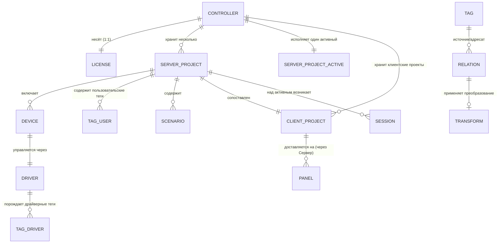

# Information Architecture & Data Schema — AV Control

## §1. Каталог сущностей (ENT)

> Логический каталог, не физическая модель. Колонки: владелец данных · ключевые продуктовые атрибуты · версионируется · входит в backup · состояния (если есть, из Logic §1.3).

### Проектный слой

- **ENT-01 · Серверный проект** — исполняемая конфигурация набора оборудования. 
  Владелец: интегратор (наработка), заказчик (экземпляр на объекте). Атрибуты: версия, совместимость с версией ядра, состав устройств/тегов/связей/сценариев/интерфейса, признак шифрования (LP). 
  Версионируется: да. Backup: да. Состояния: `Нет активного · Активен · Невалиден · Кандидат отката`.
- **ENT-02 · Клиентский проект** — конфигурация интерфейса панели; доставляется на панель только через Сервер с контролем версии. Владелец: как ENT-01. Версионируется: да. Backup: да .
- **ENT-03 · Шаблон / готовая комната** — переиспользуемая заготовка(преднастроенные драйвера, элементы управления, связи и сценарии) проекта; авторская наработка интегратора (защита — Lead Integrator). Версионируется: да. Backup: да.
- **ENT-04 · Кольцо откатов** — ограниченный набор последних задеплоенных серверных проектов; при переполнении циклическая очистка (Logic §1.4). Кандидаты отката — ENT-01 в состоянии «Кандидат отката». Глубина кольца (число) → §9.

### Слой оборудования и управления

- **ENT-05 · Оборудование** — управляемое устройство; доступ только через драйвер и HAL. Атрибуты: вендор/модель, роль в комнате, адрес/параметры подключения, признак критичности (помечает интегратор, BR-08/деградация). Состояния: `Доступно · Недоступно · Деградировано`.
- **ENT-06 · Драйвер** — независимо обновляемый модуль управления устройством. Атрибуты: версия, диапазон совместимости с ядром, capabilities, описание команд/обратной связи/статусов, параметры подключения (`FR-DRV-03/04`). Версионируется: да (поток отдельный от ядра). Backup: да.
- **ENT-07 · Тег** — единая сущность состояния (`M-VAR`, BR-07). Подтипы: _драйверный_ (командный — без хранения / обратной связи — хранит последнее значение / статусный / ошибки), _системный_ (метрики здоровья, параметры сервера/клиента/панели; часть read-only), _пользовательский_ (создаёт интегратор; persist-значения переживают перезапуск). Backup: persist-значения и пользовательские теги — да.
- **ENT-08 · Связь** — направленный автопроброс значения тег↔тег / тег↔элемент интерфейса; защита от зацикливания (`FR-VAR-04`). Атрибуты: источник, адресат, направление, преобразование.
- **ENT-09 · Преобразование (Expression Evaluator)** — нативное правило: диапазоны (0–255 ↔ 0–100), типы (int/bool/string/float), простая математика/логика без JS (`FR-VAR-05`).
- **ENT-10 · JS-расширение** — опциональный скрипт для сложной логики; изолирован, ошибки логируются (PRD «JS», ERR-03). Контракт/sandbox → Core & API. Здесь — как хранимый объект проекта.

### Оперативный слой (живёт без редеплоя — FL-OPS-OPER)

- **ENT-11 · Сценарий** — конфигурация поведения `событие → условие → действие` (как хранимый объект; _механика исполнения → Core & API_). Версионируется отдельно от проекта; переживает перезапуск; сбрасывается при загрузке нового проекта.
- **ENT-12 · Расписание** — временные триггеры (вкл/выкл, окончание встречи по таймауту). Свойства хранения — как ENT-11.
- **ENT-13 · Пресет** — сохранённый набор значений/состояний для быстрого применения. Как ENT-11.
- **ENT-14 · Сессия** — временной интервал использования поверх активного проекта (не «комната»). Состояния: `Нет · Идёт · Завершается`. Backup: нет (runtime).

### Клиенты и доступ

- **ENT-15 · Панель / клиент** — отображает состояние, принимает действия; оборудованием напрямую не управляет (`Клиент → Сервер → устройства`). Атрибуты: назначенный клиентский проект, kiosk-режим, флаг оверлея офлайна, последнее закэшированное состояние. Состояния панели — поведенческие, см. Logic FL-PNL.
- **ENT-16 · Пользователь** — учётная запись человека или панели. Атрибуты: профиль(и), статус, парольные параметры (хранение — защищённая область, `FR-SEC-02`).
- **ENT-17 · Роль / профиль** — один из 7 операционных профилей (PRD §2) + машинные пользователи API. Формальные права — §4 (ACM).
- **ENT-18 · Право (permission)** — атомарное разрешение «действие × ресурс»; принадлежит §4 (ACM).
- **ENT-19 · Сервисный доступ** — временная, явно выданная, отзывная и видимая IT/ИБ запись доступа Vendor Support (`FR-SEC-09`, SUP-02/03). Атрибуты: срок, выдавший, область.
- **ENT-20 · Сертификат** — корпоративный или самоподписанный (`FR-SEC-06/10`). Атрибуты: тип, срок действия, область применения (канал/PKI).
- **ENT-21 · Интеграционный токен** — учётка машинного пользователя API (мониторинг/SIEM, бронь/календарь, ВКС). Аутентифицирован, авторизован, версионирован (`FR-DRV-09`).

### Наблюдаемость и события

- **ENT-22 · Событие** — запись в журнале. Две независимые оси: **severity** `Info / Warning / Error / Critical` (BR-09; залочено) и **уровень детализации** — обязательный `Debug`, при котором логируются в т.ч. все команды и обратная связь от оборудования. Поля и потоки — §5.
- **ENT-23 · Аудит-событие** — защищённая запись критичного действия (вход, изменение проекта/ролей, обновление, импорт драйвера, восстановление, выдача/отзыв вендорского доступа). Не удаляется обычным пользователем; выгрузка в SIEM/syslog (`FR-SEC-07/08`). Разведено с системным логом — см. §5.
- **ENT-24 · Крашдамп** — снимок при падении сервера; хранятся последние 5 с автоочисткой (`M-MON`).
- **ENT-25 · Diagnostic bundle** — пакет диагностики (логи, состояние, версии, конфигурация по политике); собирается локально IT/интегратором, в закрытом контуре экспортируется вручную; вендор анализирует без сетевого доступа в контур (MON-03, Logic §9). Состав — ограничен ИБ.

### Коммерческий и системный слой

- **ENT-26 · Лицензия** — вшита в контроллер, криптопривязка к встроенному USB-ключу + подпись, offline-проверка (PSD §6). Типы: Production / Emulator. Лимит — только на устройства (база 50 + add-on на производстве). 1 лицензия = 1 контроллер; заводская активация, непереносимая. Состояния: `Valid · Invalid · LimitsExceeded · EmulatorActive · Missing`. Backup: нет (`FR-UPD-04`).
- **ENT-27 · Контроллер** — аппаратный узел исполнения Сервера. Несёт лицензию, проект, оперативный слой, логи. Один контроллер — одна лицензия.
- **ENT-28 · Backup** — резервная копия: проект, настройки, роли, драйверы, критичные параметры (`FR-UPD-04`). Проверяется до применения; восстановление на совместимом устройстве, в т.ч. при замене контроллера (`FR-UPD-05`).
- **ENT-29 · Патчноут** — описание релиза, вшито в пакет обновления (.deb) (PSD §7).
- **ENT-30 · Конфигурация логов/ретенции** — параметры лимитов, срока хранения и автоочистки логов и дампов (ADM-05). Числовые значения → §9.

---

## §2. Логическая ER-модель (REL)

> Карта обязательных связей. Диаграмма — ядро; периферийные сущности (лицензия, пользователи, аудит, backup) перечислены списком, чтобы не перегружать схему.

Связи списком (включая то, что не на схеме):

- **REL-01** Контроллер 1—1 Лицензия (ENT-27/26). Обязательна для публикации и режима работы.
- **REL-02** Контроллер 1—N Серверный проект; ровно один — Активный (ENT-27/01).
- **REL-03** Серверный проект 1—N Оборудование (ENT-01/05).
- **REL-04** Оборудование N—1 Драйвер; драйвер хранит диапазон совместимости с ядром (ENT-05/06).
- **REL-05** Драйвер 1—N Драйверный тег (ENT-05/07).
- **REL-06** Тег N—N Связь (источник/адресат), защита от циклов (ENT-07/08).
- **REL-07** Связь 0/1 Преобразование (ENT-08/09).
- **REL-08** Серверный проект 1—1 Клиентский проект (ENT-01/02); версии согласованы.
- **REL-09** Клиентский проект 1—N Панель; доставка только через Сервер (ENT-02/15).
- **REL-10** Серверный проект 1—N Сессия (поверх активного) (ENT-01/14).
- **REL-11** Оперативный слой (Сценарий/Расписание/Пресет) принадлежит контроллеру/проекту, но версионируется и живёт отдельно; сбрасывается при смене активного проекта (ENT-11–13).
- **REL-12** Кольцо откатов агрегирует прошлые активные серверные проекты (ENT-04/01).
- **REL-13** Пользователь N—N Роль; Роль 1—N Право (ENT-16/17/18).
- **REL-14** Сервисный доступ N—1 Пользователь (Vendor Support), ограничен сроком (ENT-19/16).
- **REL-15** Действие субъекта → Аудит-событие; критичные действия обязательны к журналированию (ENT-16/23).
- **REL-16** Контроллер 1—N Событие/Крашдамп/Лог (ENT-27/22/24).
- **REL-17** Backup агрегирует: проект, настройки, роли, драйверы, лицензирование, критичные параметры (ENT-28 → ENT-01/17/06/26).
- **REL-18** Интеграционный токен → область видимости API (какие ресурсы читаются, какие команды разрешены) (ENT-21 → §4).
- **REL-19** Контроллер 1—N Клиентский проект — **хранит** (доставка на панель — только через Сервер, REL-09). Дополняет REL-02 (хранение серверных проектов) и REL-08 (сопоставление серверного и клиентского).

---

## §3. Владение данными и жизненный цикл (DR)

- **DR-01 · Создаёт интегратор:** проект, устройства, конфигурацию драйверов, теги, связи, преобразования, сценарии, интерфейс, шаблоны. Lead Integrator — шаблоны и защита авторских наработок.
- **DR-02 · Принадлежит заказчику:** экземпляр установки на объекте, оперативный слой, пользователи и роли, сертификаты, аудит, логи.
- **DR-03 · Авторская наработка (LP):** серверный и клиентский проект шифруются так, что система их расшифровывает и исполняет, но редактирование/доступ к ресурсам без пароля невозможны. Это сдерживание копирования, не DRM против владельца железа.
- **DR-04 · Переносится между контроллерами:** проект, драйверы, настройки, роли через backup; восстановление проверяется до применения и работает на совместимом устройстве (`FR-UPD-05`). Лицензия — непереносима (`ENT-26`); сценарий замены контроллера и add-on лицензии — отдельная проработка (передано в Scope).
- **DR-05 · Persist vs runtime:** пользовательские теги и persist-значения, оперативный слой — переживают перезапуск; драйверные командные теги и сессия — runtime, не хранятся.
- **DR-06 · Сброс при смене проекта:** оперативный слой (расписания/сценарии/пресеты) сбрасывается при загрузке нового активного проекта или удалении текущего (FL-OPS-OPER).
- **DR-07 · Очистка при выводе объекта:** автоочистка пользовательских данных без аппаратного сброса приводит контроллер к состоянию, близкому к заводскому (для безопасной передачи на объект, хранения и т.д.). **Удаляется:** проект (серверный + клиентский), оперативный слой, пользователи/роли/сертификаты, логи. **Остаётся:** ПО и вшитая лицензия (`M-ADM`, ENT-26).
- **DR-08 · Входит в backup:** проект (серверный + клиентский), настройки, роли, драйверы, критичные параметры (`FR-UPD-04`). Не входит: runtime-сессии, временные runtime-изменения.
- **DR-09 · Локальность данных:** ничего не покидает закрытый контур по умолчанию (offline-first, нет облака). Внешняя передача — только явная: выгрузка аудита/ИБ-событий в SIEM/syslog и ручной экспорт diagnostic bundle.

---

## §4. Access Control Model (ACM)

> Единственный дом формальной матрицы `профиль × действие × ресурс`. PRD (`M-SEC`) и PSD (§1.8) только ссылаются. Машинные пользователи — отдельной строкой, без UX, по контракту токена.

**Принципы (PRD §2).** Минимально необходимые права; разделение проектных и эксплуатационных действий; критичные действия — в аудит; сервисный доступ временный, отзывной, видимый IT/ИБ; End User не видит инженерных сущностей.

**Матрица (продуктовый уровень).** 
Легенда: **W** — выполнять/изменять · **R** — только чтение · **T** — временно / по политике (ограниченный объём) · **—** — нет. Суффикс (ПНР) — право только на этапе пусконаладки.

| Ресурс \ Профиль                                                        | End User | Support Op. | IT Admin | Integrator Eng. | Lead Integr. | Security Auditor | Vendor Support¹ | API-токен²    |
| ----------------------------------------------------------------------- | -------- | ----------- | -------- | --------------- | ------------ | ---------------- | --------------- | ------------- |
| Управление сессией (источник, громкость, mute, сценарий)                | W        | T           | —        | W(ПНР)          | —            | —                | —               | —             |
| Проект: создание/правка (устройства, теги, связи, логика, интерфейс)    | —        | —           | —        | W               | W            | —                | —               | —             |
| Шаблоны и защита LP-наработок                                           | —        | —           | —        | —               | W            | —                | —               | —             |
| Пакет передачи объекта (handover)                                       | —        | —           | R        | T               | W            | —                | —               | —             |
| Публикация/деплой проекта, откат                                        | —        | —           | W        | W               | W            | —                | —               | —             |
| Драйверы: импорт/обновление                                             | —        | —           | W        | W               | W            | —                | —               | —             |
| Runtime-действия без правки проекта (тест-команды, временные настройки) | —        | T           | W        | W               | —            | —                | T               | —             |
| Пользователи и роли (RBAC)                                              | —        | —           | W        | T⁵              | —            | R                | —               | —             |
| Парольная политика, сертификаты TLS                                     | —        | —           | W        | —               | —            | R                | —               | —             |
| Сеть, время/NTP                                                         | —        | —           | W        | T⁵              | —            | —                | —               | —             |
| Перезагрузка/выключение контроллера                                     | —        | T           | W        | T⁵              | —            | —                | —               | —             |
| Обновления ядра, backup/restore                                         | —        | —           | W        | —               | —            | R                | —               | —             |
| Лицензия: просмотр статуса                                              | —        | R           | R        | R               | R            | R                | —               | —⁴            |
| Логи / health / диагностика, сбор diagnostic bundle                     | —        | W           | W        | W               | —            | R                | R³              | —⁴            |
| Аудит и ИБ-события                                                      | —        | —           | R        | —               | —            | R                | —               | —             |
| Выгрузка аудита/ИБ в SIEM/syslog (настройка и запуск)                   | —        | —           | W        | —               | —            | W                | —               | —⁴            |
| Выдача/отзыв сервисного доступа Vendor Support                          | —        | —           | W        | —               | —            | R                | —¹              | —             |
| Чтение состояний/health через API                                       | —        | —           | —        | —               | —            | —                | —               | R(по области) |
| Команды устройствам через API                                           | —        | —           | —        | —               | —            | —                | —               | W(перечень²)  |

¹ Vendor Support действует только в рамках выданного временного доступа (ENT-19); постоянного скрытого доступа нет. Инициировать запрос доступа может (SUP-02), выдать — нет.
² Машинные пользователи: чтение — `R(по области)`; запись — `W` строго по перечню. **Перечень write-команд и область видимости токена определяются в Core & API** (не здесь); в ACM остаётся только `R/W` по области.
³ Vendor Support читает только _переданный_ ему diagnostic bundle (ENT-25), без доступа в контур. 
⁴ API-токен (SIEM/syslog) здесь — _получатель_ выгрузки, а не актор действия (сам поток — §5, E2); в матрице прав это не разрешение, поэтому «—».
⁵ По решению эксплуатанта: на ПНР доступно; сохранять ли за интегратором после передачи объекта — выбирает заказчик (ситуации разные).

**Уточнения по `T`:** Support Operator — ограниченные сервисные действия по политике: тест-команды, просмотр логов, сбор diagnostic bundle, перезагрузка/выключение контроллера (без правки проекта, сети, пользователей). Integrator Engineer — эксплуатационные права (пользователи, сеть) доступны на ПНР; их сохранение после передачи объекта остаётся на решение эксплуатанта (сноска ⁵).

---

## §5. Таксономия событий, аудита и логов (EVT)

>Различаем **два потока хранения** (по управляемости) и **эскалацию/выгрузку наружу** как отдельное свойство, а не третий поток.

**Две оси логирования.** *Severity* — `Info · Warning · Error · Critical` (BR-09; залочено, эскалируются Error/Critical; End User видит не уровни, а понятное состояние, BR-04). *Детализация (verbosity)* — обязательный уровень **`Debug`**: при включении логируются в т.ч. все команды и обратная связь от оборудования. Debug-записи относятся к потоку A (системный), объём высокий → под ротацию/ретенцию (DR-22) и настраиваемую реакцию по метрикам (DR-23).

**Два потока хранения:**

- **Поток A · Системный** — операционные и диагностические записи; ротируется и автоочищается под политикой (`M-MON`, ADM-05).
- **Поток B · Аудит** — критичные действия **и ИБ-события в одном защищённом потоке** (не разбиваем); не удаляется обычным пользователем, tamper-evident (`FR-SEC-07/08`); read-only видит Security Auditor.

**Классы событий и распределение по потокам** (egress — отдельная колонка, не поток):

| Класс события                                                                                                                                                                                              | Поток хранения                    | Выгрузка наружу                      |
| ---------------------------------------------------------------------------------------------------------------------------------------------------------------------------------------------------------- | --------------------------------- | ------------------------------------ |
| **EVT-01 · Системный лог** — события сервера/драйверов/сценариев                                                                                                                                           | A · Системный                     | —                                    |
| **EVT-04 · Диагностические события устройств** — доступность/деградация, ошибки драйверов, ошибки преобразований (`FR-VAR-06`), ошибки JS (ERR-03)                                                         | A · Системный                     | Error/Critical → мониторинг (E1)     |
| **EVT-06 · Крашдамп** (ENT-24) — снимок при падении; последние 5, автоочистка                                                                                                                              | A · Системный                     | в составе diagnostic bundle (ручной) |
| **EVT-02 · Аудит** (ENT-23) — вход; изменение проекта; изменение ролей/пользователей; обновление ядра/драйверов; импорт драйвера; восстановление из backup; выдача/отзыв вендорского доступа (`FR-SEC-07`) | B · Аудит                         | SIEM/syslog (E2)                     |
| **EVT-03 · ИБ-события** — неуспешные входы, защита от перебора, изменения политики безопасности                                                                                                            | B · Аудит (единый поток с EVT-02) | SIEM/syslog (E2)                     |
> **EVT-05 удалён как класс.** Прежнее «события для внешнего мониторинга» — это не класс события, а правило эскалации (см. E1 ниже).

**Эскалация/выгрузка наружу (egress — не отдельное хранилище):**

- **E1 · Эскалация в мониторинг:** уровни `Error`/`Critical` из потока A → внешняя система мониторинга через API (`M-MON`, MON-04, API-01/02).
- **E2 · Выгрузка в SIEM/syslog:** аудит и ИБ-события из потока B → внешняя ИБ-система (SEC-06).
- Контракт обоих каналов (endpoints, подписка, формат) → Core & API.

**Классы журналируемого (поля «Логи/события» из флоу L&F):** создание/правка проекта; добавление устройства; автосоздание тегов/связей; ошибки автосвязей; сохранение/деплой/откат проекта; обновления; runtime-изменения; события сессии. Распределяются по EVT-01/02/04 выше.

**Поля события (продуктовый минимум, формат — §8):** время; уровень (severity); источник (компонент/устройство/пользователь/токен); тип; объект; результат; человекочитаемое описание. Сериализация и индексация → `[→ тех. лид]`.

**Конфиденциальность.** Скрытый сбор телеметрии запрещён (методология); состав diagnostic bundle ограничен ИБ. **Правило:** чувствительных данных в логах быть не должно; конкретный состав и способ логирования каждого события определяются на уровне аналитики при проектировании перечня событий.

---

## §6. Шифрование и защита данных — продуктовые требования (DR)

> Уровень «что защищаем». Алгоритмы, схема ключей, tamper-evident механика — §9.

**В транзите (in transit):**

- **DR-10** Веб-интерфейс и API — только TLS/HTTPS (`FR-SEC-05`); работа без шифрования канала исключена (`FR-SEC-10`).
- **DR-11** Поддержка корпоративных сертификатов; при отсутствии — самоподписанный (`FR-SEC-06/10`).
- **DR-12** API машинных пользователей — аутентифицирован, авторизован, версионирован (`FR-DRV-09`).
- **DR-13** Выгрузка аудита/ИБ в SIEM/syslog — по защищённому каналу `[→ тех. лид: протокол/транспорт]`.

**В покое (at rest):**

- **DR-14** Пароли — в защищённой области, парольная политика корпоративного уровня (`FR-SEC-02`); защита от перебора (`FR-SEC-03`).
- **DR-15** Серверный и клиентский проект — шифруются: система исполняет (расшифровывает), правка/доступ к ресурсам без пароля невозможны (DR-03, защита LP).
- **DR-16** Аудит-логи — tamper-evident, не удаляются обычным пользователем (`FR-SEC-07/08`).
- **DR-17** Лицензия — криптопривязка к встроенному USB-ключу + подпись, offline-проверка (PSD §6).
- **DR-18** Формат проекта должен свободно проходить антивирусную проверку (сейчас открыто лежащие JS воспринимаются как вирус и удаляются) (`NFR-COMP-01`). Способ упаковки → §8.

**Граница контура:**

- **DR-19** Данные не покидают закрытый контур, кроме явных выгрузок (DR-09). Diagnostic bundle — ручной экспорт; вендор анализирует без доступа в контур (ENT-25).

`[→ тех. лид]` для §6: алгоритм at-rest и схема ключей; механика tamper-evident; формат и подпись лицензии; схема ключа шифрования проекта и парольной защиты; способ упаковки проекта под антивирус → строки §9.

---

## §7. Требования к телеметрии и хранению логов — продуктовый уровень (DR)

- **DR-20 · Типы хранимого:** системный лог, аудит, ИБ-события, диагностические события устройств, крашдампы, persist-теги/пользовательские теги, оперативный слой.
- **DR-21 · Локальное хранение:** всё хранится на контроллере; внешняя БД/облако не используются.
- **DR-22 · Ротация и автоочистка:** логи и дампы — лимит объёма + срок хранения + автоочистка (`M-MON`, ADM-05); крашдампы — последние 5. Числовые значения → §9.
- **DR-23 · Переполнение хранилища:** деградация предсказуема, не ломает runtime (ERR-15). Конкретное поведение определяется на уровне аналитики; система должна публиковать метрики объёма/здоровья хранилища как системные теги (ENT-07), чтобы эксплуатант сам настроил реакцию (сценарий/правило) на их основе.
- **DR-24 · Передача наружу:** только явная (SIEM/syslog, ручной bundle); без скрытой телеметрии.
- **DR-25 · Разделение журналов:** аудит хранится и защищается отдельно от системного лога (нельзя смешивать в одном удаляемом потоке).

Физическая модель хранения (БД/файлы, индексы, схема таблиц) → §8/§9.

---

## §8. Конфигурационные схемы и форматы — скелет для тех. лида (CFG)

> Здесь продукт фиксирует _состав и продуктовые свойства_ объекта, тех. лид — _формат, сериализацию, версионирование, миграции_. Каждый объект по единому шаблону (Формат).

**Шаблон записи (Формат):**

> **CFG-NN · <объект>** — назначение · владелец · ключевые продуктовые поля · версионируется (да/нет) · в backup (да/нет) · шифруется (да/нет) · `[→ тех. лид: формат файла, сериализация, схема версий/миграций]`

Объекты к описанию (продуктовые поля заполнены в §1; формат — за тех. лидом):

- **CFG-01 · Серверный проект** (ENT-01) — формат, шифрование (DR-15), упаковка под антивирус (DR-18) `[→ тех. лид]`.
- **CFG-02 · Клиентский проект** (ENT-02) — формат, шифрование (DR-15), упаковка под антивирус (DR-18) `[→ тех. лид]`.
- **CFG-03 · Манифест драйвера** (ENT-06) — команды/обратная связь/статусы/capabilities/совместимость; формат описания `[→ тех. лид]`.
- **CFG-04 · Файл лицензии** (ENT-26) — формат, подпись, привязка к ключу `[→ тех. лид]`.
- **CFG-05 · Backup** (ENT-28) — формат контейнера, проверка целостности до применения `[→ тех. лид]`.
- **CFG-06 · Патчноут в пакете** (ENT-29) — формат вшивания в .deb `[→ тех. лид]`.
- **CFG-07 · Оперативный слой** (ENT-11–13) — формат хранения, персистентность, сброс при смене проекта `[→ тех. лид]`.
- **CFG-08 · Пользователи/роли/права** (ENT-16–18) — схема хранения, хранение паролей `[→ тех. лид]`.
- **CFG-09 · Схема события** (§5) — поля, сериализация, индексация, разделение аудит/системный лог `[→ тех. лид]`.
- **CFG-10 · Конфиг логов/ретенции** (ENT-30) — формат и применяемые лимиты `[→ тех. лид]` + числа → Scope.

---

## §9. Tech Lead Review Register (TL) — сводный реестр для Вовы

> Единственная точка входа для тех. лида по этому блоку: не «написать документ», а закрыть строки. Колонки: продуктовое решение (зафиксировано) · что решает тех. лид · метод (дизайн/бенчмарк) · блокирует P0.

|TL-ID|Пункт|Продуктовое решение (есть)|Решает тех. лид|Метод|Блок. P0|
|---|---|---|---|---|---|
|TL-01|Физическая модель хранения|локально, без облака, crash-safe|БД/файлы, схема таблиц|дизайн|да|
|TL-02|Формат серверного/клиентского проекта|состав §1, шифрование DR-15|сериализация, версии, миграции|дизайн|да|
|TL-03|Упаковка проекта под антивирус|DR-18 (проходит AV)|способ упаковки/подписи|дизайн|да|
|TL-04|Манифест драйвера|поля `FR-DRV-04`|формат описания|дизайн|да|
|TL-05|Алгоритм at-rest + схема ключей|что шифруем DR-14/15|алгоритм, хранение ключей|дизайн|да|
|TL-06|Tamper-evident аудита|защита от удаления DR-16|механика|дизайн|да|
|TL-07|Формат и подпись лицензии|привязка PSD §6|формат файла, подпись|дизайн|да|
|TL-08|Схема события и индексация|поля §5|сериализация, индексы|дизайн|P1|
|TL-09|Формат backup + проверка до применения|состав `FR-UPD-04/05`|контейнер, целостность|дизайн|да|
|TL-10|Модель токенов/сессий/API-auth|DR-12, область §4|контракт (с Core & API)|дизайн|P1|
|TL-11|Объём логов, retention, порог переполнения|автоочистка DR-22|числа|бенчмарк|P1|
|TL-12|Глубина кольца откатов|механизм Logic §1.4|число|дизайн/бенчмарк|P1|
|TL-13|Защищённый канал выгрузки SIEM/syslog|DR-13|протокол/транспорт|дизайн|P1|

_Строки TL-11/TL-12 дублируют числовые лимиты — числа фиксируются в Product Scope, сюда возвращается только техническое обоснование. Не задваивать._

---

## Открытые продуктовые вопросы (Q) 

## Зафиксированные продуктовые решения (по ревью)

- **Q1 · Логирование.** Две оси: severity (4, залочено) + обязательный `Debug` (логирует все команды и обратную связь оборудования).
- **Q2 · API-токены.** Перечень write-команд и область токена — в Core & API; в ACM только `R/W` по области.
- **Q3 · Support Operator.** `T` = тест-команды, просмотр логов, сбор bundle, перезагрузка/выключение.
- **Q4 · Integrator Engineer.** Эксплуатационные права на ПНР; сохранение после передачи — на решение эксплуатанта.
- **Q5 · Очистка объекта.** Удаляются и проект, и оперативный слой/пользователи/логи → близко к заводскому; ПО и лицензия остаются.
- **Q6 · Аудит/ИБ.** Единый защищённый поток.
- **Q7 · Логи.** Чувствительных данных в логах нет; состав — за аналитикой.
- **Q8 · Переполнение.** Метрики — системные теги; реакцию настраивает эксплуатант.