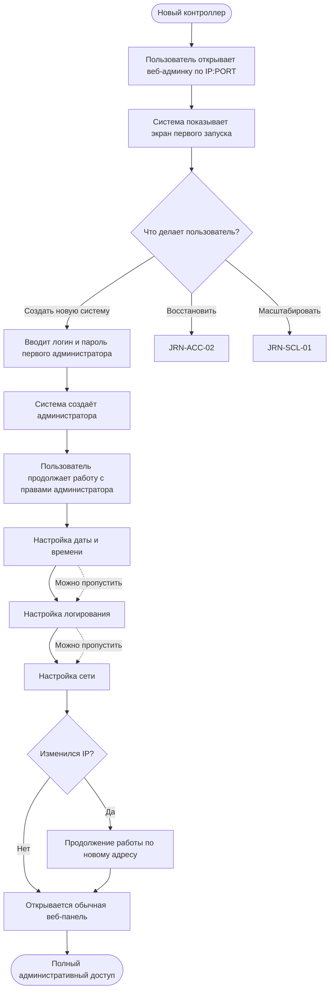

# JRN-ACC-01 · Запустить новый контроллер с нуля

**Актор:** инженер интегратора или IT-администратор.

**Триггер:** пользователь открывает веб-админку контроллера, который ещё не проходил первоначальную настройку.

**Начальное состояние:** сервер AV Control запущен, веб-админка доступна, первый администратор ещё не создан.

**Цель:** выполнить минимальную первоначальную настройку нового контроллера и получить полный административный доступ к веб-панели сервера.

**Граница пути:** путь начинается с открытия веб-админки нового контроллера и заканчивается переходом пользователя в обычную веб-панель с правами администратора. Дальнейшая работа с комплектом, клиентами, интеграциями и другими функциями в этот путь не входит.

---

## Основной путь

| Шаг | Действие пользователя | Реакция системы / результат шага |
|---|---|---|
| 1 | Пользователь открывает в браузере веб-админку сервера по `IP:PORT`. | Система определяет, что контроллер запускается впервые и первый администратор ещё не создан. Открывается экран первого запуска. |
| 2 | Пользователь видит краткое пояснение о необходимости создать первого администратора и вводит логин и пароль. | На этом же экране система предоставляет два альтернативных действия: **восстановить контроллер** и **выполнить масштабирование на новом контроллере**. Основным сценарием экрана является создание новой системы с нуля. |
| 3 | Пользователь подтверждает создание администратора. | Система проверяет введённые данные и создаёт первого пользователя с полными административными правами. Далее пользователь продолжает первоначальную настройку от имени созданного администратора. Конкретный способ перехода — автоматическая авторизация или отдельный вход — определяется на этапе аналитики. |
| 4 | Пользователь при необходимости настраивает дату и время: текущие дату и время, часовой пояс и параметры перехода на летнее/зимнее время. | Система сохраняет настройки времени и использует их в дальнейшей работе. Пользователь может пропустить этот шаг и настроить параметры позднее из веб-панели. |
| 5 | Пользователь при необходимости настраивает систему логирования: уровень логирования, ограничения на объём хранения и политику очистки логов при достижении установленных ограничений. | Система сохраняет параметры логирования. Пользователь может пропустить этот шаг и оставить действующие значения с возможностью изменить их позднее. |
| 6 | Пользователь при необходимости изменяет сетевые настройки контроллера. | Система применяет новые сетевые параметры. Если изменение приводит к смене IP-адреса, текущая связь с веб-админкой может быть прервана и работа должна быть продолжена по новому адресу. Этот шаг расположен последним среди первичных настроек, поскольку изменение сети может потребовать переподключения. |
| 7 | Пользователь завершает первоначальную настройку. | Система открывает обычную веб-панель сервера. Пользователь работает под созданной учётной записью администратора и имеет доступ ко всем разрешённым этой роли функциям. |
## Визуализация

---
## Результат

- создан первый пользователь с правами администратора;
- пользователь получил административный доступ к веб-панели сервера;
- настройки времени, логирования и сети либо заданы при первом запуске, либо оставлены для последующей настройки;
- контроллер вышел из состояния первого запуска;
- пользователь может перейти к любой функции веб-панели, доступной администратору.

Путь не предписывает обязательный следующий сценарий. После завершения `JRN-ACC-01` пользователь может, например, перейти к подготовке комплекта, подключению клиентов, настройке интеграций, управлению пользователями или другим административным операциям.

---
## Связанные пути

- `JRN-ACC-02` — восстановление существующей системы при первом доступе;
- `JRN-SCL-01` — масштабирование на новом контроллере;
- `JRN-ACC-04` — последующие входы в уже настроенный контроллер.
---
## Открытые вопросы для аналитики

1. Как пользователь продолжает работу после создания первого администратора: система автоматически авторизует созданного пользователя или предлагает выполнить отдельный вход.
2. Как именно продолжается работа после смены IP-адреса контроллера: автоматический переход браузера или ручное открытие нового адреса.
3. Какие конкретные поля и параметры входят в первоначальную настройку времени, логирования и сети — определить при детализации соответствующих настроек веб-админки.
---
