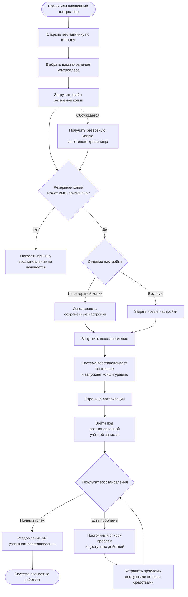

# JRN-ACC-02 · Восстановить существующую систему при первом доступе

**Актор:** инженер интегратора или IT-администратор.

**Триггер:** необходимо восстановить ранее работавшую систему на новом или очищенном контроллере.

**Начальное состояние:** сервер AV Control запущен, веб-админка доступна в режиме первого запуска, пользователь не авторизован, имеется резервная копия восстанавливаемой системы.

**Цель:** восстановить тот же объект/систему из резервной копии и вернуть её к полностью рабочему состоянию с минимальной ручной настройкой.

**Граница пути:** путь начинается с открытия веб-админки нового или очищенного контроллера и заканчивается полностью работающей восстановленной системой. Восстановление включает возврат сохранённых данных и связей системы, последующую авторизацию пользователя и устранение обнаруженных после восстановления конфликтов.

---

## Основной путь

| Шаг | Действие пользователя                                                                                                                                                     | Реакция системы / результат                                                                                                                                                                                                                                                                                                                               |
| --- | ------------------------------------------------------------------------------------------------------------------------------------------------------------------------- | --------------------------------------------------------------------------------------------------------------------------------------------------------------------------------------------------------------------------------------------------------------------------------------------------------------------------------------------------------- |
| 1   | Пользователь открывает в браузере веб-админку сервера по `IP:PORT`.                                                                                                       | Система определяет состояние первого запуска и показывает стартовый экран.                                                                                                                                                                                                                                                                                |
| 2   | Пользователь выбирает **восстановление контроллера** вместо создания новой системы с нуля.                                                                                | Система переводит пользователя в путь восстановления и предлагает указать источник резервной копии.                                                                                                                                                                                                                                                       |
| 3   | Пользователь загружает файл резервной копии.                                                                                                                              | Система получает данные для восстановления. Основной способ — загрузка локального файла. **Гипотеза:** дополнительно предоставить возможность загрузить резервную копию из доступного внутреннего сетевого хранилища по указанному адресу.                                                                                                                |
| 4   | Пользователь ожидает проверки загруженной резервной копии.                                                                                                                | Система проверяет возможность применения резервной копии к текущему контроллеру. Если копия повреждена или несовместима, восстановление не начинается, а пользователь получает причину и не может применить эту копию.                                                                                                                                    |
| 5   | Пользователь выбирает, какие сетевые настройки использовать после восстановления: **применить настройки из резервной копии** или **задать их вручную**.                   | Основной вариант — восстановить сетевые настройки из резервной копии. При ручном варианте пользователь задаёт параметры для текущего контроллера. Если в результате меняется IP-адрес, дальнейшее продолжение работы выполняется по тому же принципу, что и в `JRN-ACC-01`.                                                                               |
| 6   | Пользователь запускает восстановление.                                                                                                                                    | Система применяет резервную копию и автоматически возвращает сохранённое состояние системы: комплект, настройки, пользователей и роли, драйверы, данные подключённых клиентов и другие предусмотренные резервной копией данные. Система запускает восстановленную конфигурацию и выполняет необходимые действия для возврата объекта в рабочее состояние. |
| 7   | После завершения применения резервной копии пользователь переходит на страницу авторизации и входит под существующей учётной записью, восстановленной из резервной копии. | Система авторизует пользователя и предоставляет функции в соответствии с восстановленной ролевой системой.                                                                                                                                                                                                                                                |
| 8   | Пользователь с необходимыми правами просматривает результат восстановления.                                                                                               | При полном успехе система показывает уведомление об успешном восстановлении. Если обнаружены проблемы, система показывает список проблем, их состояние и доступные пользователю варианты дальнейших действий.                                                                                                                                             |
| 9   | При наличии проблем пользователь устраняет их доступными ему в соответствии с ролью средствами веб-админки.                                                               | Система обновляет состояние восстановления по мере устранения проблем. Информация о результате восстановления и оставшихся проблемах сохраняется и остаётся доступной для последующего просмотра — это не одноразовое уведомление.                                                                                                                        |
| 10  | Пользователь завершает устранение проблем и проверяет состояние восстановленной системы.                                                                                  | Комплект запущен, необходимые клиенты и оборудование доступны либо приведены в предусмотренное рабочее состояние, критические проблемы восстановления отсутствуют. Система считается восстановленной.                                                                                                                                                     |

## Визуализация

---

## Результат

- восстановлена та же система, состояние которой было сохранено в резервной копии;
- восстановлены предусмотренные резервной копией настройки, роли, пользователи, комплект, драйверы и другие данные;
- пользователь авторизуется уже через восстановленную ролевую систему;
- пользователь может увидеть результат восстановления и обнаруженные проблемы;
- информация о проблемах восстановления сохраняется до их устранения и доступна позднее;
- возникшие конфликты устранены средствами, доступными пользователю по его роли;
- система приведена к полностью рабочему состоянию.

Важно: резервная копия может быть создана значительно раньше момента отказа, поэтому успешное применение резервной копии ещё не означает отсутствие проблем в фактической инфраструктуре. После запуска система должна позволить пользователю увидеть расхождения между восстановленным состоянием и текущим состоянием клиентов, оборудования и других зависимостей.

---

## Связанные пути

- `JRN-ACC-01` — создание новой системы с нуля;
- `JRN-SCL-01` — создание нового самостоятельного экземпляра на новом контроллере;
- `JRN-ACC-04` — последующие входы в восстановленный контроллер;
- `JRN-SUP-01` — диагностика проблемы, если возникший после восстановления конфликт требует отдельного разбора;
- `JRN-REC-02` — восстановление той же системы при замене контроллера на этапе эксплуатации.

---

## Открытые вопросы / гипотезы

1. **Гипотеза:** кроме загрузки файла резервной копии предоставить загрузку из внутреннего сетевого хранилища по указанному пользователем адресу. Этот способ пока не утверждён.

2. **Открытый вопрос:** определить с аналитиком и техническим лидом полный перечень автоматических действий после применения резервной копии. На продуктовом уровне требуется вернуть систему максимально близко к сохранённому рабочему состоянию без повторной ручной настройки.

3. **Открытый вопрос:** определить полный состав проверок после восстановления: какие клиенты, устройства, драйверы, связи и другие элементы автоматически проверяются системой и какие результаты выводятся пользователю.

4. **Открытый вопрос:** определить точные права, необходимые для просмотра полного результата восстановления, списка возникших проблем и выполнения действий по их устранению.

---

## Связанные требования и сценарии

- `FR-UPD-04` — состав резервной копии;
- `FR-UPD-05` — проверяемость восстановления до применения и работа на совместимом контроллере;
- `UPD-03` — резервное копирование;
- `UPD-04` — восстановление / замена контроллера из резервной копии;
- `ERR-12` — повреждённая или несовместимая резервная копия;
- `FL-UPD-RESTORE` — восстановление и замена контроллера.

---
