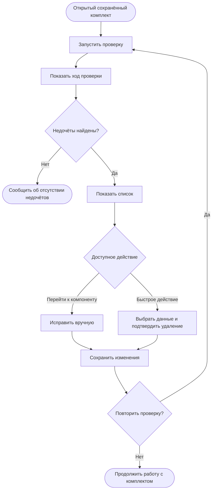

# JRN-COM-01 · Поиск недочётов и очистка комплекта

**Актор:** инженер интегратора, авторизованный под учётной записью с правом доступа к конфигуратору и редактирования комплекта.

**Триггер:** пользователь хочет найти доступные для автоматического обнаружения недочёты и удалить неиспользуемые данные без ручного поиска по всему комплекту.

**Начальное состояние:** пользователь находится в конфигураторе. Комплект открыт, сохранён и доступен для редактирования.

**Цель:** найти недочёты, перейти к связанным с ними компонентам либо выполнить доступные быстрые действия, а затем сохранить исправленный комплект.

**Граница пути:** путь начинается с запуска проверки открытого комплекта и заканчивается сохранением внесённых пользователем изменений либо просмотром результата, если недочёты не найдены. Проверка носит уведомительный характер и не подтверждает целостность комплекта, его совместимость с сервером, соответствие версии, оборудованию или лицензии. Она не является проверкой перед деплоем и не влияет на доступность деплоя. Состав проверок определяют менеджер продукта и системный аналитик. В MVP планируется только поиск и удаление неиспользуемых данных комплекта: связей, устройств, элементов управления и медиаресурсов.

---

## Основной путь

| Шаг | Действие пользователя | Реакция системы / результат |
|---|---|---|
| 1 | Пользователь запускает проверку открытого комплекта. | Система начинает проверку и показывает индикатор выполнения без перечисления внутренних операций. |
| 2 | Пользователь ожидает завершения проверки. | После завершения в конфигураторе открывается структурированный список найденных недочётов. Если недочёты не найдены, система сообщает об этом. |
| 3 | Пользователь просматривает список. При необходимости переключается между группами недочётов. | Для каждого пункта система показывает проблему и затронутые компоненты комплекта. Способ группировки и необходимость разделения списка по вкладкам определяются при проектировании интерфейса. |
| 4 | Пользователь выбирает отдельный пункт списка. | В зависимости от типа недочёта система позволяет перейти к связанному компоненту комплекта либо выполнить доступное быстрое действие. |
| 5 | Если для выбранных недочётов доступно быстрое действие, пользователь выбирает один элемент, несколько элементов или все подходящие элементы и запускает действие. | В MVP быстрое действие позволяет удалить выбранные неиспользуемые данные. |
| 6 | Пользователь подтверждает удаление. | Перед удалением система однозначно сообщает, какие данные будут удалены. После подтверждения система изменяет открытый комплект так же, как при ручном удалении этих данных. Ошибочное действие можно отменить и повторить штатными командами **«Отменить»** и **«Повторить»** (`Undo`/`Redo`). |
| 7 | Если быстрое действие недоступно, пользователь переходит из списка к связанному компоненту и исправляет его средствами конфигуратора. | Конфигуратор открывает соответствующий компонент. Список результатов остаётся доступным в пределах текущей сессии работы с комплектом. |
| 8 | Пользователь сохраняет внесённые изменения. | Исправления и результаты очистки сохраняются в комплекте. Сам список результатов в комплект не сохраняется и между сессиями не переносится. |
| 9 | При необходимости пользователь повторно запускает проверку. | Система выполняет новую проверку и полностью заменяет предыдущий список. Сравнение результатов двух проверок не отображается. |

## Визуализация

---

## Результат

- пользователь получил результат проверки и, при наличии недочётов, их структурированный список;
- пользователь мог перейти к связанным компонентам либо удалить выбранные неиспользуемые данные быстрым действием;
- удаление выполнено как обычное изменение комплекта и может быть отменено или повторено штатными средствами конфигуратора;
- внесённые изменения сохранены в комплекте;
- список результатов доступен только в текущей сессии и не является частью комплекта;
- при повторном запуске сформирован новый список без сравнения с предыдущим результатом.

Проверка не подтверждает готовность комплекта к деплою и не заменяет проверку, выполняемую в рамках `JRN-COM-02`.

---

## Связанные пути

- `JRN-KIT-01` — подготовка типового комплекта с помощью мастера;
- `JRN-KIT-02` — подготовка комплекта полностью вручную и ручная доработка;
- `JRN-KIT-03` — подготовка комплекта без доступа к полному набору оборудования;
- `JRN-CHG-01` — изменение существующего комплекта;
- `JRN-COM-02` — деплой серверной части, включающий отдельную проверку перед деплоем.

---

## Открытые вопросы / гипотезы

Открытых вопросов по пользовательскому пути нет. Состав проверок, правила поиска неиспользуемых данных и внутренняя процедура их удаления определяются при системном анализе и в эту карточку не входят.

---

## Связанные требования и сценарии

- `PRJ-04` — ручная доработка комплекта после создания;
- отдельное требование на поиск и удаление неиспользуемых данных комплекта в исходных документах не зафиксировано;
- `FR-PRJ-04`, `FR-PRJ-08`, `NFR-UX-03`, `PRJ-06` и `FL-PRJ-BUILD` описывают проверку готовности перед запуском. Эти положения не являются требованиями к текущему пути и требуют отдельной актуализации.

---
