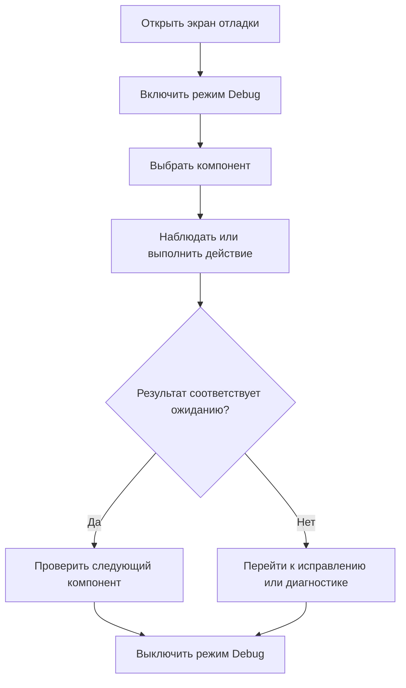

# JRN-COM-03 · Проверить работу через экран отладки после деплоя

**Статус:** черновик  
**Актор:** инженер интегратора; IT-администратор с правом использования режима отладки.  
**Триггер:** серверная часть и необходимые пользовательские интерфейсы установлены, после чего требуется вручную проверить доступные признаки работы системы.  
**Начальное состояние:** пользователь авторизован в веб-панели. Серверная часть комплекта установлена и запущена. Доступен экран отладки; состав подключённого оборудования и клиентов зависит от объекта.  
**Цель:** с помощью экрана отладки просмотреть текущее состояние доступных компонентов и вручную проверить отдельные действия до передачи помещения в эксплуатацию.  
**Граница пути:** путь начинается с открытия экрана отладки и заканчивается выходом из режима отладки после ручной проверки. Путь не является автоматической проверкой комплекта, не подтверждает соответствие реальному оборудованию и не присваивает комплекту статус готовности. Состав экрана отладки и внутренних диагностических данных определяется отдельно.

**Термин:** режим Debug — режим экрана отладки, в котором пользователь может наблюдать доступные диагностические данные и выполнять предусмотренные действия для ручной проверки.

---

## Основной путь

| Шаг | Действие пользователя | Реакция системы / результат |
|---|---|---|
| 1 | Пользователь открывает экран отладки. | Система показывает, какая серверная часть активна, и предоставляет доступные для текущей роли средства отладки. |
| 2 | Пользователь включает режим Debug. | Система явно обозначает активный режим отладки и показывает предупреждение о том, что выполняемые действия могут влиять на работу оборудования и помещения. |
| 3 | Пользователь выбирает компонент или группу данных, которые требуется проверить. | Экран показывает сведения, необходимые для проверки выбранного компонента, без перехода в другие разделы веб-панели. |
| 4 | Пользователь наблюдает значения, состояния, события или сообщения, доступные на экране отладки. | Система обновляет отображаемые данные и сохраняет связь каждого значения или события с соответствующим компонентом. |
| 5 | Если экран отладки допускает управляющие действия, пользователь запускает выбранное действие. | Система показывает выполненное действие и его наблюдаемый результат. Действия, недоступные текущей роли, нельзя запустить. |
| 6 | Если действие невозможно выполнить, пользователь просматривает сообщение. | Система сообщает причину, если она известна, и сохраняет на экране контекст компонента и выполненного действия. |
| 7 | Пользователь самостоятельно сопоставляет фактическое поведение с ожидаемым и при необходимости повторяет проверку для других компонентов. | Система не присваивает результату автоматический статус «готово» или «не готово». |
| 8 | Пользователь завершает проверку и выключает режим Debug. | Система возвращает экран в обычное состояние и явно показывает, что режим отладки выключен. |
| 9 | Если обнаружена проблема, пользователь переходит к её исправлению штатными средствами либо начинает диагностику. | Контекст найденной проблемы используется как основание для изменения комплекта или перехода к связанному пути диагностики. |

## Визуализация

Схема показывает ручную проверку через экран отладки. Система предоставляет данные и действия, но пользователь самостоятельно оценивает результат.

---

## Результат

- пользователь просмотрел доступные признаки работы выбранных компонентов;
- предусмотренные действия проверены вручную в пределах возможностей экрана отладки;
- режим Debug выключен после завершения работы;
- обнаруженная проблема передана в штатный путь исправления или диагностики;
- комплект не получает отдельный системный статус готовности.

---

## Связанные пути

- `JRN-COM-02` — деплой серверной части;
- `JRN-PNL-02` — деплой или обновление интерфейса на подключённом клиенте;
- `JRN-CHG-01` — изменение комплекта и деплой его новой версии;
- `JRN-SUP-01` — диагностика и первичный разбор инцидента.

---

## Открытые вопросы / гипотезы

1. **Состав экрана отладки.** Необходимо определить, какие данные, компоненты и действия доступны пользователю в MVP. **Владелец:** не определён. **Влияет на:** структуру экрана и детализацию шагов 3–6.

2. **Права доступа.** Необходимо определить роли, которым разрешены просмотр диагностических данных и выполнение управляющих действий. **Владелец:** не определён. **Влияет на:** доступность режима Debug и отдельных действий.

3. **Переход к исправлению.** Необходимо определить, может ли пользователь перейти из найденной записи непосредственно к связанному компоненту комплекта. **Владелец:** не определён. **Влияет на:** завершение проверки и сокращение пути к исправлению.

---

## Связанные требования и сценарии

Связанные требования и сценарии необходимо определить после утверждения состава экрана отладки и функций режима Debug.

