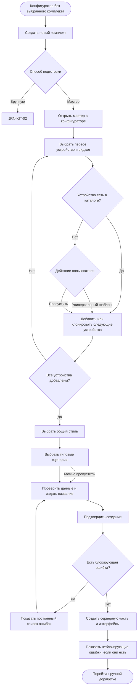

# JRN-KIT-01 · Подготовить типовой комплект с помощью мастера

**Актор:** инженер интегратора, авторизованный под учётной записью с правом доступа к конфигуратору и создания комплектов.

**Триггер:** пользователю необходимо создать новый типовой комплект с нуля и сократить объём ручной работы с помощью мастера.

**Начальное состояние:** пользователь авторизован и имеет доступ к конфигуратору. В конфигураторе ни один комплект не выбран. На сервере могут присутствовать другие комплекты и опубликованная конфигурация, но их наличие и состояние не влияют на текущий путь.

**Цель:** создать основу нового комплекта — серверную часть и один или несколько пользовательских интерфейсов с выбранными устройствами, элементами управления, связями, общим стилем и типовыми сценариями — для последующей ручной доработки. Количество создаваемых интерфейсов зависит от утверждённого уровня гибкости мастера.

**Граница пути:** путь начинается с открытия конфигуратора без выбранного комплекта и заканчивается открытием созданного мастером комплекта для обычного ручного редактирования. Мастер автоматизирует только те действия, которые инженер может выполнить самостоятельно, а все созданные им устройства, теги, связи, элементы управления, стили и сценарии можно позднее изменить или удалить вручную. Проверка готовности, публикация на сервер и подключение клиентов в этот путь не входят. Запуск мастера для добавления новых элементов в непустой комплект рассматривается как отдельная ветка `JRN-CHG-01`, без создания нового JRN.

---

## Основной путь

| Шаг | Действие пользователя | Реакция системы / результат |
|---|---|---|
| 1 | Пользователь открывает конфигуратор. | Конфигуратор открывается без выбранного комплекта. Наличие других комплектов и опубликованных данных не влияет на создание нового комплекта. |
| 2 | Пользователь выбирает действие **«Создать новый комплект»**. | Система создаёт черновик с временным названием и предлагает выбрать способ подготовки: вручную или с помощью мастера. Пользователь может изменить название в любой момент, но перед сохранением должен задать название комплекта. |
| 3 | Пользователь выбирает мастер. | Мастер открывается как часть интерфейса конфигуратора, а не как полностью изолированное окно. Пользователь может видеть уже сформированное содержимое комплекта во время работы с мастером. |
| 4 | При необходимости пользователь прерывает работу с мастером, просматривает доступное содержимое комплекта и возвращается к незавершённому этапу. | В пределах текущей сессии конфигуратора мастер сохраняет введённые данные и текущий этап. Действия с комплектом, которые могут повлиять на результат незавершённого мастера, требуют отдельного решения на этапе аналитики. |
| 5 | Пользователь переходит к выбору устройств. Для первого устройства заполняет строку, добавленную по умолчанию. | Система показывает пустую строку первого устройства. Все необязательные поля получают значения по умолчанию. |
| 6 | Для устройства пользователь последовательно выбирает вендора, тип устройства, при необходимости категорию внутри каталога вендора, модель и один элемент управления (виджет). | Для выбора вендора, типа и модели используются поля с поиском и выпадающим списком. Пользователь может искать и фильтровать доступные варианты, чтобы не просматривать полный каталог. По выбранной модели система определяет используемое программное обеспечение управления — драйвер. Выбранный виджет определяет необходимые для управления теги и команды устройства и связи с элементами интерфейса. |
| 7 | Пользователь добавляет следующее устройство одним из двух способов: создаёт новую пустую строку или клонирует любую из ранее созданных строк. | При обычном добавлении появляется новая строка со значениями по умолчанию. При клонировании полностью копируется выбранная строка устройства вместе с виджетом; копия становится самостоятельной и может быть изменена независимо. |
| 8 | Если нужного вендора или модели нет в каталоге, пользователь выбирает один из доступных вариантов: добавляет универсальный шаблон устройства либо пропускает это устройство и продолжает работу с остальными. | Для универсального шаблона пользователь выбирает тип устройства и протокол связи. Система добавляет в комплект устройство, использующее подходящий универсальный драйвер, создаёт в устройстве базовый набор тегов и команд, необходимый выбранному виджету, и формирует связи с интерфейсом. Если пользователь пропускает устройство, мастер продолжает работу без него. Получить драйвер у iRidi или создать его самостоятельно и добавить устройство позднее можно вне текущего прохождения мастера. |
| 9 | Пользователь повторяет выбор или клонирование, пока не укажет все устройства, которые планирует включить в создаваемую основу комплекта. | Мастер сохраняет сформированный список устройств и позволяет перейти к следующему этапу. Отсутствие пропущенного устройства не блокирует работу с остальными. |
| 10 | Пользователь выбирает общий стиль комплекта. | Система предлагает применить единый стиль ко всем создаваемым пользовательским интерфейсам. Конкретный способ задания стиля — готовая тема, параметры, каскадные таблицы стилей (CSS) или их сочетание — определяется позднее. Необязательные параметры получают значения по умолчанию. |
| 11 | Пользователь при необходимости выбирает типовые сценарии, например ручной запуск помещения и завершение его работы, и указывает участвующие в каждом сценарии устройства. | Сценарии являются необязательными, а их окончательный перечень определяется отдельно. Для выбранных устройств мастер подставляет предусмотренные действия в соответствии с их типом и возможностями. Все созданные действия и сценарии можно позднее изменить или удалить вручную. |
| 12 | Пользователь проверяет выбранные устройства, виджеты, общий стиль и сценарии. При необходимости возвращается к предыдущим этапам и исправляет данные. | Мастер сохраняет изменения в пределах текущей сессии и показывает подготовленные данные перед созданием комплекта. |
| 13 | Пользователь задаёт или подтверждает название комплекта и подтверждает, что мастер можно завершить. | Система начинает формирование серверной части комплекта и одного или нескольких пользовательских интерфейсов. Количество интерфейсов зависит от решения аналитика об уровне гибкости мастера. |
| 14 | Пользователь ожидает завершения формирования и просматривает результат. | Система создаёт выбранные устройства, подключает соответствующие драйверы, формирует теги и команды устройств, добавляет виджеты, создаёт связи между ними, применяет общий стиль и создаёт выбранные сценарии. |
| 15 | Если при формировании возникли ошибки, пользователь просматривает их и продолжает работу в зависимости от их характера. | Успешно созданные части остаются в комплекте. Ошибки показываются с указанием затронутых элементов и сохраняются в доступном для последующего просмотра списке, а не исчезают как временное уведомление. Отдельные ошибки могут полностью блокировать завершение мастера, например невозможность создать пользовательский интерфейс; перечень таких ошибок определяет аналитик. |
| 16 | После завершения мастера пользователь переходит к ручной доработке результата. | Созданный комплект открывается в обычном интерфейсе конфигуратора. Пользователь может изменять или удалять любые созданные мастером элементы так же, как если бы они были добавлены вручную. Дальнейшая ручная подготовка комплекта относится к `JRN-KIT-02`. |

## Визуализация

---

## Результат

- создан новый именованный комплект, не зависящий от наличия других комплектов или опубликованных данных на сервере;
- сформированы серверная часть комплекта и один или несколько пользовательских интерфейсов — в зависимости от утверждённой гибкости мастера;
- в комплект добавлены выбранные устройства, использующие соответствующие драйверы;
- в устройствах созданы необходимые теги и команды, а в пользовательских интерфейсах — выбранные виджеты и связи с ними;
- к созданным интерфейсам применён выбранный общий стиль либо значения по умолчанию;
- при выборе пользователем созданы типовые сценарии с участвующими устройствами;
- пропущенные неподдерживаемые устройства не помешали создать остальную часть комплекта;
- успешно созданные части сохранены, а возникшие ошибки остаются доступными до устранения;
- пользователь перешёл к обычной ручной доработке и может изменить или удалить любой результат работы мастера.

Мастер не является самостоятельной заменой конфигуратору и не завершает подготовку комплекта целиком. Его назначение — быстро выполнить повторяющиеся ручные операции и передать пользователю редактируемую основу для дальнейшей работы.

---

## Связанные пути

- `JRN-KIT-02` — подготовка комплекта полностью вручную и ручная доработка результата мастера;
- `JRN-KIT-03` — подготовка комплекта без доступа к полному набору оборудования;
- `JRN-CHG-01` — изменение существующего комплекта, включая добавление новой части с помощью мастера без изменения ранее созданных элементов;
- `DRV-01` — запрос и получение драйвера для неподдерживаемого устройства;
- `JRN-DRV-02` — установка конфигурационного драйвера, полученного после создания основы комплекта;
- `JRN-COM-01` — предварительная проверка готовности комплекта;
- `JRN-COM-02` — публикация серверной части подготовленного комплекта.

---

## Открытые вопросы / гипотезы

1. **Работа с комплектом во время незавершённого мастера:** определить, допускается ли только просмотр или также ручное редактирование комплекта, и какие действия могут повлиять на данные и результат мастера.

2. **Сохранение незавершённого мастера:** в пределах текущей сессии конфигуратора пользователь может прерывать работу и возвращаться к ней. Необходимо определить поведение после выхода из учётной записи, закрытия браузера или завершения сессии.

3. **Место размещения виджета:** определить, когда и как пользователь выбирает интерфейс, страницу или всплывающее окно, в котором должен появиться виджет. Для нового комплекта мастер в любом случае создаёт как минимум один интерфейс.

4. **Добавление в непустой комплект:** ветка относится к `JRN-CHG-01`. Мастер позволяет создать новый интерфейс либо добавить виджеты в выбранный существующий интерфейс, не перемещая, не удаляя и не перенастраивая существующие элементы.

5. **Дополнение существующих сценариев:** определить, должен ли мастер при добавлении оборудования в непустой комплект создавать только новые сценарии или также предлагать включить новое устройство в существующие сценарии.

6. **Каталог сценариев:** определить перечень типовых сценариев, доступных в мастере, и их состав в первой версии продукта. Наличие шага сценариев в первой версии также требует подтверждения.

7. **Автоматические действия сценария:** определить правила, по которым тип устройства, используемый драйвер и возможности устройства преобразуются в действия сценария. Созданный результат в любом случае остаётся доступным для ручного изменения.

8. **Общий стиль:** определить формат задания общего стиля, правила наследования и состав значений по умолчанию. Этап выбора стиля должен находиться после выбора устройств и до выбора сценариев.

9. **Универсальный шаблон устройства:** определить поддерживаемые типы и протоколы, используемые универсальные драйверы, базовые наборы тегов и команд и правила их формирования из требований выбранного виджета.

10. **Ошибки формирования:** определить перечень блокирующих и неблокирующих ошибок, допустимость повторного запуска отдельных операций и способ устранения проблемы без потери успешно созданных частей.

11. **Поиск и фильтрация:** определить состав фильтров и способ их применения к каталогам вендоров, типов и моделей. Поскольку на старте списки могут быть небольшими, необходимо отдельно оценить этап продукта, на котором расширенная фильтрация становится необходимой; строка поиска и выпадающий список предусматриваются изначально.

12. **Публичный конструктор драйверов — гипотеза:** возможность самостоятельного создания драйвера пользователем пока не утверждена. В текущем пути она учитывается только как возможный будущий способ получить недостающий драйвер и добавить устройство позднее.

---

## Связанные требования и сценарии

- `FR-PRJ-01` — конфигурирование серверной части и пользовательских интерфейсов через веб-конфигуратор;
- `FR-PRJ-02` — подготовка комплекта вручную, добавлением готовых устройств или с помощью готовой комнаты;
- `FR-PRJ-03` — автоматическое добавление драйвера, элементов управления и связей при выборе устройства;
- `FR-PRJ-04` — показ ошибок конфигурации с понятным следующим действием;
- `FR-PRJ-07` — последующая настройка текста, значков, цветов, видимости и порядка элементов интерфейса;
- `FR-PRJ-09` — единый стиль пользовательского интерфейса с возможностью локального переопределения;
- `FR-PRJ-10` — стартовые состояния и значения по умолчанию на уровне комплекта;
- `FR-DRV-05` — поддержка универсальных драйверов и драйверов конкретных устройств;
- `NFR-UX-03` — пошаговая настройка и проверка готовности для инженера интегратора;
- `PRJ-01` — создание типового помещения с помощью мастера;
- `PRJ-02` — добавление устройств с помощью мастера;
- `PRJ-04` — ручная доработка комплекта после создания;
- `PRJ-05` — настройка общего и локального стиля интерфейса;
- `DRV-01` — получение драйвера для неподдерживаемого устройства;
- `FL-PRJ-BUILD` — сборка комплекта, автоматические связи и переход к ручной доработке.

---
