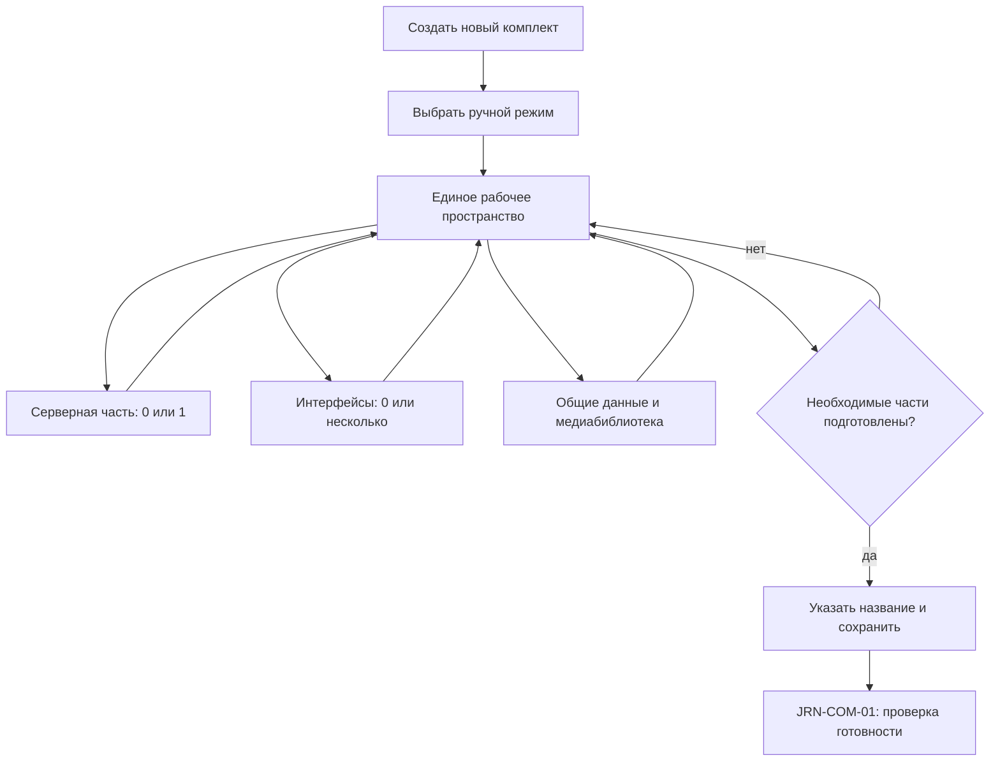

## `JRN-KIT-02 · Подготовить комплект полностью вручную`

**Актор:** инженер интегратора или другой пользователь, имеющий доступ к конфигуратору.

**Триггер:** пользователю необходимо создать новый комплект без использования мастера как основного способа сборки.

**Начальное состояние:** пользователь открыл конфигуратор; ни один комплект не выбран.

**Цель:** вручную сформировать необходимый состав комплекта — серверную часть, один или несколько пользовательских интерфейсов, устройства, теги, связи, программную логику, сценарии, стили и медиаресурсы — и сохранить результат для последующей проверки готовности.

**Граница пути:** путь начинается с выбора создания нового комплекта и ручного режима. Он охватывает свободную нелинейную сборку комплекта и заканчивается, когда пользователь считает необходимые части подготовленными и сохраняет комплект. Формальная проверка полноты и готовности выполняется отдельно в `JRN-COM-01`; публикация серверной части и назначение интерфейсов клиентам в этот путь не входят.

### Основной путь

> После создания заготовки работа не является линейным мастером. Пользователь может выполнять перечисленные действия в любом порядке, чередовать их, возвращаться к уже созданным частям и сохранять промежуточное состояние. Ограничения возникают только там, где действие требует существования связанной сущности.

| Шаг | Действие пользователя                                                                                                                                      | Реакция системы / результат                                                                                                                                                                                                                                                                             |
| --- | ---------------------------------------------------------------------------------------------------------------------------------------------------------- | ------------------------------------------------------------------------------------------------------------------------------------------------------------------------------------------------------------------------------------------------------------------------------------------------------- |
| 1   | Пользователь открывает конфигуратор, не выбирая существующий комплект.                                                                                     | Система показывает доступные действия, включая создание нового комплекта.                                                                                                                                                                                                                               |
| 2   | Пользователь выбирает создание нового комплекта.                                                                                                           | Система предлагает выбрать способ подготовки: с помощью мастера или полностью вручную.                                                                                                                                                                                                                  |
| 3   | Пользователь выбирает ручной режим.                                                                                                                        | Система создаёт пустую редактируемую заготовку комплекта с временным названием и открывает единое рабочее пространство конфигуратора.                                                                                                                                                                   |
| 4   | Пользователь создаёт серверную часть, пользовательский интерфейс, сразу обе части или несколько интерфейсов.                                               | Система не требует определённого порядка и допускает любое промежуточное сочетание. В комплекте может существовать не более одной серверной части; после её создания возможность создать ещё одну блокируется. Количество интерфейсов не ограничивается.                                                |
| 5   | Пользователь при необходимости удаляет серверную часть.                                                                                                    | Система предупреждает о последствиях и показывает зависимые сущности. После удаления снова становится доступно создание одной серверной части.                                                                                                                                                          |
| 6   | Пользователь добавляет устройство в серверную часть, выбирая доступный драйвер, и настраивает его свойства.                                                | Драйвер добавляется в комплект как отдельное устройство, изолированное от других устройств. Доступные свойства и правила их изменения определяются самим устройством и драйвером.                                                                                                                       |
| 7   | Пользователь отмечает отдельные свойства устройства как динамические данные экземпляра.                                                                    | В комплекте сохраняется указание получать фактическое значение с сервера конкретного помещения, чтобы такое значение, например IP-адрес устройства, можно было изменить без изменения комплекта.                                                                                                        |
| 8   | Пользователь настраивает теги устройства.                                                                                                                  | Состав тегов определяется самим устройством: возможны неизменяемый предопределённый набор, полностью ручное создание или смешанный вариант. В устройстве не может существовать тег, который им не описан. Перемещение тега в другое устройство запрещается.                                             |
| 9   | Пользователь добавляет устройство на основе транспортного драйвера, который сам не задаёт прикладные теги, и выбирает его тип, например поворотную камеру. | Система может добавить стандартный набор тегов выбранного типа устройства и сделать доступным готовый виджет. Связи между виджетом и устройством создаются так же, как при добавлении через мастер. Конкретные варианты определяются описанием устройства.                                              |
| 10  | Пользователь создаёт и настраивает пользовательские теги.                                                                                                  | Пользовательские теги добавляются в серверную часть и становятся доступны для связей и программной логики. Системные теги уже существуют и также доступны для связей в пределах разрешённых свойств.                                                                                                    |
| 11  | Пользователь создаёт или редактирует интерфейс.                                                                                                            | При создании нового пустого интерфейса система автоматически создаёт его первую страницу. Пользователь может добавлять остальные страницы и всплывающие окна. Ограничений на состав интерфейса нет: он может быть управляющим, информационным или временно оставаться пустым.                           |
| 12  | Пользователь добавляет элементы управления вручную либо выбирает устройство и создаёт доступный для него готовый виджет.                                   | При ручном добавлении создаётся независимый элемент. При добавлении готового виджета система размещает предусмотренный набор элементов и создаёт готовые связи с устройством.                                                                                                                           |
| 13  | Пользователь загружает изображения, иконки и шрифты.                                                                                                       | Ресурсы добавляются в общую медиабиблиотеку комплекта и становятся доступны всем его интерфейсам. Отдельных медиабиблиотек у интерфейсов нет.                                                                                                                                                           |
| 14  | Пользователь задаёт общий стиль интерфейса и при необходимости настраивает отдельные элементы.                                                             | Стиль применяется в пределах выбранного интерфейса. Его можно скопировать в другой интерфейс.                                                                                                                                                                                                           |
| 15  | Пользователь создаёт связи между элементами интерфейса, тегами устройств, пользовательскими и системными тегами.                                           | Система разрешает создать связь только между уже существующими совместимыми сущностями. Если источник или адресат отсутствует, связь создать нельзя.                                                                                                                                                    |
| 16  | Пользователь настраивает программную логику элементов и тегов интерфейса.                                                                                  | Для элемента настраиваются действия по его событиям: нажатию, удержанию, отпусканию, перемещению и другим поддерживаемым изменениям состояния. Для тега используются два разных события: изменение значения и получение значения.                                                                       |
| 17  | Пользователь создаёт сценарии и события серверной части и связывает их с другими сущностями комплекта.                                                     | Сценарии и серверные события сохраняются в единственной серверной части и исполняются только сервером. Элементы интерфейса могут инициировать предусмотренные действия.                                                                                                                                 |
| 18  | Для сложного случая пользователь создаёт JavaScript-скрипт.                                                                                                | Скрипт сохраняется как часть соответствующей серверной или клиентской логики. Типовые действия остаются доступны без JavaScript.                                                                                                                                                                        |
| 19  | Пользователь добавляет отдельное устройство с помощью мастера в уже частично подготовленный комплект.                                                      | Система запускает соответствующий фрагмент пути добавления через мастер. Мастер может добавить устройство, виджеты, связи между ними и сценарии, но не изменяет медиабиблиотеку. После завершения пользователь продолжает ручную сборку текущего комплекта.                                             |
| 20  | Пользователь копирует сущности внутри текущего комплекта.                                                                                                  | Доступные зависимости копируются вместе с выбранными сущностями. При совпадении имён система автоматически добавляет числовой суффикс. Пользователь может одной командой удалить все связи у скопированных сущностей.                                                                                   |
| 21  | Пользователь создаёт дополнительный интерфейс копированием ранее созданного либо полностью клонирует его.                                                  | Частичное копирование переносит выбранные части. Полное клонирование без исключений переносит структуру, страницы, всплывающие окна, стили, элементы, программную логику и связи. Новая пустая первая страница при клонировании не создаётся. Ссылки на общую медиабиблиотеку остаются действительными. |
| 22  | Пользователь удаляет сущность, которая используется в связях, сценариях или программной логике.                                                            | Система показывает зависимые сущности и предупреждает о последствиях. Связанные данные не удаляются молча. Конкретные варианты разрешения зависимостей определяет аналитик.                                                                                                                             |
| 23  | Пользователь запускает быстрый просмотр выбранного интерфейса, в том числе незавершённого.                                                                 | Целевое поведение — запуск фактического клиента из конфигуратора без отдельной авторизации, с доступом к системным настройкам клиента. Технически поддерживаемый объём поведения определяется аналитиком и техническим лидером.                                                                         |
| 24  | В перспективе пользователь запускает отдельную проверку сценария во время сборки.                                                                          | Система выполняет сценарий в доступной среде и показывает результат. Возможность относится к будущему развитию и не заменяет `JRN-COM-01`.                                                                                                                                                              |
| 25  | Пользователь вручную запускает очистку неиспользуемых данных.                                                                                              | Система анализирует комплект, включая JavaScript, и показывает полный список предлагаемых к удалению сущностей и медиаресурсов, которые увеличивают размер комплекта или нагрузку на сервер либо клиент. Пользователь выбирает, что удалить, и подтверждает очистку.                                    |
| 26  | Пользователь заполняет общие данные комплекта: описание, сведения об авторах и другие предусмотренные метаданные; при необходимости задаёт защиту.         | Все параметры, кроме названия, необязательны. Защиту может настроить любой пользователь с доступом к конфигуратору. Она начинает действовать при следующем открытии комплекта и не ограничивает текущую сессию.                                                                                         |
| 27  | Пользователь в любой момент задаёт название и сохраняет комплект.                                                                                          | При наличии названия система сохраняет текущее состояние, даже если оно неполное. Без названия сохранение блокируется и система предлагает его указать. Пользователь может прервать работу и позднее продолжить с последнего сохранённого состояния.                                                    |
| 28  | Завершив необходимые ему части, пользователь сохраняет комплект.                                                                                           | Комплект считается подготовленным вручную и доступен для отдельной проверки готовности по `JRN-COM-01`. Само сохранение не означает, что такая проверка пройдена.                                                                                                                                       |

#### Правила нелинейной работы

- Действия после входа в ручной режим не образуют обязательную последовательность.
- Пользователь может многократно переходить между серверной частью, интерфейсами, медиабиблиотекой, связями, сценариями, стилями и метаданными.
- Интерфейс конфигуратора должен позволять выполнять максимально возможное количество связанных действий в одном рабочем пространстве и открывать основной функционал не более чем за одно-два действия.
- Создание зависимой сущности доступно только при наличии необходимых исходных сущностей. Например, связь нельзя создать без источника и адресата.
- Отсутствие серверной части или интерфейсов не блокирует промежуточное сохранение и само по себе не ограничивает возможный состав комплекта.
- В комплекте может быть не более одной серверной части и неограниченное количество пользовательских интерфейсов.

### Визуализация

### Результат

- Создан и сохранён новый комплект, подготовленный преимущественно вручную.
- Комплект может содержать одну серверную часть и любое количество пользовательских интерфейсов; отсутствие одной из этих частей не блокирует сохранение.
- Все сохранённые части остаются полностью редактируемыми.
- Пользователь самостоятельно решил, что необходимый ему состав подготовлен.
- Формальная готовность комплекта ещё не подтверждена; следующим самостоятельным путём может быть `JRN-COM-01`.

### Связанные пути

- `JRN-KIT-01` — подготовка типового комплекта с помощью мастера; отдельный фрагмент этого пути может использоваться для добавления устройства в уже создаваемый комплект.
- `JRN-KIT-03` — подготовка комплекта без доступа к полному набору оборудования.
- `JRN-DRV-02` — установка или обновление конфигурационного драйвера, если необходимого драйвера нет среди доступных.
- `JRN-COM-01` — формальная проверка готовности комплекта перед вводом в работу.
- `JRN-COM-02` — последующая публикация серверной части.
- `JRN-PNL-01` — подключение клиентов и назначение им интерфейсов.
- `JRN-CHG-01` — последующее изменение уже созданного комплекта и публикация его новой версии.
- Копирование сущностей между разными комплектами требует отдельной проработки; оно не описывается как часть текущего пути.

### Открытые вопросы / гипотезы

1. **Автоматическое сохранение.** Возможность предусмотрена требованиями, однако точный механизм, периодичность и ограничения определяют аналитик и технический лидер с учётом ресурсов контроллера. Независимо от решения пользователь должен иметь возможность прервать работу и продолжить её без потери последнего сохранённого состояния.
2. **Динамические данные экземпляра.** Требуется определить полный перечень свойств, которые могут храниться на уровне сервера вне комплекта, правила задания значений по умолчанию и поведение при обычном вводе в работу, масштабировании, переносе и восстановлении.
3. **Варианты устройств и тегов.** Аналитик должен определить контракт, по которому устройство объявляет предопределённые теги, возможность их ручного добавления, стандартные наборы по типу устройства и доступность готовых виджетов. Обязательное правило: устройство не может содержать не описанные им теги, а тег нельзя переместить между разными устройствами.
4. **Добавление через мастер.** Детальный путь и обработка сложностей остаются в `JRN-KIT-01`. Для текущего пути требуется определить только способ запуска мастера из уже созданного комплекта и корректное возвращение в ручное рабочее пространство.
5. **Копирование между комплектами.** Отдельно определить доступные для копирования сущности, перенос зависимостей, работу с отсутствующими сущностями, идентификаторами, медиаресурсами и защищёнными частями исходного комплекта.
6. **Удаление зависимых сущностей.** Требуется определить варианты, которые система предлагает после показа зависимостей: отменить удаление, удалить выбранную сущность с очисткой связей либо выполнить другое предусмотренное действие.
7. **Быстрый просмотр.** Аналитик и технический лидер должны проверить возможность запуска фактического клиента внутри конфигуратора без отдельной авторизации, определить способ передачи незавершённого интерфейса, доступные системные настройки клиента, взаимодействие с серверной частью и оборудованием, а также ограничения такого режима.
8. **Проверка сценариев во время сборки.** Возможность запланирована на будущее. Нужно определить поддерживаемую среду, допустимые действия с реальным оборудованием и отличие от общей проверки готовности.
9. **Очистка комплекта.** Аналитик определяет полный перечень проверяемых сущностей, правила обнаружения косвенных зависимостей и JavaScript-ссылок, а также поведение в случаях, когда использование нельзя определить однозначно.
10. **Права и защита.** На текущем уровне защиту может задать любой пользователь с доступом к конфигуратору; отдельных системных ролей инженера и ведущего интегратора нет. Аналитик должен определить конкретное право доступа, механизм установки и снятия защиты и поведение при следующем открытии комплекта.
11. **Метаданные.** Требуется определить полный состав необязательных данных комплекта, кроме обязательного названия.
12. **Гипотеза интерфейса.** Серверная часть, интерфейсы, связи, программная логика и свойства выбранной сущности должны быть доступны в одном рабочем контексте либо открываться не более чем за одно-два действия. Конкретная компоновка определяется при проектировании интерфейса.

### Связанные требования и сценарии

- `FR-PRJ-01` — конфигурирование серверной и клиентских частей через веб-интерфейс.
- `FR-PRJ-02` — ручный режим, добавление готового устройства и мастер готового помещения.
- `FR-PRJ-03` — автоматическое добавление драйвера, элементов управления и связей при использовании готового устройства.
- `FR-PRJ-04` — проверка полноты конфигурации до запуска; реализуется связанным путём `JRN-COM-01`.
- `FR-PRJ-05` — повторное использование и перенос подготовленных частей.
- `FR-PRJ-07`, `FR-PRJ-09` — настройка интерфейсов и общих стилей.
- `FR-PRJ-10` — стартовые состояния и значения по умолчанию.
- `FR-PRJ-12` — защита комплекта и авторских наработок.
- `FR-VAR-01…07` — теги устройств, пользовательские и системные теги, связи и преобразования.
- `FR-AUT-01…10` — серверные сценарии, события, правила и JavaScript-расширения.
- `FR-DRV-01…05` — добавление, изоляция, описание возможностей и совместимость драйверов.
- `PRJ-02` — создание с добавлением готовых устройств.
- `PRJ-03` — создание полностью вручную.
- `PRJ-04` — свободное редактирование после создания.
- `PRJ-05` — настройка интерфейсов, стилей и предварительного просмотра.
- `PRJ-06` — проверка готовности.
- `PRJ-09` — импорт, экспорт и перенос частей конфигурации.
- `PRJ-11` — защита комплекта от копирования и редактирования.
- `AUT-01`, `AUT-02`, `AUT-04` — создание и проверка сценариев, использование JavaScript для сложной логики.
- `DRV-02` — установка или обновление отсутствующего конфигурационного драйвера.
