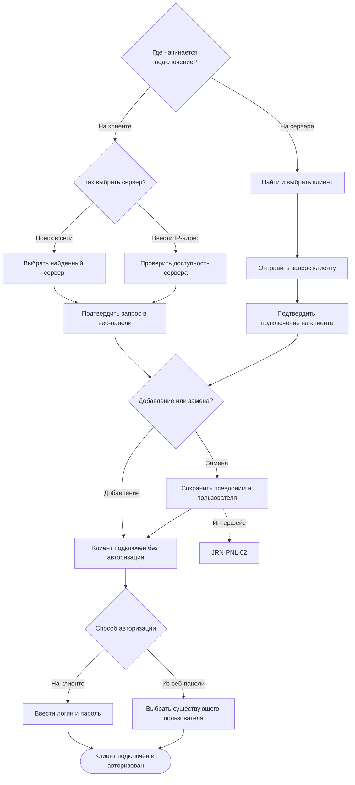

# JRN-PNL-01 · Подключить клиент к серверу

**Актор:** инженер интегратора или IT-администратор с правом подключения клиентов. В зависимости от выбранного способа актор работает в веб-панели сервера, на клиенте либо последовательно в обоих интерфейсах.

**Триггер:** необходимо подключить к серверу первый или дополнительный клиент либо заменить ранее подключённый клиент.

**Начальное состояние:** сервер доступен в сети. На клиентском устройстве запущена оболочка AV Control. Для авторизации можно использовать любую существующую учётную запись; отдельный клиентский пользователь не является обязательным предусловием.

**Цель:** установить связь клиента с сервером, авторизовать на клиенте существующего пользователя и увидеть подключённый авторизованный клиент в веб-панели.

**Граница пути:** путь начинается с поиска сервера на клиенте либо поиска клиента в веб-панели и заканчивается успешной авторизацией пользователя на подключённом клиенте. Подключение и авторизация являются последовательными этапами одного пути. Состояние без авторизации допустимо между этапами и при смене пользователя, но не считается успешным результатом первоначального подключения. Создание пользователей и назначение ролей относятся к `JRN-MNT-01`. Выбор, установка и запуск интерфейса относятся к `JRN-PNL-02`. Удаление связи с клиентом относится к `JRN-PNL-03`.

---

## Основной путь

| Шаг | Действие пользователя | Реакция системы / результат |
|---|---|---|
| 1 | Пользователь выбирает, откуда начать подключение: с клиента или из веб-панели сервера. | Система предоставляет два равноправных способа начать подключение одного клиента. Групповое подключение в текущем объёме не предусматривается. |
| 2 | Если подключение начинается с клиента, пользователь открывает настройки подключения и выбирает способ поиска сервера: автоматический поиск в сети или ручной ввод IP-адреса. | Клиент запускает поиск доступных серверов либо предоставляет поле для ввода адреса. |
| 3 | При автоматическом поиске пользователь выбирает сервер из списка. При ручной настройке вводит IP-адрес сервера. | После ручного ввода клиент проверяет доступность сервера. Если сервер недоступен, пользователь видит причину и может исправить адрес или повторить попытку. Если сервер доступен, он становится выбранным. Способ технической проверки доступности определяет системный аналитик. |
| 4 | Пользователь отправляет с клиента запрос на подключение к выбранному серверу. | В веб-панели появляется входящий запрос со сведениями, достаточными для идентификации клиента. Авторизация на клиенте недоступна до подтверждения подключения. |
| 5 | Инженер интегратора или IT-администратор просматривает запрос в веб-панели и выбирает: добавить новый клиент либо заменить существующий. | При добавлении система готовит новую связь. При замене интерфейс показывает новый и заменяемый клиенты и предупреждает о последствиях. Старый клиент может быть недоступен и не участвует в подтверждении. |
| 6 | Пользователь подтверждает подключение или замену в веб-панели либо отклоняет запрос. | После подтверждения связь устанавливается, и клиент переходит в состояние «Подключён, не авторизован». После отклонения связь не создаётся, а клиент получает сообщение об отказе. |
| 7 | Если подключение начинается с сервера, пользователь открывает раздел управления клиентами и запускает поиск. | Веб-панель показывает найденные в сети клиенты и сведения для их идентификации. |
| 8 | Пользователь выбирает один клиент, указывает, нужно ли добавить его или заменить существующий, и отправляет запрос на подключение. | На выбранном клиенте появляется запрос на подтверждение. При замене веб-панель также показывает новый и заменяемый клиенты и предупреждает о последствиях. |
| 9 | В основном варианте пользователь подтверждает подключение на клиенте. | После подтверждения связь устанавливается, и клиент переходит в состояние «Подключён, не авторизован». Возможность подключения без подтверждения на клиенте для сервера с соответствующими правами остаётся открытым вопросом. |
| 10 | Пользователь выбирает способ авторизации: ввод данных на клиенте или удалённая авторизация из веб-панели. | Клиент остаётся подключённым, но предоставляет только ограниченные функции до завершения авторизации. |
| 11 | При авторизации на клиенте пользователь вводит логин и пароль существующей учётной записи. | Сервер проверяет учётные данные. При ошибке клиент показывает причину и позволяет повторить ввод. При успешной проверке дополнительное подтверждение в веб-панели не требуется. |
| 12 | При удалённой авторизации пользователь выбирает подключённый клиент и существующего пользователя в веб-панели, затем запускает авторизацию. | Если на клиенте нет активной пользовательской сессии, выбранный пользователь авторизуется. Создание новой учётной записи из этого шага недоступно. |
| 13 | Если на клиенте уже авторизован другой пользователь, пользователь просматривает предупреждение и подтверждает либо отменяет смену учётной записи. | После подтверждения текущая сессия завершается и выбранный пользователь авторизуется. После отмены текущая сессия сохраняется без изменений. |
| 14 | Пользователь просматривает результат авторизации. | Веб-панель показывает активное соединение, подключённый клиент и авторизованного на нём пользователя. Пользователь с правом деплоя получает доступ ко всем интерфейсам комплекта. Клиентский пользователь видит только интерфейсы, доступ к которым ему предоставлен. |
| 15 | Если выполнялась замена клиента, пользователь завершает этап подключения. | Новый клиент сохраняет псевдоним заменённого клиента, его связь с сервером и назначенного пользователя. Для загрузки и запуска прежнего интерфейса путь продолжается по `JRN-PNL-02` с уже выбранными клиентом и интерфейсом. |
| 16 | Если необходимо сменить пользователя без удаления связи, пользователь завершает текущую сессию с клиента или из веб-панели, а затем повторяет авторизацию. | После выхода клиент остаётся подключённым и временно переходит в состояние без авторизации с ограниченными функциями. Для нового пользователя повторяются шаги авторизации без повторного подключения клиента. |

## Визуализация

---

## Результат

- один клиент подключён к серверу и отображается в веб-панели;
- на клиенте авторизован существующий пользователь;
- веб-панель показывает состояние соединения и авторизованного пользователя;
- доступный пользователю список интерфейсов определяется его правами;
- при замене новый клиент сохраняет псевдоним и назначенного пользователя прежнего клиента;
- интерфейс на клиент в рамках этого пути не устанавливается;
- после выхода пользователя клиент сохраняет связь с сервером и работает с ограниченными функциями до следующей авторизации.

---

## Связанные пути

- `JRN-COM-02` — деплой серверной части комплекта;
- `JRN-PNL-02` — выбор, загрузка, установка и запуск интерфейса на подключённом клиенте;
- `JRN-PNL-03` — удаление связи с клиентом;
- `JRN-MNT-01` — создание пользователей, назначение ролей и управление правами доступа.

---

## Открытые вопросы / гипотезы

1. **Подключение по инициативе сервера без подтверждения на клиенте.** Определить, может ли сервер с соответствующими правами подключить найденный клиент без ручного подтверждения на клиенте. **Владелец:** не определён. **Влияет на:** шаг 9 и требования к предупреждениям в клиентской оболочке.

2. **Функции клиента без авторизации.** Определить набор функций, доступных на подключённом клиенте до входа пользователя и после завершения его сессии. **Владелец:** менеджер продукта. **Влияет на:** состояние клиента между подключением и авторизацией, а также при смене пользователя.

---

## Связанные требования и сценарии

- `FR-ROOM-01`, `FR-ROOM-02` — клиентская оболочка и режим киоска;
- `FR-ROOM-03` — связь клиента с сервером;
- `FR-ROOM-08` — авторизация пользователя на клиенте и доступ только к разрешённым интерфейсам;
- `PNL-01` — подключение клиента к серверу;
- `PNL-03` — замена клиента;
- `FL-PNL-LIFECYCLE` — подключение, авторизация и замена клиента.

---
