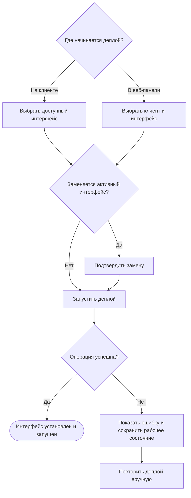

# JRN-PNL-02 · Деплой или обновление интерфейса на подключённом клиенте

**Актор:** пользователь, авторизованный на клиенте и имеющий доступ хотя бы к одному интерфейсу активного комплекта; инженер интегратора или IT-администратор, выполняющий деплой из веб-панели сервера. Пользователь с правом деплоя серверной части имеет доступ ко всем интерфейсам активного комплекта.

**Триггер:** необходимо впервые установить интерфейс на подключённый клиент, обновить установленный интерфейс либо повторно установить его после замены клиента.

**Начальное состояние:** клиент подключён к серверу, на клиенте существует активная пользовательская сессия. На сервере запущена серверная часть активного комплекта. На клиенте может отсутствовать интерфейс либо может быть установлен и запущен один активный интерфейс.

**Цель:** выбрать доступный интерфейс активного комплекта, установить его на клиент и автоматически запустить без отдельного действия пользователя.

**Граница пути:** путь начинается с открытия списка интерфейсов на клиенте либо выбора клиента в веб-панели. Путь заканчивается автоматическим запуском установленного интерфейса или сообщением о неудаче с отображением фактического состояния клиента. Подключение клиента и авторизация пользователя относятся к `JRN-PNL-01`. Деплой серверной части относится к `JRN-COM-02`. Автоматическое обновление без действия пользователя, массовый деплой, скачивание без установки и ручная очистка сохранённых интерфейсов в путь не входят.

**Термин:** деплой интерфейса — единая для пользователя операция, которая включает загрузку, установку и запуск интерфейса на клиенте.

---

## Основной путь

| Шаг | Действие пользователя | Реакция системы / результат |
|---|---|---|
| 1 | Пользователь выбирает, откуда начать деплой: с клиента или из веб-панели сервера. | Система предоставляет два способа установить или обновить интерфейс на одном подключённом клиенте. |
| 2 | Если путь начинается с клиента, пользователь открывает список доступных интерфейсов. | Клиент показывает интерфейсы активного комплекта, доступные авторизованному пользователю. Текущий активный интерфейс и доступное для него обновление визуально обозначаются в списке. Пользователь с правом деплоя серверной части видит все интерфейсы активного комплекта. Клиентский пользователь видит только интерфейсы, к которым ему предоставлен доступ. |
| 3 | Если список доступных интерфейсов пуст, пользователь завершает путь. | Клиент сообщает, что для текущего пользователя нет доступных интерфейсов. Установка не начинается. |
| 4 | Пользователь выбирает интерфейс и запускает его установку или обновление. | Клиент показывает выбранный интерфейс и готовит единую операцию загрузки и установки. Пользователю не требуется отдельно скачивать, а затем устанавливать интерфейс. |
| 5 | Если путь начинается из веб-панели, пользователь открывает раздел управления клиентами и выбирает один подключённый клиент с активной пользовательской сессией. | Веб-панель показывает сведения, необходимые для выбора: клиент, авторизованный пользователь, активный интерфейс и наличие доступного обновления. |
| 6 | Пользователь открывает список интерфейсов для выбранного клиента. | Веб-панель показывает интерфейсы активного комплекта. Пользователь с правом деплоя серверной части имеет доступ ко всему списку независимо от прав пользователя, авторизованного на клиенте. |
| 7 | Пользователь выбирает интерфейс и запускает его установку или обновление на клиенте. | Веб-панель показывает выбранные клиент и интерфейс и готовит единую операцию загрузки и установки. |
| 8 | Если операция заменяет активный интерфейс или его установленную версию, пользователь просматривает предупреждение и подтверждает либо отменяет действие. | Предупреждение однозначно называет клиент, текущий интерфейс и интерфейс, который будет установлен. После отмены состояние клиента не изменяется. После подтверждения операция продолжается. |
| 9 | Пользователь ожидает завершения операции. | В интерфейсе, из которого начат деплой, отображается общий ход загрузки, установки и запуска без раскрытия внутренних операций. На клиенте отображается состояние, объясняющее временную недоступность рабочего интерфейса. |
| 10 | Если во время операции потеряно соединение с клиентом, пользователь просматривает уведомление и ожидает восстановления связи. | Автоматическое продолжение не выполняется. После восстановления связи интерфейс показывает фактическое состояние клиента, а пользователь может вручную повторить деплой. |
| 11 | Если загрузка, установка или запуск не завершились успешно, пользователь просматривает сообщение об ошибке. | Сообщение указывает этап и причину проблемы, если причину можно определить. Если до начала операции на клиенте работал интерфейс, он восстанавливается и остаётся активным. Пользователь может повторить деплой. Ошибка остаётся доступной после исчезновения временного уведомления. |
| 12 | Если операция завершилась успешно, пользователь ожидает запуска интерфейса. | Установленный интерфейс автоматически становится активным и запускается. Дополнительное подтверждение результата не требуется. |
| 13 | Пользователь просматривает итоговое состояние на клиенте или в веб-панели. | Клиент показывает запущенный интерфейс. Веб-панель показывает активное соединение, авторизованного пользователя и активный интерфейс клиента. |

Если настройка удаления неиспользуемых интерфейсов выключена, предыдущий интерфейс сохраняется на клиенте после успешной установки нового. Настройка выключена по умолчанию. Если настройка включена, предыдущий интерфейс удаляется после успешной установки нового. Изменение настройки и ручная очистка относятся к отдельным пользовательским путям.

## Визуализация

Схема показывает две точки входа и общий результат деплоя одного интерфейса на один клиент.

---

## Результат

- на клиенте установлен и автоматически запущен выбранный интерфейс активного комплекта;
- одновременно активен один интерфейс;
- веб-панель показывает подключённый клиент, авторизованного пользователя и активный интерфейс;
- отдельное подтверждение успешного запуска не требуется;
- при неудаче ранее работавший интерфейс восстановлен и остаётся активным; если интерфейса не было, клиент остаётся без активного интерфейса;
- пользователь видит причину неудачи и может вручную повторить деплой;
- сохранение предыдущего интерфейса после успешной установки определяется настройкой удаления неиспользуемых интерфейсов.

---

## Связанные пути

- `JRN-COM-02` — деплой серверной части активного комплекта;
- `JRN-PNL-01` — подключение клиента к серверу и авторизация пользователя;
- `JRN-PNL-03` — удаление связи с клиентом;
- `JRN-MNT-01` — управление пользователями, правами на установку и доступом к интерфейсам.

---

## Открытые вопросы / гипотезы

1. **Интерфейсы вне активного комплекта.** Рассмотреть возможность установки интерфейса из другого сохранённого комплекта для специальных случаев. Решение должно учитывать совместимость интерфейса с активной серверной частью. **Владелец:** не определён. **Влияет на:** состав списка интерфейсов и предупреждения перед установкой.

2. **Скачивание без установки.** Рассмотреть отдельное действие, которое сохраняет интерфейс на клиенте без установки и запуска. В текущем пути загрузка и установка остаются одной пользовательской операцией. **Владелец:** не определён. **Влияет на:** действия в списке интерфейсов и отображение сохранённых интерфейсов.

3. **Массовый деплой.** Проработать выбор и установку интерфейсов сразу на несколько клиентов. Функция планируется, но срок её включения в дорожную карту не определён. **Владелец:** не определён. **Влияет на:** выбор клиентов, подтверждение операции, общий прогресс и представление ошибок по каждому клиенту.

4. **Автоматическое обновление.** Проработать отдельный системный сценарий автоматического обновления интерфейса без действия пользователя. Сценарий не является частью текущего пользовательского пути. **Владелец:** не определён. **Влияет на:** уведомления, правила запуска обновления и отображение результата в веб-панели и на клиенте.

---

## Связанные требования и сценарии

- `FR-ROOM-03` — загрузка интерфейса с сервера и отображение состояний оборудования;
- `FR-ROOM-08` — авторизация пользователя на клиенте и доступ только к разрешённым интерфейсам;
- `FR-PRJ-11` — один активный серверный компонент на сервере и один активный интерфейс на клиенте;
- `PNL-01` — подключение клиента и первоначальная загрузка интерфейса;
- `PNL-02` — обновление интерфейса на клиенте;
- `PNL-03` — замена клиента и повторная загрузка интерфейса;
- `FL-PNL-LIFECYCLE` — подключение клиента, загрузка интерфейса и последующие обновления.

---
