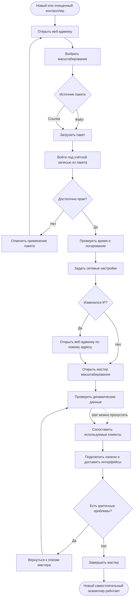

# JRN-SCL-01 · Создать новый самостоятельный экземпляр на новом контроллере

**Актор:** инженер интегратора или IT-администратор. Ведущий интегратор может участвовать, если для использования комплекта или защищённых наработок требуются его права.

**Триггер:** необходимо создать новый самостоятельный контроллер/помещение на основе существующего комплекта без изменения самого комплекта.

**Начальное состояние:** сервер AV Control запущен, веб-админка доступна в режиме первого запуска, пользователь не авторизован, имеется пакет масштабирования существующего экземпляра.

**Цель:** с минимальным количеством ручных действий создать на новом или очищенном контроллере самостоятельный экземпляр системы, переиспользовав комплект, пользователей, роли, данные клиентов и другие доступные данные исходного экземпляра.

**Граница пути:** путь начинается с открытия веб-админки нового или очищенного контроллера и заканчивается полностью работающим самостоятельным экземпляром системы. Исходный контроллер, исходный экземпляр и сам комплект в рамках этого пути не изменяются.

---

## Основной путь

| Шаг | Действие пользователя                                                                                                                                                                                                                                           | Реакция системы / результат                                                                                                                                                                                                                                                                                                                                                                                                                                            |
| --- | --------------------------------------------------------------------------------------------------------------------------------------------------------------------------------------------------------------------------------------------------------------- | ---------------------------------------------------------------------------------------------------------------------------------------------------------------------------------------------------------------------------------------------------------------------------------------------------------------------------------------------------------------------------------------------------------------------------------------------------------------------- |
| 1   | Пользователь открывает в браузере веб-админку сервера по `IP:PORT`.                                                                                                                                                                                             | Система определяет состояние первого запуска и показывает стартовый экран.                                                                                                                                                                                                                                                                                                                                                                                             |
| 2   | Пользователь выбирает **масштабирование на новом контроллере** вместо создания новой системы с нуля или восстановления существующей системы.                                                                                                                    | Система сообщает, что будет создан новый самостоятельный экземпляр, а исходный экземпляр и комплект не изменятся, и предлагает указать источник пакета масштабирования.                                                                                                                                                                                                                                                                                                |
| 3   | Пользователь выбирает пакет масштабирования: загружает локальный файл или указывает ссылку на пакет во внешнем хранилище.                                                                                                                                       | Система загружает пакет. Если пакет невозможно использовать, пользователь получает понятное сообщение и может выбрать другой пакет или выйти из пути масштабирования.                                                                                                                                                                                                                                                                                                  |
| 4   | Пользователь переходит к авторизации и видит, какие роли или права позволяют продолжить масштабирование. Затем вводит логин и пароль учётной записи, содержащейся в пакете.                                                                                     | Система использует перенесённую из пакета ролевую систему и предоставляет дальнейшие действия только пользователю с достаточными правами. Первый администратор заново не создаётся.                                                                                                                                                                                                                                                                                    |
| 5   | Пользователь подтверждает вход.                                                                                                                                                                                                                                 | При успешной авторизации система продолжает применение пакета. Если учётные данные неверны или прав недостаточно, пользователь получает причину. При выходе из авторизации или невозможности продолжить система отменяет применение пакета и возвращает контроллер в состояние первого запуска.                                                                                                                                                                        |
| 6   | Пользователь проверяет дату, время, часовой пояс и связанные параметры и при необходимости изменяет их для нового контроллера.                                                                                                                                  | Система подставляет значения из пакета и сохраняет подтверждённые или изменённые параметры.                                                                                                                                                                                                                                                                                                                                                                            |
| 7   | Пользователь проверяет параметры системы логирования и при необходимости изменяет их.                                                                                                                                                                           | Система подставляет значения из пакета и сохраняет подтверждённые или изменённые параметры.                                                                                                                                                                                                                                                                                                                                                                            |
| 8   | Пользователь задаёт сетевые настройки нового контроллера. Если в пакете сохранён статический IP-адрес, пользователь должен явно указать сетевые параметры нового контроллера; сохранённый статический адрес не применяется автоматически.                       | Система применяет сетевые настройки. Если в результате меняется IP-адрес, дальнейшее продолжение работы выполняется по тому же принципу, что и в `JRN-ACC-01`. Система сохраняет состояние незавершённого масштабирования.                                                                                                                                                                                                                                          |
| 9   | При смене IP-адреса пользователь открывает веб-админку по новому адресу.                                                                                                                                                                                        | Система возвращает пользователя к следующему незавершённому шагу масштабирования. Пользователю не требуется повторно загружать пакет или начинать путь сначала.                                                                                                                                                                                                                                                                                                        |
| 10  | Пользователь попадает в веб-админку, где автоматически открыт мастер масштабирования.                                                                                                                                                                           | Пользователь уже авторизован. Мастер показывает этапы приведения нового экземпляра к рабочему состоянию, их текущее состояние и обнаруженные проблемы. До завершения мастера пользователь может возвращаться к предыдущим этапам и исправлять введённые данные.                                                                                                                                                                                                        |
| 11  | Пользователь при необходимости проверяет и задаёт динамические данные нового экземпляра: адреса оборудования и клиентов, используемые помещения и другие данные, относящиеся только к этому серверу. После этого пользователь развёртывает комплект на сервере. | Система подставляет доступные данные из пакета. Шаг является необязательным, но рекомендуемым: пользователь может продолжить с перенесёнными значениями, если считает их подходящими. Пользователь не обязан задавать данные для помещений, оборудования или клиентов, которые не используются в новом экземпляре. Отсутствие таких данных не должно требовать изменения самого комплекта и не должно создавать тупик для пользователя без прав на его редактирование. |
| 12  | Пользователь переходит к сопоставлению клиентов. Для каждого используемого клиента из пакета он выбирает соответствующую физическую панель или другое клиентское устройство, доступное в сети.                                                                  | Система показывает сведения, перенесённые из пакета: ожидаемые клиенты, используемые на них учётные записи и назначенные активные интерфейсы. Пользователь видит результат сопоставления по каждому клиенту. Один клиент получает один активный интерфейс. Неиспользуемые в новом экземпляре клиенты не требуют сопоставления.                                                                                                                                         |
| 13  | Пользователь подтверждает сопоставление и запускает подключение клиентов.                                                                                                                                                                                       | Доступные панели подключаются к новому серверу, проходят предусмотренную авторизацию и получают назначенные им интерфейсы. Мастер показывает состояние каждого клиента и позволяет повторить действие для клиента, который не был подключён или настроен.                                                                                                                                                                                                              |
| 14  | Пользователь просматривает итоговое состояние нового экземпляра и при необходимости возвращается к предыдущим этапам мастера для исправления данных, сопоставлений или других обнаруженных проблем.                                                             | Система обновляет состояние готовности по мере выполнения действий. Результаты этапов и оставшиеся проблемы сохраняются, поэтому пользователь может выйти из веб-админки и позднее продолжить незавершённое масштабирование.                                                                                                                                                                                                                                           |
| 15  | Пользователь завершает мастер после устранения критичных проблем и проверки работы комплекта, оборудования и используемых клиентов.                                                                                                                             | Мастер закрывается. Новый контроллер выходит из процесса масштабирования и работает как самостоятельный экземпляр системы. Возврат к этапам завершённого мастера больше недоступен; дальнейшие изменения выполняются через соответствующие функции веб-админки.                                                                                                                                                                                                        |

## Визуализация

---

## Результат

- на новом или очищенном контроллере создан новый самостоятельный экземпляр системы;
- исходный контроллер, исходный экземпляр и сам комплект не изменены;
- комплект, пользователи, роли, сведения о клиентах, назначенные интерфейсы и другие доступные данные переиспользованы из пакета масштабирования;
- первый администратор заново не создавался, пользователь вошёл через перенесённую ролевую систему;
- сетевые параметры нового контроллера заданы без автоматического применения сохранённого статического IP-адреса;
- для нового экземпляра определены используемые помещения, оборудование и клиенты без обязательного заполнения данных отсутствующих элементов;
- используемые физические клиенты сопоставлены с клиентами из пакета и получили назначенные интерфейсы;
- критичные проблемы устранены, комплект запущен, а новый экземпляр приведён к полностью рабочему состоянию;
- после завершения мастера дальнейшие изменения выполняются через обычные функции веб-админки.

---

## Связанные пути

- `JRN-ACC-01` — создание новой системы с нуля;
- `JRN-ACC-02` — восстановление существующей системы при первом доступе;
- `JRN-ACC-04` — последующие входы в настроенный контроллер;
- `JRN-SCL-02` — масштабирование существующего комплекта на уже инициализированный контроллер;
- `JRN-DEP-01` — развёртывание комплекта на сервере;
- `JRN-PNL-01` — подключение и авторизация клиента на сервере.
- `JRN-PNL-02` — деплой или обновление интерфейса на подключённом клиенте.
- `JRN-SUP-01` — диагностика проблемы, если возникший конфликт требует отдельного разбора.

---

## Открытые вопросы / гипотезы

Следующие вопросы не меняют утверждённый пользовательский путь. Они фиксируются как задел для системного аналитика при проектировании пакета и механизмов масштабирования.

1. **Пакет масштабирования:** определить его формат, состав и отличие от резервной копии. Пакет должен содержать данные, необходимые для описанного пользовательского пути, но не должен превращать масштабирование в восстановление исходного экземпляра.
2. **Применение пакета:** определить, какие данные можно использовать до авторизации и в какой момент пакет начинает изменять состояние контроллера. Пользовательский результат остаётся неизменным: при невозможности авторизоваться или продолжить путь контроллер возвращается в состояние первого запуска.
3. **Права пользователя:** определить конкретные роли или отдельное право, позволяющее создать новый экземпляр из пакета. Допустимые роли или требования к правам должны быть явно указаны на странице авторизации.
4. **Неуспешная авторизация:** определить количество допустимых попыток, возможность выбрать другую учётную запись и условия отмены применения пакета с учётом требований защиты от перебора паролей.
5. **Сетевые настройки:** определить, как показывать сохранённый статический IP-адрес и допускается ли его применение после явного подтверждения пользователя. По умолчанию он не должен переноситься на новый контроллер автоматически.
6. **Продолжение после смены IP:** определить способ возврата пользователя в незавершённый мастер и сохранения авторизации. Если сессию невозможно перенести на новый адрес, повторная авторизация не должна приводить к потере прогресса или повторной загрузке пакета.
7. **Развёртывание комплекта:** определить, на каком этапе комплект импортируется, развёртывается и запускается, а также какие действия повторяются после возврата пользователя к предыдущим этапам мастера.
8. **Динамические данные экземпляра:** определить их полный состав, способ отделения от комплекта и правила обработки элементов исходной конфигурации, которые не используются в новом экземпляре.
9. **Сопоставление клиентов:** определить способ обнаружения физических клиентов в сети и представление сопоставления клиентских устройств, учётных записей и интерфейсов в мастере.
10. **Подготовка клиентов:** определить необходимые условия для удалённого подключения панели: установленное клиентское приложение, подключение к сети, режим ожидания подключения и другие требования.
11. **Авторизация клиентов:** определить безопасный способ удалённой авторизации панелей без раскрытия пользователю сохранённых паролей и без повторной ручной настройки каждой панели.
12. **Критерий завершения:** определить, какие проблемы блокируют завершение мастера, а какие допускают ввод экземпляра в работу с предупреждением. Отсутствующие и явно неиспользуемые в новом экземпляре помещения, оборудование и клиенты не должны считаться ошибкой.
13. **Возврат внутри мастера:** определить последствия изменения уже применённых данных, включая повторное развёртывание комплекта, изменение сопоставления клиента и повторную доставку интерфейса. До завершения мастера пользователь должен иметь возможность вернуться к этапу, не теряя остальной прогресс.

---

## Связанные требования и сценарии

- `FR-PRJ-06` — перенос конфигурации между объектами;
- `FR-ROOM-03` — загрузка клиентом интерфейса с сервера и отображение состояния оборудования;
- `FR-ROOM-08` — авторизация пользователя на клиенте и доступ только к разрешённым интерфейсам;
- `FR-MON-01` — отображение состояния сервера, клиентов, устройств, драйверов и сценариев;
- `FR-SEC-01` — обязательная аутентификация доступа к веб-интерфейсу;
- `FR-SEC-03` — защита от перебора паролей;
- `FR-SEC-04` — ролевая модель и управление пользователями;
- `FR-ADM-03` — настройка даты, времени, часового пояса и синхронизации времени;
- `FR-ADM-04` — настройка контроллера для работы в корпоративной сети;
- `FR-ADM-06` — подключение, мониторинг и управление клиентами;
- `FR-ADM-07` — доставка интерфейсов на клиенты через сервер;
- `FR-LIC-03` — ограничения области применения по числу устройств, помещений и клиентов;
- `PNL-01` — подключение панели/клиента и загрузка интерфейса;
- `PNL-04` — согласованное состояние нескольких панелей одного помещения;
- `SEC-01` — управление пользователями и ролями, включая пользователей для панелей;
- `FL-PNL-LIFECYCLE` — подключение панели, доставка интерфейса и дальнейшая синхронизация.

---
