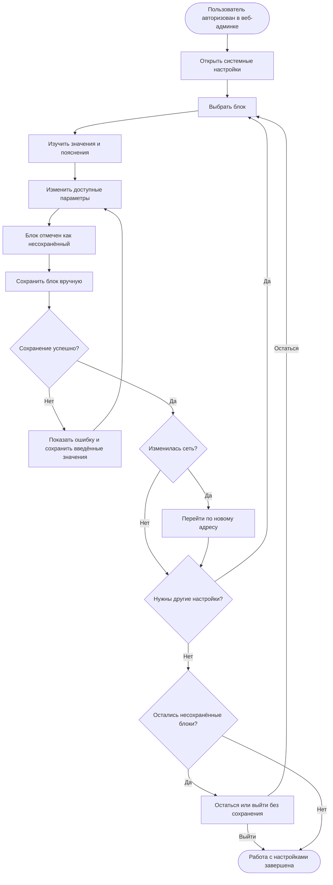

# JRN-SET-01 · Выполнить первичную настройку системных параметров контроллера

**Актор:** инженер интегратора или IT-администратор, авторизованный под учётной записью, которая позволяет изменять системные настройки в пределах назначенных прав.

**Триггер:** после первого запуска контроллера пользователь хочет заполнить пропущенные ранее системные настройки или изменить значения, заданные по умолчанию либо во время первого запуска.

**Начальное состояние:** контроллер запущен, веб-админка доступна, пользователь авторизован и находится на одной из её обычных страниц. На контроллере действуют настройки по умолчанию либо значения, заданные при первом запуске.

**Цель:** привести системные параметры контроллера к состоянию, необходимому для его работы в инфраструктуре объекта, сохраняя каждый изменяемый блок отдельно и осознанно.

**Граница пути:** путь начинается с перехода авторизованного пользователя в системные настройки и заканчивается, когда выбранные настройки сохранены либо пользователь осознанно покинул раздел без сохранения оставшихся изменений. В путь входят только системные параметры контроллера. Управление пользователями, ролями, правами доступа и сертификатами относится к `JRN-MNT-01`. Ручная выгрузка и удаление данных также не являются обычным сохранением системных настроек и должны рассматриваться как отдельные действия.

---

## Основной путь

| Шаг | Действие пользователя | Реакция системы / результат |
|---|---|---|
| 1 | Пользователь переходит из текущей страницы веб-админки в раздел системных настроек. | Система открывает настройки, доступные пользователю в соответствии с его ролью и правами. Повторная авторизация для обычного перехода не требуется. |
| 2 | Пользователь просматривает систематизированные блоки настроек и выбирает нужный блок. | Настройки сгруппированы по назначению. Каждый блок изменяется и сохраняется независимо от остальных. Окончательные состав, названия, порядок и структура блоков определяются с учётом реализованного функционала. |
| 3 | Пользователь изучает текущие значения и пояснения внутри выбранного блока. | Вместе с формой система показывает информацию, необходимую для принятия решения: назначение параметров, действующие значения, существенные последствия изменения, зависимости и предупреждения. Пользователю не требуется переходить в другие разделы только для поиска этой информации. Точный состав пояснений зависит от конкретного блока. |
| 4 | Пользователь видит параметры, которые доступны и недоступны ему в соответствии с правами. | Доступные параметры представлены элементами управления. Параметры, изменение которых запрещено текущей роли, отображаются текстом с явной пометкой о недостаточности прав. Они визуально и смыслово отличаются от информационных значений, которые по своему назначению всегда доступны только для чтения. |
| 5 | Пользователь изменяет один или несколько доступных параметров блока. | Система отмечает блок как содержащий несохранённые изменения. Изменения пока не применяются автоматически. |
| 6 | Пользователь вручную сохраняет изменённый блок. | Система применяет только изменения этого блока. Несохранённые изменения в других блоках не сохраняются и не сбрасываются. |
| 7 | Пользователь получает результат сохранения. | При успехе система показывает подтверждение и снимает с блока признак несохранённых изменений. При неуспехе система сообщает, что данные не применены, показывает понятное описание ошибки и сохраняет введённые значения в форме, чтобы пользователь мог исправить их без повторного ввода. |
| 8 | При необходимости пользователь исправляет данные и повторяет сохранение либо переходит к другим блокам. | Система позволяет последовательно настроить только необходимые блоки. Пользователь не обязан просматривать, изменять или сохранять все доступные системные настройки. |
| 9 | Если пользователь изменяет сетевые параметры, он перед сохранением проверяет новый адрес и информацию о последствиях изменения. | Система предупреждает о возможной потере текущего соединения и показывает информацию, необходимую для продолжения работы после применения новых параметров. |
| 10 | Пользователь вручную сохраняет блок сетевых настроек. | Система применяет сетевые параметры и по возможности автоматически открывает веб-админку по новому IP-адресу. Если автоматический переход невозможен, пользователь получает новый адрес и понятную инструкцию для ручного подключения. Невозможность автоматического перехода сама по себе не означает, что сетевые настройки не сохранены. |
| 11 | Если пользователь пытается покинуть раздел при наличии несохранённых изменений, он выбирает: остаться в настройках или выйти без сохранения. | Система предупреждает о несохранённых данных и указывает изменённые блоки. При выборе остаться введённые значения сохраняются в формах. При выходе система отменяет только несохранённые изменения; ранее сохранённые блоки остаются применёнными. |
| 12 | Пользователь завершает работу с системными настройками. | Выбранные и успешно сохранённые параметры действуют на контроллере. Неизменённые блоки сохраняют прежние значения. Общего обязательного действия «завершить настройку контроллера» не требуется. |

## Визуализация

---

## Результат

- пользователь настроил только необходимые ему системные параметры контроллера;
- каждый блок был сохранён отдельно и только по явному действию пользователя;
- успешное сохранение подтверждено, а при ошибке пользователь получил понятную причину без потери введённых значений;
- несохранённые блоки были заметно обозначены, а при выходе пользователь осознанно выбрал дальнейшее действие;
- пользователь видел в каждом блоке информацию, необходимую для выбора значений и понимания существенных последствий;
- запрет изменения по правам роли был отличим от обычной информации, доступной только для чтения;
- при изменении сети пользователь продолжил работу по новому адресу автоматически либо по показанной системой инструкции;
- управление пользователями, правами доступа и сертификатами не было смешано с первоначальной настройкой системных параметров.

Ориентировочно системные настройки могут включать дату и время, часовой пояс, синхронизацию времени, сеть, базовые системные параметры безопасности, уровни логирования, ограничения хранилища, правила автоматической очистки и другие параметры по мере появления функциональности. Этот перечень не является окончательным и не фиксирует структуру интерфейса.

---

## Связанные пути

- `JRN-ACC-01` — запуск нового контроллера с нуля и возможность пропустить часть первоначальных настроек;
- `JRN-SCL-01` — создание нового самостоятельного экземпляра с проверкой части системных параметров;
- `JRN-ACC-04` — вход в уже настроенный контроллер;
- `JRN-MNT-01` — последующее управление пользователями, правами доступа и сертификатами;
- `JRN-SUP-01` — диагностика проблемы, если системная настройка привела к ошибке, которую нельзя устранить в текущем блоке.

---

## Открытые вопросы / гипотезы

Следующие вопросы не меняют утверждённый пользовательский путь и должны быть уточнены при проработке конкретных системных настроек.

1. **Состав настроек:** определить окончательный перечень блоков и параметры, входящие в каждый блок, по мере утверждения функциональности продукта.

2. **Информация для принятия решения:** для каждого блока определить, какие текущие состояния, последствия, зависимости, ограничения и предупреждения необходимо показывать рядом с формой.

3. **Права:** определить права на просмотр и изменение каждого блока и отдельных параметров, включая случаи, когда пользователь может изменять только часть значений внутри блока.

4. **Применение настроек:** определить, какие параметры начинают действовать сразу после сохранения, а какие требуют повторного подключения, перезапуска службы или контроллера. Пользователь должен узнать о таком последствии до сохранения.

5. **Изменение сети:** определить способ автоматического перехода на новый IP-адрес и содержание инструкции для ручного продолжения работы, если переход невозможен.

6. **Границы безопасности:** определить перечень базовых системных параметров безопасности, относящихся к `JRN-SET-01`. Управление пользователями, ролями, правами и сертификатами остаётся в `JRN-MNT-01`.

7. **Хранение данных:** определить параметры лимитов и автоматической очистки для каждого вида данных. Ручная выгрузка и удаление данных должны выполняться как отдельные явные действия и не объединяться с обычным сохранением блока.

8. **Представление несохранённых изменений:** определить способ обозначения изменённых блоков и предупреждения при выходе без привязки к конкретной структуре страниц или вкладок.

---

## Связанные требования и сценарии

- `FR-ADM-01` — отображение состояния сервера и контроллера в веб-интерфейсе;
- `FR-ADM-03` — настройка даты, времени, часового пояса, синхронизации времени и перехода на летнее/зимнее время;
- `FR-ADM-04` — сетевые настройки для работы в корпоративной сети;
- `FR-SEC-04` — ролевая модель и ограничение действий в соответствии с правами пользователя;
- `ADM-01` — первое включение и переход к первоначальной настройке контроллера;
- `ADM-02` — настройка сети и времени;
- `ADM-05` — настройка хранения логов и дампов: ограничения, сроки хранения и автоматическая очистка;
- `ERR-15` — переполнение хранилища;
- `JRN-ACC-01` — первоначальная настройка времени, логирования и сети при первом запуске.

---
