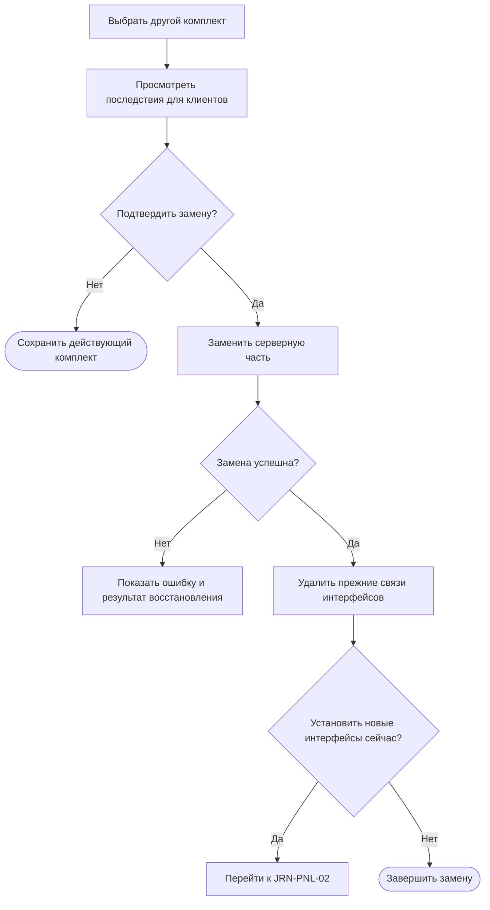

# JRN-CHG-02 · Заменить активный комплект другим комплектом

**Статус:** черновик  
**Актор:** инженер интегратора или IT-администратор с правом деплоя серверной части.  
**Триггер:** вместо действующего комплекта требуется ввести в работу другой комплект.  
**Начальное состояние:** пользователь авторизован в веб-панели. На сервере активна серверная часть одного комплекта. К серверу могут быть подключены и авторизованы клиенты; часть клиентов может быть связана с интерфейсами активного комплекта. Другой сохранённый комплект доступен для деплоя.  
**Цель:** заменить активную серверную часть серверной частью другого комплекта и получить однозначное представление о состоянии клиентов после замены.  
**Граница пути:** путь начинается с запуска деплоя другого комплекта и заканчивается успешным запуском его серверной части либо сообщением о неудаче с фактическим состоянием сервера. Установка интерфейсов нового комплекта выполняется отдельно по `JRN-PNL-02`. Снятие активной серверной части без установки новой в путь не входит.

---

## Основной путь

| Шаг | Действие пользователя | Реакция системы / результат |
|---|---|---|
| 1 | Пользователь выбирает другой комплект в хранилище или конфигураторе и запускает деплой его серверной части. | Система определяет, что выбранная серверная часть относится не к активному комплекту, и переводит пользователя в путь замены. Если действие начато из конфигуратора, деплой доступен только после сохранения всех компонентов комплекта. |
| 2 | Пользователь просматривает предупреждение о замене. | Система показывает активный и выбранный комплекты, а также клиентов, связи которых с интерфейсами прежнего комплекта будут удалены. Предупреждение сообщает, что после замены установленные на клиентах прежние интерфейсы не смогут взаимодействовать с новой серверной частью. |
| 3 | Пользователь отменяет замену либо явно подтверждает её. | При отмене активная серверная часть и связи клиентов не изменяются. При подтверждении система начинает замену. |
| 4 | Пользователь ожидает завершения операции. | Веб-панель показывает общий ход замены без раскрытия внутренних операций. |
| 5 | Если соединение с сервером временно потеряно, пользователь просматривает уведомление и ожидает восстановления связи. | После восстановления соединения веб-панель продолжает показывать операцию с последней доступной точки. Повторная авторизация и повторный запуск уже выполненных этапов не требуются. |
| 6 | Если заменить серверную часть не удалось, пользователь просматривает сообщение о неудаче. | Система останавливает операцию, сообщает причину, если она известна, и показывает фактическое состояние сервера. Если предыдущая серверная часть была удалена, система пытается восстановить её из точки отката и отдельно сообщает результат восстановления. |
| 7 | Если предыдущая серверная часть восстановлена, пользователь просматривает состояние клиентов и их связей. | Веб-панель показывает, восстановлены ли связи клиентов с интерфейсами предыдущего комплекта. Если состояние требует действий пользователя, соответствующие клиенты перечислены в сообщении о результате. |
| 8 | Если замена завершилась успешно, пользователь просматривает итог. | Серверная часть выбранного комплекта становится активной. Сервер удаляет связи клиентов с интерфейсами прежнего комплекта. Клиенты остаются подключёнными и авторизованными, но прежние интерфейсы больше не взаимодействуют с серверной частью. |
| 9 | Пользователь просматривает список клиентов после замены. | Веб-панель показывает клиентов без назначенного интерфейса и сообщает, что интерфейсы нового комплекта устанавливаются отдельно. |
| 10 | Пользователь завершает путь либо переходит к установке интерфейсов на выбранные клиенты. | Завершение пути не требует деплоя интерфейсов. При переходе начинается `JRN-PNL-02`. |

## Визуализация

Схема показывает обязательную замену серверной части и необязательный переход к установке интерфейсов.

---

## Результат

Успешный результат:

- серверная часть другого комплекта установлена, запущена и обозначена как активная;
- связи клиентов с интерфейсами прежнего комплекта удалены;
- клиенты остаются подключёнными и авторизованными;
- веб-панель показывает клиентов, которым требуется установить интерфейс нового комплекта;
- пользователь может завершить путь без деплоя интерфейсов либо перейти к `JRN-PNL-02`.

Неуспешный результат:

- пользователь получил описание причины и фактического состояния сервера;
- если предыдущая серверная часть была удалена, пользователь видит результат её восстановления из точки отката;
- состояние связей клиентов отображено отдельно и не скрывается за общим сообщением об ошибке.

---

## Связанные пути

- `JRN-COM-02` — деплой серверной части;
- `JRN-PNL-01` — подключение и авторизация клиента на сервере;
- `JRN-PNL-02` — деплой или обновление интерфейса на подключённом клиенте;
- `JRN-CHG-01` — изменение комплекта и деплой его новой версии;
- `JRN-CHG-03` — ручной возврат к предыдущей серверной части.

---

## Открытые вопросы / гипотезы

1. **Восстановление связей после неудачи.** Необходимо определить, восстанавливаются ли связи клиентов с интерфейсами предыдущего комплекта вместе с предыдущей серверной частью. В любом варианте веб-панель должна показать фактическое состояние каждой затронутой связи. **Владелец:** не определён. **Влияет на:** шаг 7 и действия пользователя после неудачной замены.

2. **Представление затронутых клиентов.** Необходимо определить формат списка клиентов и сведений об удаляемых связях в предупреждении перед заменой. **Владелец:** не определён. **Влияет на:** возможность оценить последствия до подтверждения.

3. **Переход к деплою интерфейсов.** Рассмотреть действие, которое после успешной замены открывает список клиентов для последовательного или массового назначения интерфейсов. Массовый деплой пока не определён в дорожной карте. **Владелец:** не определён. **Влияет на:** продолжение пути после шага 9.

---

## Связанные требования и сценарии

- `FR-PRJ-11` — на сервере исполняется одна серверная часть комплекта;
- `NFR-REL-02`, `NFR-REL-03` — сохранение рабочего состояния и восстановление после сбоя;
- `ERR-10`, `ERR-11` — восстановление предыдущей серверной части при неудачном деплое;
- `FL-PRJ-DEPLOY` — деплой и возврат серверной части; поток требует уточнения для замены серверной части другим комплектом.

