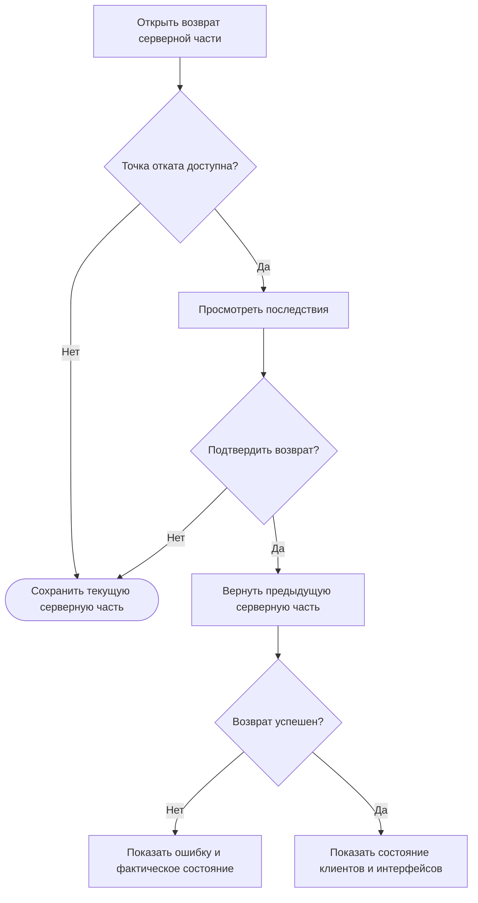

# JRN-CHG-03 · Вернуть предыдущую серверную часть

**Статус:** черновик  
**Актор:** инженер интегратора или IT-администратор с правом управления активной серверной частью.  
**Триггер:** после изменения или замены активной серверной части требуется вручную вернуться к предыдущей серверной части.  
**Начальное состояние:** пользователь авторизован в веб-панели. На сервере запущена активная серверная часть. Сервер может содержать одну точку отката с самостоятельной копией предыдущей серверной части. Исходный комплект этой серверной части может отсутствовать в хранилище. На клиентах могут быть установлены интерфейсы, относящиеся к текущему или предыдущему комплекту.  
**Цель:** вручную заменить активную серверную часть единственной сохранённой предыдущей серверной частью и увидеть фактическое состояние клиентов после возврата.  
**Граница пути:** путь начинается с выбора действия возврата и заканчивается запуском предыдущей серверной части либо сообщением о неудаче. Возврат не восстанавливает комплект в хранилище, пользовательские интерфейсы на клиентах или предыдущие версии интерфейсов. Снятие серверной части без установки другой и создание точки отката при таком снятии в путь не входят.

---

## Основной путь

| Шаг | Действие пользователя | Реакция системы / результат |
|---|---|---|
| 1 | Пользователь открывает сведения об активной серверной части и выбирает возврат к предыдущей версии. | Система проверяет наличие точки отката и показывает доступность действия. |
| 2 | Если точки отката нет, пользователь просматривает сообщение и завершает путь. | Система сообщает, что предыдущая серверная часть недоступна. Действующая серверная часть не изменяется. |
| 3 | Если точка отката доступна, пользователь просматривает сведения о текущей и предыдущей серверных частях. | Система показывает единственный доступный вариант возврата. Наличие исходного комплекта в хранилище для возврата не требуется. |
| 4 | Пользователь просматривает предупреждение о последствиях. | Система сообщает, что будут заменены только серверные части. Интерфейсы на клиентах не изменятся и после возврата могут не соответствовать запущенной серверной части. |
| 5 | Пользователь отменяет возврат либо явно подтверждает его. | При отмене состояние системы не изменяется. При подтверждении система начинает возврат. |
| 6 | Пользователь ожидает завершения операции. | Веб-панель показывает общий ход возврата без раскрытия внутренних операций. |
| 7 | Если соединение с сервером временно потеряно, пользователь просматривает уведомление и ожидает восстановления связи. | После восстановления соединения веб-панель продолжает показывать операцию с последней доступной точки. Повторная авторизация и повторный запуск уже выполненных этапов не требуются. |
| 8 | Если возврат не завершился успешно, пользователь просматривает сообщение об ошибке. | Система сообщает причину, если она известна, и показывает, какая серверная часть фактически запущена. Пользователь не должен определять состояние по косвенным признакам. |
| 9 | Если возврат завершился успешно, пользователь просматривает сообщение о запуске предыдущей серверной части. | Предыдущая серверная часть становится активной. Комплекты в хранилище и установленные на клиентах интерфейсы не изменяются. |
| 10 | Пользователь просматривает состояние клиентов и установленных интерфейсов. | Веб-панель показывает активные соединения, авторизованных пользователей, назначенные интерфейсы и признаки, доступные для оценки их работы с возвращённой серверной частью. Автоматическое изменение интерфейсов не выполняется. |
| 11 | Пользователь завершает путь либо переходит к ручной установке подходящего интерфейса на выбранный клиент. | При переходе начинается `JRN-PNL-02`. Решение об изменении интерфейса принимает пользователь. |

## Визуализация

Схема показывает возврат единственной предыдущей серверной части без автоматического изменения клиентских интерфейсов.

---

## Результат

Успешный результат:

- предыдущая серверная часть из единственной точки отката запущена и обозначена как активная;
- возврат выполнен независимо от наличия исходного комплекта в хранилище;
- комплекты в хранилище и интерфейсы на клиентах не изменены;
- пользователь видит состояние клиентов и самостоятельно решает, требуется ли деплой другого интерфейса.

Неуспешный результат:

- действующая серверная часть не скрыта за общим статусом операции;
- пользователь видит причину неудачи, если она известна, и фактически запущенную серверную часть;
- автоматический возврат интерфейсов не выполняется.

---

## Связанные пути

- `JRN-COM-02` — деплой серверной части;
- `JRN-PNL-02` — деплой или обновление интерфейса на подключённом клиенте;
- `JRN-CHG-01` — изменение комплекта и деплой его новой версии;
- `JRN-CHG-02` — замена активного комплекта другим комплектом;
- `JRN-REC-01` — восстановление рабочей конфигурации на текущем контроллере.

---

## Открытые вопросы / гипотезы

1. **Связи клиентов после возврата.** Необходимо определить, сохраняются или удаляются существующие связи клиентов с интерфейсами при возврате серверной части, относящейся к другому комплекту. Веб-панель в любом случае должна показать фактическое состояние связей. **Владелец:** не определён. **Влияет на:** шаги 9–11 и последующий переход к `JRN-PNL-02`.

2. **Данные для выбора точки отката.** Необходимо определить минимальный набор сведений о предыдущей серверной части, который позволит пользователю оценить возврат до подтверждения. Выбор из нескольких версий не требуется. **Владелец:** не определён. **Влияет на:** шаги 3–5.

3. **Повторный возврат.** Необходимо определить, что становится единственной точкой отката после успешного ручного возврата и доступно ли немедленное возвращение к заменённой серверной части. **Владелец:** не определён. **Влияет на:** дальнейшие действия пользователя после шага 9.

---

## Связанные требования и сценарии

- `NFR-REL-02`, `NFR-REL-03` — сохранение рабочего состояния и восстановление после сбоя;
- `ERR-10`, `ERR-11` — восстановление предыдущей серверной части при неудачном деплое;
- `FL-PRJ-DEPLOY` — деплой и возврат серверной части; поток требует уточнения для ручного возврата.

