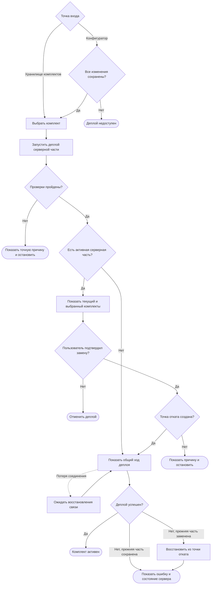

# JRN-COM-02 · Выполнить деплой серверной части

**Актор:** инженер интегратора, авторизованный под учётной записью с правом выполнять деплой на сервер.

**Триггер:** пользователь хочет установить и запустить на сервере серверную часть выбранного комплекта.

**Начальное состояние:** пользователь находится в хранилище комплектов либо в конфигураторе. На сервере может отсутствовать активная серверная часть либо может работать серверная часть ранее развёрнутого комплекта.

**Цель:** сделать серверную часть выбранного комплекта активной и сохранить возможность восстановить предыдущую рабочую версию при неудаче.

**Граница пути:** путь начинается с выбора деплоя в хранилище комплектов или конфигураторе и заканчивается успешным запуском новой серверной части либо уведомлением о неудаче и конечном состоянии сервера. При запуске из конфигуратора все компоненты комплекта должны быть сохранены. Из комплекта развёртывается только одна серверная часть; доставка пользовательских интерфейсов клиентам относится к `JRN-PNL-02`. Состав внутренних проверок, техническая процедура деплоя, журналирование и содержание системных записей в путь не входят.

---

## Основной путь

| Шаг | Действие пользователя | Реакция системы / результат |
|---|---|---|
| 1 | Пользователь начинает путь из хранилища комплектов либо из открытого комплекта в конфигураторе. | В хранилище доступны сохранённые комплекты. В конфигураторе действие деплоя доступно, только если все компоненты открытого комплекта сохранены. При наличии несохранённых изменений действие недоступно, а интерфейс показывает причину. |
| 2 | Пользователь выбирает комплект и запускает деплой на сервер. | Интерфейс показывает, что из выбранного комплекта будет развёрнута его серверная часть. Пользовательские интерфейсы на этом этапе клиентам не передаются. |
| 3 | Пользователь ожидает завершения предварительной проверки. | Система проверяет возможность деплоя выбранного комплекта, наличие одной серверной части и её совместимость с сервером. Если проверка не пройдена, деплой останавливается, а пользователь видит точное описание проблемы. При успешной проверке процесс продолжается без отдельного уведомления. Состав проверок определяет системный аналитик. |
| 4 | Пользователь продолжает ожидание. | Система проверяет соответствие выбранного комплекта действующей лицензии. При несоответствии деплой останавливается, а пользователь видит точную причину. При успешной проверке процесс продолжается без отдельного уведомления. |
| 5 | Если на сервере уже есть активная серверная часть, пользователь просматривает предупреждение. | Интерфейс показывает названия текущего активного и выбранного комплектов, предупреждает о замене работающей серверной части и описывает связанные с заменой риски. |
| 6 | Пользователь подтверждает замену либо отменяет деплой. | После подтверждения процесс продолжается. После отмены активная серверная часть не изменяется, пользователь возвращается к исходному экрану. Если активной серверной части нет, подтверждение замены не запрашивается. |
| 7 | Пользователь ожидает создания точки отката. | Если на сервере есть активная серверная часть, система сохраняет её как точку отката и уведомляет пользователя. Если точку отката создать не удалось, деплой останавливается, а пользователь видит точное описание проблемы. Если активной серверной части нет, этот этап пропускается. |
| 8 | Пользователь ожидает завершения деплоя. | В MVP интерфейс показывает общий ход операции без перечисления внутренних этапов. Если возникает ошибка, деплой останавливается, а пользователь видит точное описание проблемы. Если предыдущая серверная часть уже была заменена, система переходит к её восстановлению. |
| 9 | Если соединение с сервером потеряно, пользователь ожидает его восстановления. | Интерфейс сообщает о потере соединения и автоматически восстанавливает отображение хода операции после повторного подключения. Пользователю не требуется заново входить в систему или запускать деплой повторно. |
| 10 | Если деплой завершился неудачно после замены предыдущей серверной части, пользователь ожидает восстановления. | Система восстанавливает предыдущую серверную часть из точки отката и сообщает пользователю о неудачном деплое и результате восстановления. Если восстановление также не удалось, пользователь получает отдельное точное уведомление о текущем состоянии сервера. |
| 11 | Если деплой завершился успешно, пользователь просматривает результат. | Интерфейс сообщает, что новая серверная часть установлена и успешно запущена. Выбранный комплект отображается как активный во всех предусмотренных разделах. Для активного состояния комплекта достаточно успешного запуска серверной части. |
| 12 | Пользователь завершает путь после просмотра результата. | Интерфейс сообщает, что пользовательские интерфейсы ещё не переданы клиентам и устанавливаются отдельно. В MVP прямой переход к подключению клиентов из уведомления не предусматривается. |

## Визуализация

---

## Результат

Успешный результат:

- серверная часть выбранного комплекта установлена и запущена;
- выбранный комплект отображается как активный;
- пользователь получил подтверждение успешного деплоя;
- пользователь уведомлён, что интерфейсы устанавливаются на клиенты отдельно.

Неуспешный результат:

- деплой остановлен;
- пользователь получил точное описание проблемы и увидел конечное состояние сервера;
- если предыдущая серверная часть уже была заменена, пользователь получил результат её восстановления из точки отката;
- повторный вход в систему и повторный запуск уже выполнявшихся этапов после временной потери соединения не требуются.

---

## Связанные пути

- `JRN-KIT-01` — подготовка типового комплекта с помощью мастера;
- `JRN-KIT-02` — подготовка комплекта полностью вручную;
- `JRN-COM-01` — поиск недочётов и очистка комплекта; путь носит уведомительный характер и не является условием деплоя;
- `JRN-PNL-02` — подключение клиентов и передача им пользовательских интерфейсов.

---

## Открытые вопросы / гипотезы

**Гипотеза для развития:** после успешного деплоя в уведомление можно добавить переход к `JRN-PNL-02`. В MVP пользователь видит только сообщение о том, что интерфейсы необходимо установить на клиенты отдельно.

Состав проверок, перечень возможных ошибок, содержание журналов и техническая процедура деплоя определяются при системном анализе и в эту карточку не входят.

---

## Связанные требования и сценарии

- `FR-PRJ-11` — на сервере исполняется одна серверная часть комплекта;
- `FR-LIC-03`, `FR-LIC-04` — ограничения лицензии и отображение её состояния;
- `NFR-REL-02`, `NFR-REL-03` — перезапуск без потери комплекта и восстановление рабочего состояния после сбоя;
- `PRJ-07` — публикация активного комплекта на сервер; предусловие о прохождении `PRJ-06` требует актуализации, поскольку `JRN-COM-01` не является проверкой перед деплоем;
- `ERR-05` — остановка деплоя при превышении ограничения лицензии;
- `ERR-10`, `ERR-11` — откат при неудачном деплое и восстановление предыдущей рабочей версии;
- `FL-PRJ-DEPLOY` — деплой и откат; передачу пользовательских интерфейсов клиентам необходимо исключить из этого потока и оставить в `JRN-PNL-02`;
- `TL-CORE-21` — атомарность деплоя и восстановление при сбое.

---
