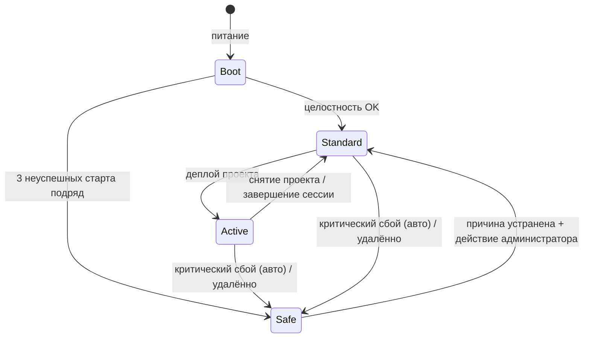
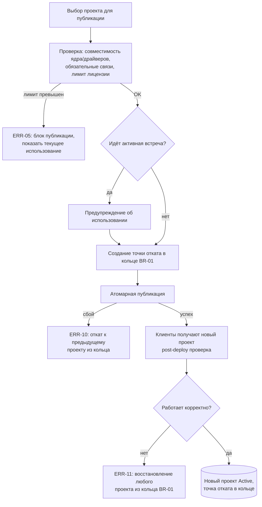
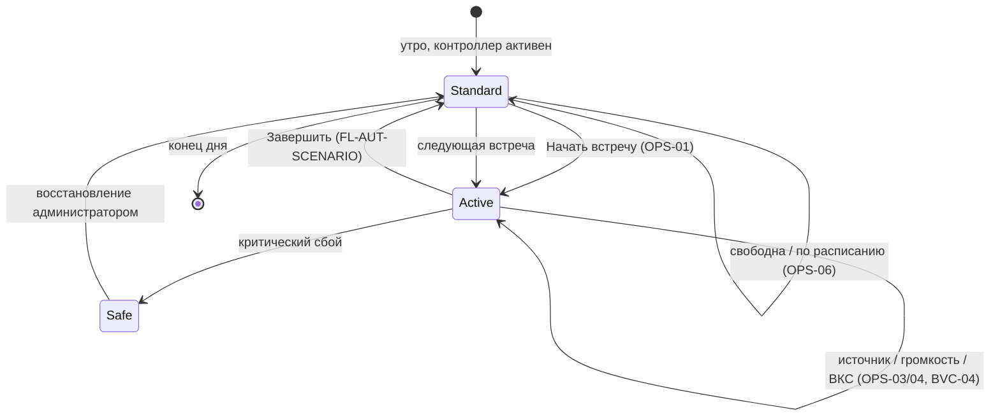
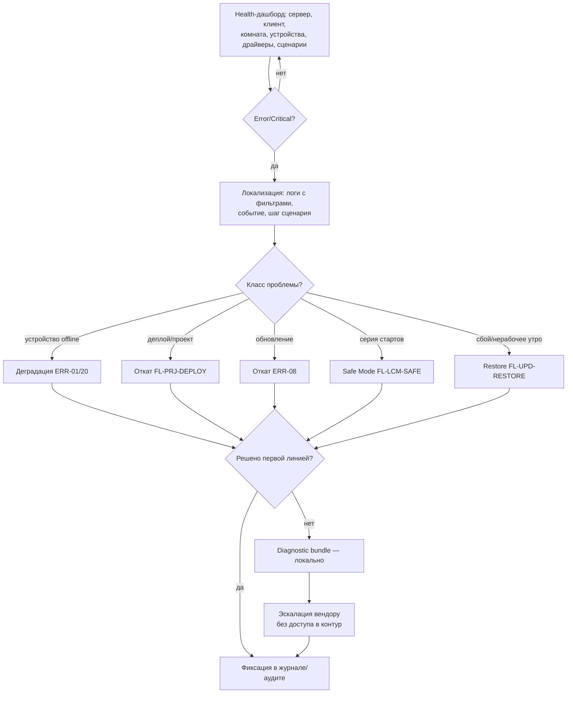
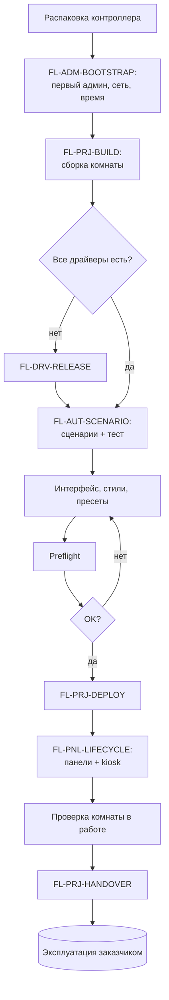

# Logic & User Flows — AV Control

**Рабочий черновик v0.2 · для итерации**

> **Назначение.** Развернуть **продуктово-наблюдаемую логику** работы системы и **пользовательские потоки** по ролям: переходы состояний, ветвления, условия (guards), системные реакции, откаты, деградацию, синхронизацию — детальнее, чем use cases, но не на уровне реализации.
> 
> **Уровень.** Только то, что наблюдает пользователь и за что отвечает продукт. Реализационные детали (атомарность транзакций, выбор проекта из кольца отката, watchdog/retry, нарастающий таймаут Safe Mode, удалённый вход/выход, health-check, механика синхронизации) **не решаются здесь** — собраны в §8 «Вопросы тех. лиду».
> 
> **Что НЕ включаем.** Матрицу прав `профиль × действие × ресурс` → **ACM**. ER-модель, схемы конфигурации/телеметрии, состав backup и bundle → **Information Architecture & Data Schema**. Контракты API, Driver Engine (sandbox, lifecycle), SDK → **Core & API & Integration Specs**. Архитектуру, протоколы, ОС → **PSD**. «Историю актора» → **Use Case Specification (UC)**.

---

## §0. Стык блока (handoff frame)

### Продуктовая рамка (ключевое)

AV Control — **инструмент**. Конкретное поведение переговорной собирает **интегратор**: сценарии, расписания, пресеты, условия, привязку к брони/ВКС. L&F описывает **примитивы платформы и потоки работы с ними**, а не политики конкретной комнаты.

Практическое следствие для всего документа: там, где «правило» на самом деле настраивается интегратором (например, что именно делает «Завершить», когда стартует следующая встреча, какие устройства критичны), L&F описывает **механизм и точку настройки**, а не фиксированное поведение.

### Закрыто выше — ссылаться, не пересматривать

- **Роли (PRD §2).** `End User`, `Support Operator`, `IT Admin`, `Integrator Engineer` (Инж), `Lead Integrator` (Lead), `Security Auditor` (ИБ), `Vendor Support` (Вендор) + машинные пользователи API.
- **Режимы (PSD §5).** `Boot` / `Стандартный` / `Активный` / `Safe Mode`. Offline — штатный режим. Деградация = потеря локальной зависимости.
- **Принципы.** offline-first; хранится много проектов — исполняется один активный; конфигурация вместо кода (JS — опциональное расширение); защита проекта = сдерживание копирования; конечный пользователь не видит инженерных сущностей; драйверы — независимый поток; цепочка `Клиент → Сервер → устройства`.
- **Уровни ошибок.** Info / Warning / Error / Critical; в мониторинг (v1) эскалируются Error / Critical.
- **Состояния лицензии (PSD §6.4).** Valid / Invalid / LimitsExceeded / EmulatorActive / Missing. Превышение лимита блокирует публикацию, не ломая runtime.

### Границы

- **UC ↔ L&F.** UC — наблюдаемая актором история; L&F — механика и ветвления. Каждому P0-кейсу «Полная» соответствует flow (см. каталог §3).
- **L&F ↔ тех. лид.** Всё техническое уходит в §8 на усмотрение тех. лида.

### Конвенции и маркеры

- Потоки — `FL-<область>-NN`; сквозные правила — `BR-NN`; ссылки на кейсы — по ID.
- `[? — продукт]` — открытый продуктовый вопрос (сведены в §6).
- `[→ тех. лид]` — вынесено в §8.
- `[? — аналитика]` — требует отдельной проработки в аналитике.
- `[подтвердить]` — значение-кандидат из upstream-документов.

---

## §1. Сквозные правила

> Здесь только то, что **не принадлежит одному потоку**. Остальные правила вшиты в соответствующие flow. Окончание сессии сюда **не входит** — это уровень сценариев интегратора (см. FL-AUT-SCENARIO).

### BR-01 · Кольцо откатов проектов

Система хранит несколько ранее загруженных **серверных** проектов — **5** . Восстановиться можно на **любой** из них. При достижении лимита дамп очищается циклически, начиная с самого раннего.

Из этого следует для потоков:

- «Откат деплоя» (ERR-10) и «возврат к last-known-good» (ERR-11) — не два разных объекта, а **выбор любого из 5 сохранённых** проектов.
- Точка отката создаётся при каждом успешном деплое (FL-PRJ-DEPLOY).
- Алгоритм выбора при автоматическом откате `[→ тех. лид]`.

### BR-02 · Канон режимов

Единственный источник истины — PSD §5. Любые «состояния комнаты» в потоках ниже — это UI-надстройки, отображаемые на эти режимы, а не параллельная модель.

- Вход в Safe Mode: автоматически (критический сбой или **3 неуспешных старта подряд**, с нарастающим таймаутом между попытками `[→ тех. лид]`) либо удалённо из Admin UI.
- В Safe Mode **тестовые команды на оборудование запрещены**.
- Offline и деградация — **не** отдельные режимы.

---

## §2. Формат описания flow

### Карточка flow

|Поле|Содержание|
|---|---|
|**ID / Название**|`FL-<область>-NN` + краткое действие|
|**Метаданные**|Тип · Приоритет · Глубина · Акторы|
|**Связанные UC**|ID кейсов|
|**Цель**|Что обеспечивает поток|
|**Триггер / начальное состояние**|Что запускает; состояние до старта|
|**Основной поток**|Шаги|
|**Ветвления / guards**|Условия, альтернативы, запреты|
|**Что видит актор**|Пользователь / инженер / IT|
|**Логи / события**|Что фиксируется (хэндофф в Data Schema)|
|**Конечное состояние**|Чем завершается|
|**BPMN-приложение**|Нужно / не нужно|
|**Трассировка**|UC / PRD / PSD → смежные документы|

### Типы flow

- **Role** — последовательность действий роли.
- **System** — внутренняя логика (деплой, откат, совместимость).
- **Runtime** — поведение в исполнении (сценарий, обратная связь, синхронизация).
- **Error / Recovery** — ошибки, деградация, rollback, Safe Mode.
- **Integration** — API / внешняя система / машинный актор.
- **State** — переходы между режимами.

### Глубина

- **Полная** — для P0 и многоветочных потоков.
- **Краткая** — для линейных потоков; даёт цель, поток, ветвления, итог.

---

## §3. Каталог flow

| ID               | Название                                             | Входящие UC                            | Тип             | Прио  | Глубина | BPMN |
| ---------------- | ---------------------------------------------------- | -------------------------------------- | --------------- | ----- | ------- | ---- |
| FL-ADM-BOOTSTRAP | Первичный ввод контроллера                           | ADM-01/02, SEC-01                      | Role+System     | P0    | Краткая | —    |
| FL-PRJ-BUILD     | Сборка проекта                                       | PRJ-01/02/03/04/06                     | Role+System     | P0    | Полная  | —    |
| FL-PRJ-DEPLOY    | Деплой и откат                                       | PRJ-07/08, ERR-05/10/11                | System+Recovery | P0    | Полная  | да   |
| FL-AUT-SCENARIO  | Сценарий: создание, тест, исполнение                 | AUT-01/02, OPS-01/05, ERR-02           | Runtime         | P0    | Полная  | —    |
| FL-DRV-RELEASE   | Драйвер: запрос, выпуск, установка                   | DRV-01/02/03, ERR-04/09                | Integration     | P0    | Полная  | да   |
| FL-PNL-LIFECYCLE | Панель: подключение, доставка, замена, синхронизация | PNL-01/02/03/04                        | Role+Runtime    | P0    | Краткая | —    |
| FL-OPS-DAY       | Эксплуатация: маршрут типового дня                   | OPS-01..07, BVC-01/02/04, ERR-01/07/20 | State+Runtime   | P0    | Полная  | —    |
| FL-OPS-OPER      | Оперативный слой без редеплоя                        | AUT-03, ADM-03, PRJ-05                 | Runtime         | P0    | Полная  | —    |
| FL-UPD-CORE      | Обновление ядра                                      | UPD-01/02, ERR-08                      | System+Recovery | P0    | Полная  | —    |
| FL-UPD-RESTORE   | Backup / restore / замена контроллера                | UPD-03/04/05, ERR-12/19                | Recovery        | P0    | Полная  | да   |
| FL-MON-TRIAGE    | Триаж инцидента, bundle, эскалация                   | MON-01/02/03, SUP-01/02                | Role+Support    | P0    | Полная  | да   |
| FL-LCM-SAFE      | Safe Mode и невалидный проект                        | ERR-13/14                              | State+Recovery  | P0    | Полная  | да   |
| FL-BVC-BOOKING   | Бронирование / ВКС                                   | BVC-01/02/04, API-03                   | Integration     | P1    | Краткая | —    |
| FL-SEC-ACCESS    | Доступ и безопасность (config)                       | SEC-01/02/03/04                        | Role            | P0/P1 | Краткая | —    |
| FL-PRJ-HANDOVER  | Передача объекта и вывод                             | PRJ-14/15, SEC-04                      | Role            | P1    | Краткая | —    |

---

## §4. Потоки

### Ввод и проект

#### FL-ADM-BOOTSTRAP · Первичный ввод контроллера

_System+Role · P0 · Краткая · Инж/IT · UC: ADM-01/02, SEC-01_

- **Цель.** Ввести контроллер в работу и получить первичный административный доступ.
- **Триггер.** Контроллер получен; лицензия вшита заводски (проверять не требуется).
- **Основной поток.**
    1. Первое включение, базовая инициализация.
    2. Создание первого администратора.
    3. Настройка сети и времени (NTP).
    4. Создание пользователей и назначение ролей (права → ACM).
- **Ветвления.** Аппаратный/инициализационный сбой → диагностика (FL-MON-TRIAGE).
- **Конечное состояние.** Контроллер доступен под администратором, в сети, со временем.
- **Логи / события.** Создание первого админа, изменения пользователей/ролей (в аудит).
- **BPMN.** Не нужно (линейный).

#### FL-PRJ-BUILD · Сборка проекта

_Role+System · P0 · Полная · Инж · UC: PRJ-01/02/03/04/06_

- **Цель.** Собрать конфигурацию комнаты — из готовой комнаты, по устройствам или вручную — и проверить готовность.
- **Триггер.** Активен проект; есть права настройки.
- **Основной поток.**
    1. Выбор способа сборки.
    2. Наполнение состава (устройства, драйверы, теги, связи, базовые сценарии, стиль).
    3. Корректировка под объект (адреса, фактическое оборудование).
    4. Доработка логики/интерфейса при необходимости.
    5. Preflight-проверка полноты.
    6. Сохранение; проект готов к деплою (FL-PRJ-DEPLOY).
- **Ветвления / guards.**

| Условие                    | Реакция                                     |
| -------------------------- | ------------------------------------------- |
| Нет готовой комнаты        | Wizard по устройствам или ручная сборка     |
| Нет драйвера на устройство | Запрос драйвера (FL-DRV-RELEASE)            |
| Конфликт связей/тегов      | Показать конфликт и следующий шаг           |
| Нативной логики не хватает | JS-расширение (граница — §6-Q-JS)           |
| Preflight не пройден       | Вернуть к доработке, перезапустить проверку |

- **Ключевой принцип.** Любой проект/шаблон полностью редактируем после создания; шаблонность не блокирует правки.
- **Что видит актор.** Перечень незакрытых пунктов preflight (несвязанные теги, отсутствующие драйверы, неполные сценарии).
- **Логи / события.** Создание комнаты/устройства, автосвязи, ошибки автосвязей, сохранение.
- **Конечное состояние.** Проект валиден, готов к публикации.
- **BPMN.** Не нужно (ветвление умеренное, покрыто таблицей).
    

#### FL-PRJ-DEPLOY · Деплой и откат

_System+Recovery · P0 · Полная · Инж (частично IT) · UC: PRJ-07/08, ERR-05/10/11_

- **Цель.** Сделать проект активным без риска для текущей рабочей конфигурации.
- **Триггер / предусловие.** Проект прошёл preflight; лицензия валидна; нет идущего обновления/восстановления.

- **Ветвления / guards.** Превышен лимит → блок публикации, runtime не меняется. Активная встреча → предупреждение, осознанное подтверждение. Драйвер несовместим → блок или предложение обновить драйвер. Клиент не получил проект → показывает прежнее состояние, событие в диагностику.
- **Логи / события.** Старт/итог деплоя, создание точки отката, откат, причина.
- **Конечное состояние.** Успех — новый проект активен; неуспех — прежний остаётся или восстановлен из кольца; в обоих случаях запись в журнал.
- **BPMN.** **Да** — ветвление и откаты тяжёлые.
- **Технически → §8:** атомарность транзакции, post-deploy health-check, выбор проекта из кольца.

### Сценарии и эксплуатация

#### FL-AUT-SCENARIO · Сценарий: создание, тест, исполнение

_Runtime · P0 · Полная · Инж / End User / система · UC: AUT-01/02, OPS-01/05, ERR-02_

- **Цель.** Дать координированное поведение комнаты в 1–2 действия(оборудования в ней); обеспечить старт и завершение сессии.
- **Рамка.** Что делает сценарий — задаёт интегратор (команды, задержки, условия, обработка ошибки, возврат в штатное состояние). Платформа исполняет.
- **Конфигурационный поток (Инж).**
    1. Создаёт сценарий из шаблона или вручную.
    2. Задаёт последовательность команд, задержек, условий.
    3. Настраивает обработку ошибки (повтор, пропуск необязательного, останов, деградация, сообщение).
    4. Настраивает финальное состояние проекта.
    5. Тестирует до публикации (на эмуляторе/стенде, без привязки к интерфейсу).
- **Runtime-поток (End User + система).**
    1. Пользователь нажимает сценарий в клиенте.
    2. Сервер проверяет роль, активный проект, состояние комнаты.
    3. Scenario Engine запускает последовательность; команды идут через драйверы.
    4. Обратная связь устройств обновляет теги; клиент показывает выполнение.
    5. Успех → целевое состояние; ошибка → error-ветка.
- **Завершение сессии (продуктовый уровень).** Сессия завершается:
    - **явным действием** пользователя с панели;
    - **истечением таймаута по расписанию**.
    В обоих случаях запускается **сценарий завершения, заданный интегратором** (закрыть ВКС, очистить пользовательские данные, перевести технику в дежурное, вернуть `Стандартный`). Поведение «следующая встреча стартует, не завершив корректно предыдущую» — **настройка интегратора на уровне сценариев** (через интеграцию брони), не продуктовое правило.

- **Error-ветки.** Устройство offline → понятная ошибка пользователю, детали в диагностику. Необязательное устройство недоступно → продолжить с предупреждением. Критичное недоступно → деградация/останов по настройке сценария. Сценарий не завершился → возврат комнаты в безопасное/штатное состояние. Рантайм-сбой → ERR-02.
- **Логи / события.** Старт/итог сценария, шаг с ошибкой, обратная связь устройств.
- **Конечное состояние.** Комната в целевом состоянии либо корректно деградирована.
- **BPMN.** Не нужно (две ветви, покрыты текстом).

#### FL-OPS-DAY · Эксплуатация: маршрут типового дня

_State+Runtime · P0 · Полная · End User / система / API · UC: OPS-01..07, BVC-01/02/04, ERR-01/07/20_

- **Цель.** Описать, как комната живёт в течение дня и где включаются error-кейсы.
- **Принцип.** Пользователь видит сценарии и понятные состояния, не инженерные сущности; при сбое — следующий шаг на языке действия.

- **Ветвления / guards.**

| Событие                        | Переход / реакция                                                         |
| ------------------------------ | ------------------------------------------------------------------------- |
| Часть устройств недоступна     | Деградация (ERR-20): продолжить на доступном, понятная подсказка (OPS-07) |
| Потеря связи клиент↔сервер     | Клиент → оверлей «нет связи» (FL-PNL-LIFECYCLE); сервер продолжает        |
| Серия неуспешных стартов       | → Safe Mode (FL-LCM-SAFE)                                                 |
| Сервисное действие при встрече | Предупреждение, требует подтверждения                                     |

- **Что видит актор.** «Нет сигнала / нет звука / устройство недоступно» + действие; инженерные детали — только поддержке.
- **Конечное состояние.** Комната возвращается в `Стандартный` / свободна.
- **BPMN.** Не нужно (диаграмма состояний достаточна).

#### FL-OPS-OPER · Оперативный слой без редеплоя

_Runtime · P0 · Полная · Инж/IT · UC: AUT-03, ADM-03, PRJ-05_

- **Цель.** Менять эксплуатационные настройки **без правки и публикации проекта** — решает «больной» кейс смены поведения после сдачи.
- **Объём (что редактируется на лету).**
    - **Расписания** — запуск сценариев/состояний по времени.
    - **Сценарии** — состав и параметры готовых сценариев.
    - **Пресеты** — пользовательские пресеты комнаты.
- **Правило сохранения.** Оперативные изменения сохраняются и **переживают перезапуск**; сбрасываются только при загрузке нового проекта или удалении текущего.
- **Доступ.** После сдачи менять могут **и Инж, и IT** (по правам, под аудитом).
- **Граница.** Изменение состава устройств, связей, базовой логики — это правка проекта → FL-PRJ-BUILD + FL-PRJ-DEPLOY, не оперативный слой.
- **Ветвления.** Невыполненное расписание → диагностика (FL-MON-TRIAGE). Временная runtime-настройка (тест-команда, не сохраняется) — отдельный режим ADM-03.
- **Логи / события.** Изменение расписания/сценария/пресета — в аудит.
- **Конечное состояние.** Поведение комнаты изменено без редеплоя; зафиксировано до смены проекта.
- **BPMN.** Не нужно.

### Устройства, панели, драйверы

#### FL-DRV-RELEASE · Драйвер: запрос, выпуск, установка

_Integration · P0 · Полная · Инж / Вендор / IT · UC: DRV-01/02/03, ERR-04/09_

- **Цель.** Добавить или обновить драйвер **без релиза ядра**.
- **Основной поток.**
    1. Обнаружено неподдержанное устройство.
    2. Запрос драйвера (вендор, модель, протокол, нужные функции/capabilities, документация).
    3. Вендор/команда готовит и проводит стендовую проверку.
    4. Присвоение Driver ID, версии, диапазона совместимости; offline-доставка.
    5. Установка без перезапуска ядра; проверка подписи и совместимости.
    6. Драйвер в каталоге и журнале; прежние версии доступны.
- **Ветвления / guards.**

| Условие                        | Реакция                                                                                      |
| ------------------------------ | -------------------------------------------------------------------------------------------- |
| Нет протокольной документации  | Вне SLA «1 день», отдельный случай                                                           |
| Несовместимая версия           | Установка блокируется с понятным сообщением                                                  |
| Драйвер падает после установки | Деградация устройства (ERR-04) → откат к прежней версии драйвера (ERR-09), ядро не затронуто |
| Покрытие частичное             | Маркируется capabilities и ограничения (DRV-03)                                              |

- **Конечное состояние.** Устройство управляется драйвером; ядро не затронуто.
- **BPMN.** **Да** — release-цепочка с несколькими акторами и ветвлениями.
- **Технически → §8 / Core&API:** sandbox, lifecycle Init/Start/Stop, подпись, compatibility-check.

#### FL-PNL-LIFECYCLE · Панель: подключение, доставка, замена, синхронизация

_Role+Runtime · P0 · Краткая · Инж/IT / End User / система · UC: PNL-01/02/03/04_

- **Цель.** Ввести панель в работу, доставлять проект, восстанавливать после замены, держать согласованное состояние.
- **Поток.**
    1. Подключение к серверу (pairing по IP сервера или выбором из сети), авторизация.
    2. Загрузка клиентского проекта — он задаёт функцию панели.
    3. Перевод в kiosk-режим, при необходимости.
    4. Доставка обновлений клиентского проекта (после публикации, FL-PRJ-DEPLOY).
- **Синхронизация.** Состояние комнаты — на сервере; панели отражают синхронно; действие с одной видно на остальных.
- **Потеря связи (оверлей).** Панель кэширует последнее состояние и ждёт сервер. Интегратор может включить **оверлей «нет связи»** (флаг в опциях + выбор страницы-заглушки); использовать его — решение интегратора по проекту. Очередь офлайн-событий **не строится**: при реконнекте панель ресинхронизирует состояние с сервера, а не доигрывает старые нажатия.
- **Ветвления.** Несколько панелей одной комнаты → согласованное состояние. Замена панели → подключение + загрузка того же проекта, без донастройки.
- **Конечное состояние.** Панель работает в kiosk по своему проекту; состояние согласовано.
- **BPMN.** Не нужно.

### Обслуживание и восстановление

#### FL-UPD-CORE · Обновление ядра

_System+Recovery · P0 · Полная · IT · UC: UPD-01/02, ERR-08_

- **Цель.** Обновить ядро offline с возможностью отката.
- **Основной поток.**
    1. Загрузка offline-пакета(c ПК, на котором открыта web UI или через централизованную систему управления и мониторинга по API); проверка подписи/целостности/совместимости/места.
    2. Показ патчноута.
    3. Guard активной встречи (см. ниже).
    4. Создание точки восстановления → установка.
    5. Health-check; при успехе — фиксация версии; запись в журнал.

- **Guard активной встречи.** При активной сессии — **предупреждение** об использовании; администратор откладывает или подтверждает осознанно. В перспективе — настраиваемое на стороне сервера более строгое условие `[? — продукт; §6]`.
- **Ветвления.** Сбой до установки → не применено. Сбой после установки → авто-откат (ERR-08). Сбой отката → Safe Mode (FL-LCM-SAFE).
- **Конечное состояние.** Ядро обновлено либо откатано; запись в журнал.
- **BPMN.** Не нужно (конечные состояния таблицей).
- **Технически → §8:** подпись/манифест, gate-проверки, health-check.

#### FL-UPD-RESTORE · Backup / restore / замена контроллера

_Recovery · P0 · Полная · IT/Инж · UC: UPD-03/04/05, ERR-12/19_

- **Цель.** Восстановить работу после сбоя или замены оборудования.
- **Основной поток.**
    1. Backup — вручную или по расписанию; проверка целостности.
    2. (При замене контроллера) установка из ЗИП.
    3. Восстановление конфигурации из backup.
    4. **Проверка backup на совместимость до применения.**
    5. Применение; комната работает без ручной донастройки.

- **Ветвления / guards.**

| Условие                        | Реакция                                                               |
| ------------------------------ | --------------------------------------------------------------------- |
| Backup повреждён/несовместим   | Восстановление прерывается (ERR-12), текущая конфигурация сохраняется |
| Только устройство заменено     | Переподключение драйвера к новому экземпляру (UPD-05)                 |
| Нерабочее состояние перед днём | Диагностика → откат/restore → проверка готовности (ERR-19)            |

- **Лицензия.** Стандартный случай: лицензия вшита в контроллер, пользователь о ней **не думает** — переносит/восстанавливает и работает. **Addon-лицензия** при замене → возможны сложности, `[? — аналитика]` (отдельная проработка, в L&F не решается).
- **Конечное состояние.** Контроллер/комната восстановлены; downtime минимизирован.
- **BPMN.** **Да** — ветвление по типу замены и состоянию backup.
- **Состав/формат backup → Data Schema.**

#### FL-MON-TRIAGE · Триаж инцидента, bundle, эскалация

_Role+Support · P0 · Полная · IT / Сап / Вендор · UC: MON-01/02/03, SUP-01/02_

- **Цель.** Закрывать большинство инцидентов первой линией без выезда и без постоянного доступа в контур.

- **Граница.** Bundle собирают IT/Инж/Сап локально; вендор работает по нему без доступа в контур. При необходимости IT выдаёт временный сервисный доступ (отзывной, под аудитом).
- **Логи / события.** Класс инцидента, выполненное действие, факт формирования/передачи bundle.
- **Конечное состояние.** Инцидент закрыт первой линией либо подготовлена эскалация.
- **BPMN.** **Да** — много классов и развилок.
- **Состав bundle (приватность/ИБ) → §8 / Data Schema.**

#### FL-LCM-SAFE · Safe Mode и невалидный проект

_State+Recovery · P0 · Полная · IT/Сап / система · UC: ERR-13/14_

- **Цель.** Управляемо изолировать причину сбоя и восстановить работу ПО.
- **Вход.** Авто — критический сбой или **3 неуспешных старта подряд**; либо удалённо из Admin UI (BR-02).
- **В Safe Mode доступно.** Admin UI, диагностика/логи, экспорт bundle, restore/rollback, установка обновления/отката. Активные сценарии выключены; клиент показывает заглушку; **тестовые команды на оборудование запрещены**.
- **Невалидный активный проект (ERR-14).** Система не остаётся в неопределённом состоянии: откат к исправному проекту из кольца (BR-01) либо уход в Safe Mode.
- **Выход.** Только действием администратора после устранения причины.
- **Конечное состояние.** Контроллер управляем; есть путь к штатной работе.
- **BPMN.** **Да** — это state-machine с условиями входа/выхода.
- **Технически → §8:** порог и нарастающий таймаут, реализация удалённого входа/выхода, объекты состояния.

### Интеграция и безопасность

#### FL-BVC-BOOKING · Бронирование / ВКС

_Integration · P1 · Краткая · End User / API · UC: BVC-01/02/04, API-03_

- **Цель.** Показать встречу из календаря, управлять ею в части брони, запустить ВКС.

- **Поток.**

| Шаг | End User             | AV Control         | Booking API                  | ВКС                |
| --- | -------------------- | ------------------ | ---------------------------- | ------------------ |
| 1   | видит встречу        | читает событие     | отдаёт текущую/ближайшую     | —                  |
| 2   | начинает             | запускает сценарий | —                            | поднимает endpoint |
| 3   | продлевает/завершает | шлёт изменение     | принимает (start/extend/end) | —                  |
| 4   | управляет звонком    | команды            | —                            | mute/camera/layout |

- **Граница.** Конкретное связывание брони с управлением — настройка интегратора на уровне проекта, не функция платформы. Перечень систем и команд → §6. API-уровень обязан поддерживать создание брони уже сейчас (UI брони с панели — P2).
- **Ветвления.** Терминал/линия недоступны → понятная подсказка (OPS-07). Ошибка внешней интеграции (auth/версия) → запрос отклоняется, сообщение администратору.
- **BPMN.** Не нужно (swimlane достаточно). **Контракт endpoints → Core&API.**

#### FL-SEC-ACCESS · Доступ и безопасность (config)

_Role · P0/P1 · Краткая · IT (Инж при ПНР) · UC: SEC-01/02/03/04_

- **Цель.** Заводить пользователей/роли, парольную политику, сертификаты, временный сервисный доступ.
- **Поток.**
    1. Создание пользователя (человек или для панели), назначение роли.
    2. Парольная политика по требованиям заказчика.
    3. Установка/продление корпоративных сертификатов TLS.
    4. Выдача/отзыв временного сервисного доступа.
- **Ветвления.** Истечение сертификата → предупреждение заранее, при истечении — ограничение защищённых соединений (ERR-16).
- **Граница.** Формальная матрица прав → **ACM**. Все изменения — в аудите.
- **BPMN.** Не нужно.

### Завершение жизненного цикла

#### FL-PRJ-HANDOVER · Передача объекта и вывод

_Role · P1 · Краткая · Lead→IT · UC: PRJ-14/15, SEC-04_

- **Цель.** Передать эксплуатацию без зависимости от подрядчика и без утечки наработок.
- **Поток.**
    1. Lead формирует пакет передачи (переносимая конфигурация, роли, документация).
    2. Авторские наработки защищены (не редактируются без пароля).
    3. IT принимает систему, получает админ-права; права интегратора отзываются/понижаются.
    4. IT проверяет доступ к эксплуатации (статусы, обновления, backup).
- **Альтернатива.** По договору интегратор сохраняет ограниченный сервисный доступ (отзывная роль, FL-SEC-ACCESS).
- **Вывод объекта.** Очистка пользовательских данных по политике; фиксация в аудите (с учётом, что аудит очистки сам уходит в SIEM до очистки) `[? — продукт; §6]`.
- **BPMN.** Не нужно. **Права при handover → ACM.**

---

## §5. Потоки по ролям

> Краткий набор из трёх ролевых маршрутов. Не переописывают механику — связывают потоки §4 по ID под углом роли.

### 5.1 Интегратор — от первой настройки до передачи

`FL-ADM-BOOTSTRAP → FL-PRJ-BUILD → (FL-DRV-RELEASE при необходимости) → FL-AUT-SCENARIO → FL-PRJ-DEPLOY → FL-PNL-LIFECYCLE → проверка → FL-PRJ-HANDOVER`. Подробный сквозной маршрут — **Приложение А «Карта первого дня»**.

### 5.2 IT-инженер — мониторинг и реакция на инцидент

`FL-MON-TRIAGE` как ядро: health → локализация → выбор ветки восстановления (`FL-PRJ-DEPLOY` / `FL-UPD-CORE` / `FL-UPD-RESTORE` / `FL-LCM-SAFE`) → при недостатке первой линии — bundle и эскалация. Оперативные правки без редеплоя — `FL-OPS-OPER`.

### 5.3 Конечный пользователь — типовой день

`FL-OPS-DAY`: вход → `FL-AUT-SCENARIO` (старт) → источник/управление/ВКС → завершение. При сбое — деградация (ERR-20) и понятная подсказка (OPS-07), без инженерной диагностики.

---

## §6. Открытые вопросы (продукт)

> Только реально открытое после v0.2. Техническое — в §8.

- **Q-UPD-strict.** Более строгое поведение обновления при активной встрече (настраиваемое на сервере условие) — в каком релизе и какие условия (окно обслуживания, принудительно по политике)?
- **Q-JS-scope.** Граница JS в первом релизе: только серверная логика или и клиентская; что точно нельзя через JS в MVP.
- **Q-BVC-scope.** Целевые системы бронирования и ВКС-платформы первого релиза; обязательный набор команд ВКС (start/end/mute/camera/layout/dial).
- **Q-WIPE-audit.** Как фиксировать аудит вывода объекта, учитывая, что данные (и часть аудита) удаляются — отправлять в SIEM до очистки достаточно?
- **Q-IP-mark.** Нужна ли видимая маркировка «защищённый проект/шаблон» для пользователя.
- **Q-bundle-preview.** Должен ли пользователь видеть состав bundle до экспорта.

_В аналитику (не L&F):_ **addon-лицензия при замене контроллера** `[? — аналитика]`.

---

## §7. Статус блока

**Готово к ревью:** §0 рамка и границы, §1 сквозные правила, §2 формат, §3 каталог, потоки §4 уровня «Полная» (BUILD, DEPLOY, AUT-SCENARIO, OPS-DAY, OPS-OPER, DRV-RELEASE, UPD-CORE, UPD-RESTORE, MON-TRIAGE, LCM-SAFE), ролевые маршруты §5, Приложение А.

**Требует решений §6:** строгое обновление при встрече, граница JS, scope брони/ВКС, аудит вывода, маркировка IP, превью bundle.

**Передано тех. лиду §8.** **В аналитику:** addon-лицензия при замене.

---

## §8. Вопросы тех. лиду (на его усмотрение)

> Всё техническое, что L&F не решает. Формулировки — предложения.

- **Состояния runtime.** Полный перечень объектов состояния (Сервер/Ядро, Активный проект, Лицензия, Драйвер, Устройство, Сценарий, Обновление, Клиент) и их значения.
- **Атомарность.** Какие операции атомарны: деплой проекта, update ядра, update драйвера, restore.
- **Кольцо откатов.** Механика хранения 5 проектов, выбор при автоматическом откате, критерий last-known-good.
- **Watchdog / recovery.** Что детектируется, retry/restart/disable, граница «ПО ↔ ОС».
- **Safe Mode.** Реализация порога «3 старта» и нарастающего таймаута; удалённый вход/выход.
- **Health-check.** Как определяется работоспособность после деплоя/обновления.
- **Совместимость.** Формат compatibility-check драйвер↔ядро и проект↔ядро.
- **Синхронизация.** Механика согласования нескольких клиентов одной комнаты.
- **Аудит vs system log.** Что уходит в аудит, что только в системный лог.
- **Bundle.** Допустимый состав diagnostic bundle с точки зрения ИБ.
- **API.** Какие команды считаются write и требуют повышенных прав.

---

## Приложение А. Карта первого дня (commissioning journey)

> Самый критичный поток внедрения — от распаковки до работающей переговорной. Цель приложения — проверять **удобство** этого маршрута; если он неудобен, внедрение проваливается.

**Для финала приложения зафиксировать по каждому шагу:** ответственного, ожидаемое время, типовую точку «спотыкания» и обходной путь. Кандидат на пред-выезд: pre-commissioning через эмулятор и preflight без полного комплекта оборудования.

---

_Конец черновика v0.2. Нотация — Mermaid в теле; BPMN-приложения помечены в каталоге §3 (DEPLOY, DRV-RELEASE, UPD-RESTORE, MON-TRIAGE, LCM-SAFE)._