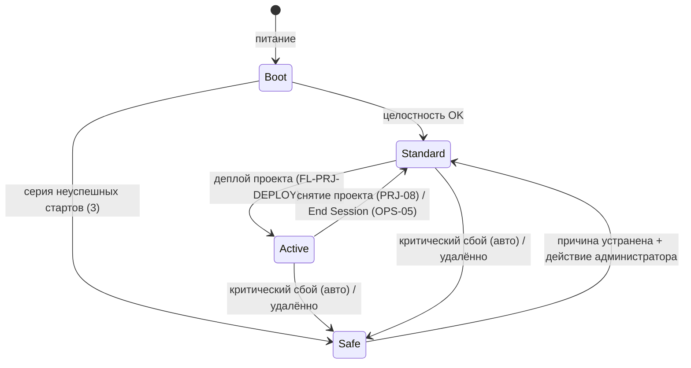
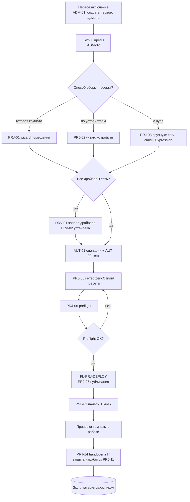
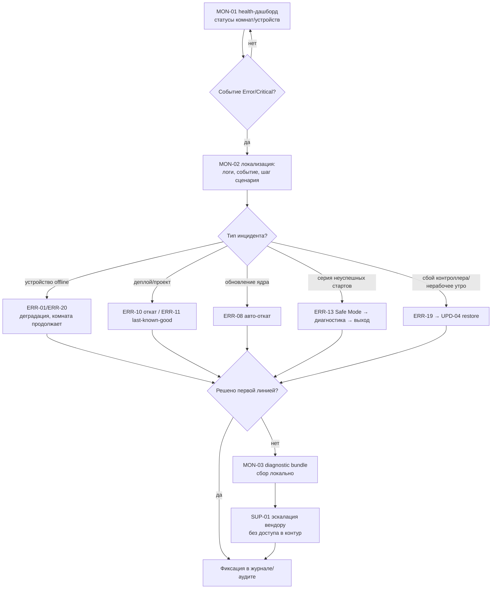
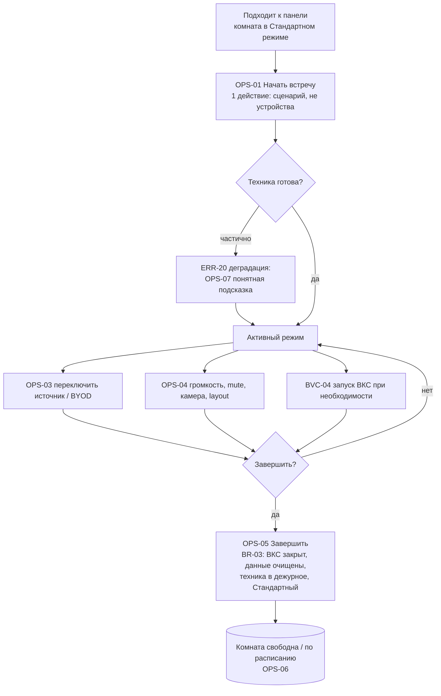
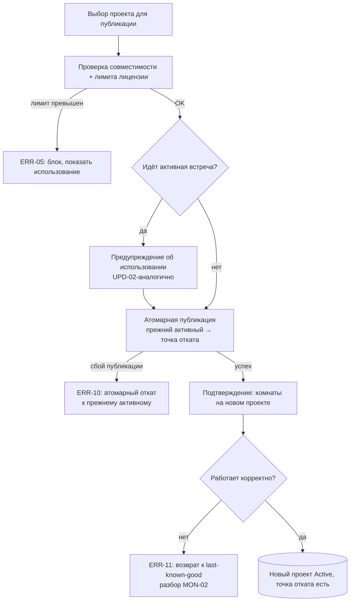
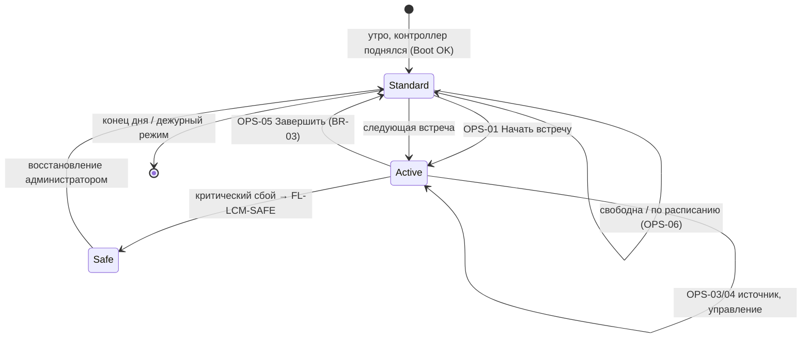

# Logic & User Flows — AV Control

**Рабочий черновик v0.1 · для итерации**

> **Назначение.** Развернуть **внутреннюю логику** работы системы и **подробные пользовательские потоки** по ролям — детальнее, чем use cases. Документ берёт кейсы, помеченные `→ L&F`, и превращает их «историю актора» в пошаговую механику: порядок системных операций, ветвления по состояниям, точки принятия решений и условия, обработку ошибок и восстановление.
>
> **Что это НЕ заменяет (границы).** Формальную матрицу прав `профиль × действие × ресурс` → **Access Control Model (ACM)**. Контракт API, Driver Engine (sandbox, lifecycle), механику watchdog/recovery, алгоритмы retry → **Core & API & Integration Specs**. ER-модель, схемы конфигурации/телеметрии, состав backup и diagnostic bundle → **Information Architecture & Data Schema**. Архитектуру, протоколы, ОС, продуктовую модель режимов → **PSD**. «Историю актора» (цель, шаги, видимые актору) → **Use Case Specification (UC)**.

---

## §0. Стык блока (handoff frame)

**Закрыто выше — не пересматривать, ссылаться:**

- **Роли (PRD §2).** 7 операционных профилей: `End User`, `Support Operator`, `IT Admin`, `Integrator Engineer` (Инж), `Lead Integrator` (Lead), `Security Auditor` (ИБ), `Vendor Support` (Вендор) + машинные пользователи через API (мониторинг/SIEM, бронирование/календарь, терминалы ВКС).
- **Режимы (PSD §5).** `Boot` / `Стандартный` / `Активный` / `Safe Mode`. Offline — штатный режим (offline-first), не отдельное состояние. Деградация = потеря локальных зависимостей (сеть до устройств / устройство / панель / лицензия / активный проект).
- **Принципы (PRD/PSD).** offline-first; «активный проект» (хранится много — исполняется один); конфигурация вместо кода (JS — опциональное расширение); защита проекта = сдерживание копирования; конечный пользователь не видит инженерных сущностей; драйверы — независимый поток без релиза ядра; цепочка `Клиент → Сервер → устройства` (клиент не управляет оборудованием напрямую).
- **Уровни ошибок (UC).** Info / Warning / Error / Critical; в мониторинг (v1) эскалируются Error / Critical.
- **Состояния лицензии (PSD §6.4).** Valid / Invalid / LimitsExceeded / EmulatorActive / Missing. Правило: превышение лимита блокирует **публикацию**, не ломая runtime.

**Граница UC ↔ L&F (подтверждена в финальном UC §0).** UC описывает наблюдаемую актором историю; L&F разворачивает внутреннюю механику. Каждому P0-кейсу уровня «Полная» соответствует флоу в этом документе (см. карту соответствия §4.0). Это предотвращает двойное описание одного процесса.

**Граница L&F ↔ тех. лид.** L&F фиксирует **продуктово-наблюдаемую логику** (состояния, переходы, условия, точки решения, что видит/делает актор). Реализационные детали — внутренняя атомарность транзакции деплоя, алгоритм выбора last-known-good, пороги и backoff watchdog/retry, механика входа/выхода Safe Mode — помечаются `[→ тех. лид]` и раскрываются в Core & API / приложении тех. лида. L&F задаёт для них рамку «что должно произойти», не «как».

**Маркеры контента.** `[? — продукт]` — открытый продуктовый вопрос (сведены в §6) · `[→ тех. лид]` — реализация вне продуктовой части · `[подтвердить]` — значение-кандидат из upstream-документов · `(Формат)` — место, где предложен шаблон (см. §7).

**Конвенции.** Кейсы и смежные документы — по ID-якорям, без переописывания. Потоки нумеруются `FL-<область>-NN`. Бизнес-правила — `BR-NN`.

---

## Карта готовности блоков

| Блок | Статус | В теле черновика | Требует решения / вынесено |
|---|---|---|---|
| §2 Бизнес-правила (логика) | 🟡 | 10 правил: жизненный цикл проекта, режимы, окончание сессии, деградация, лицензия, координация сценария, теги/преобразования, откат, уровни ошибок, синхронизация панелей | пороги (тайм-аут сессии, «3 старта»), точное различие rollback-целей → §6 |
| §3 Потоки по ролям | 🟡 | 3 ключевых потока: интегратор (первый день → handover), IT-инженер (мониторинг → инцидент), конечный пользователь (типовой день) | нужны ли потоки Support/Vendor/Security отдельно → §6-Q10 |
| §4 Критические механические потоки | 🟡 | деплой/откат, Safe Mode, невалидный проект, update ядра, driver-release, restore, координация+сессия, деградация, потеря связи | внутренняя механика → Core&API / тех. лид |
| §5 Маршрут типового дня комнаты | 🟢 | переходы Стандартный↔Активный↔Safe с точками включения error-кейсов | нотация финала (Mermaid/BPMN) → §6-Q8 |
| §6 Открытые вопросы | 🟢 | Q1–Q12 для продукта | — |
| §7 Предлагаемые форматы | 🟢 | 7 форматов + рекомендация по блокам | выбрать нотацию и глубину → §6-Q8/Q9 |

Обозначения: 🟢 готово к ревью · 🟡 черновик, требует ответов из §6 · ⚪ заглушка.

---

## §1. Модель описания потоков (конвенции блока)

**Уровень описания.** Продуктовая логика: наблюдаемые состояния и переходы, условия, точки решения, обработка ошибок, что видит/делает каждый актор. Реализационные детали — ссылкой `[→ тех. лид]` / `→ Core&API`.

**Нотации (черновик — финал утвердить, §6-Q8).**
- Линейные потоки — нумерованные шаги + явные точки решения «если … то …».
- Ветвящиеся потоки (деплой, Safe Mode, восстановление) — блок-схема (в черновике — Mermaid `flowchart`; кандидат на BPMN в финале).
- Режимы и переходы — диаграмма состояний (Mermaid `stateDiagram`) + таблица переходов.
- Потоки по ролям — журней-цепочка с дорожками (кандидат на swimlane).

**Карточка потока (Формат, см. §7-A).** `ID · Связанные UC · Акторы · Триггер · Предусловия · Основной путь (шаги + точки решения) · Ошибки/альтернативы · Постусловие · Трассировка`.

---

## §2. Бизнес-правила (логика)

> Правила — единый источник «как система решает». Потоки в §3–§5 на них ссылаются, не переописывая.

### BR-01 · Жизненный цикл и валидность активного проекта
Состояния активного проекта (продуктовый уровень): `None` → `Active` → (`Invalid` | `Rollback`). 
- Проект становится `Active` только после успешного деплоя (FL-PRJ-DEPLOY). 
- При загрузке/исполнении система проверяет валидность проекта; невалидный/повреждённый → не остаётся в неопределённом состоянии: откат к исправному либо уход в Safe Mode (BR-02, ERR-14). 
- Хранится много проектов, исполняется один (принцип «активный проект»). 
- `[→ тех. лид]` критерии валидации проекта и объект состояния `Active Project`.
*Связь:* PRJ-07, ERR-14, ERR-11.

### BR-02 · Переходы режимов комнаты/контроллера
Канон из PSD §5.2. Точки входа в `Safe Mode` **не зависят от аппаратной кнопки**: (а) автоматически — критический сбой или серия неуспешных стартов (`3` `[подтвердить]`); (б) удалённо — команда администратора из Admin Web UI. Выход из Safe Mode — только действием администратора после устранения причины.


*Связь:* PSD §5, ERR-13, ERR-14.

### BR-03 · Правило окончания сессии («как система решает, что встреча закончилась»)
Сессия завершается по одному из триггеров:
1. **Явно** — пользователь нажимает «Завершить» (OPS-05).
2. **По расписанию / тайм-ауту** — авто-завершение (AUT-03), напр. по окончании слота бронирования или по бездействию `[? — продукт: значение тайм-аута и считать ли бездействие; §6-Q2]`.
3. **По событию бронирования** — завершение текущей встречи приходит из booking (BVC-02, через API-03).

Действие при завершении (единое для всех триггеров): закрыть ВКС → очистить пользовательские данные сессии → перевести технику в дежурное состояние → вернуть `Стандартный` режим → выдать уведомление об успехе. Если ВКС не закрылся штатно → принудительное завершение; «оставленная техника» / «незакрытый ВКС» не возникают как класс инцидента.
*Связь:* OPS-05, OPS-06, AUT-03, BVC-02, EU-F5.

### BR-04 · Правило деградации (частичная работоспособность)
Деградация = потеря локальной зависимости (PSD §5.4), а не offline сам по себе. При недоступности части оборудования во время сессии: retry-политика `[→ Core&API]` → пометка «устройство недоступно» → комната **продолжает на доступном** (ERR-20). Пользователь видит понятное состояние и подсказку на языке действия (OPS-07); инженерные детали того же события видит поддержка (MON-01/02). 
*Открыто:* перечень «минимально работающего» набора по типам комнат `[? — продукт; §6-Q6]`.
*Связь:* ERR-20, ERR-01, OPS-07.

### BR-05 · Лицензионные правила в runtime
- `LimitsExceeded` → блокирует **публикацию** проекта с понятным сообщением и текущим использованием (ERR-05), runtime не ломается. 
- `Invalid` (нарушена подпись/привязка) → ограниченный режим, событие, эскалация в поддержку (ERR-06). 
- `EmulatorActive` → через ~`20` мин `[подтвердить]` сервер снимает активный проект и прекращает работу с оборудованием; клиент показывает оверлей с таймером; требуется повторный деплой. Истечение сессии эмулятора — **штатный механизм, не ошибка** (LIC-03). 
- Расширение лимита — только через вендора/дистрибьютора, механизм скрыт от пользователя.
*Связь:* PSD §6, ERR-05, ERR-06, LIC-03.

### BR-06 · Координация устройств в сценарии
Сценарий = координированное поведение комнаты, доступное пользователю в 1–2 действия. Логика: последовательность `команда → задержка → условие` по модели `событие → условие → действие`; внутри сценария — обработка ошибки и возврат помещения в штатное состояние. Рантайм-сбой сценария → ERR-02 (фиксация события, по возможности возврат в штатное состояние). 
*Связь:* AUT-01, OPS-01, ERR-02.

### BR-07 · Связи тегов и преобразования значений
Единая сущность «тег» (драйверные / системные / пользовательские, в т.ч. persist-значения). Связи: тег устройства ↔ элемент интерфейса. Преобразования значений — нативно через Expression Evaluator (без JS); сложная логика — опционально JS-расширение (изоляция и логирование ошибок → ERR-03). Ошибка связи/преобразования → система указывает место и причину. 
*Связь:* PRJ-03, AUT-04, ERR-03. *Схема тегов/persist → IA & Data Schema.*

### BR-08 · Атомарность и точки отката
- **Деплой проекта** — атомарный; прежний активный проект сохраняется как точка отката (PRJ-07). Неуспешный деплой → откат к прежнему активному (ERR-10). 
- **Опубликован, но работает некорректно** → возврат к `last-known-good` (ERR-11). 
- **Update ядра** — создаётся точка восстановления до установки; неуспех → авто-откат (ERR-08). 
- **Driver** — откат к предыдущей версии драйвера, ядро не затронуто (ERR-09). 
- **Restore** — backup проверяется **до** применения; несовместимость → восстановление прерывается, текущая конфигурация сохраняется (ERR-12). 
*Открыто:* точное различие «прежний активный» (ERR-10) vs `last-known-good` (ERR-11) — это один объект или два `[? — продукт; §6-Q4]`. *Внутренняя механика атомарности и выбора last-known-good → `[→ тех. лид]`.*

### BR-09 · Уровни ошибок и эскалация
Классификация события: `Info / Warning / Error / Critical`. В систему мониторинга (v1) эскалируются `Error` и `Critical` (MON-04, API-01/02). Пользователю в обычном интерфейсе инженерные уровни не показываются — только понятное состояние (BR-04, OPS-07). 
*Связь:* UC §0, MON-04. *Перечень фиксируемых событий → IA & Data Schema.*

### BR-10 · Синхронизация состояния панелей
Состояние комнаты хранится на сервере; панели отражают его синхронно. Действие с одной панели видно на остальных. Потеря связи панели ↔ сервер → панель показывает «нет связи» и инструкции, остальные продолжают (ERR-07); при восстановлении — ресинхронизация. 
*Связь:* PNL-04, ERR-07.

---

## §3. Пользовательские потоки по ролям

> Три ключевых потока из методологии §2.4. Каждый — последовательность UC по ID с точками решения и error-ветками; механика шагов — в §2 (BR) и §4 (FL).

### 3.1 Поток интегратора — от первой настройки до передачи проекта
*Акторы:* Integrator Engineer (основной), Lead Integrator (точечно: шаблоны, защита, handover), IT Admin (приём на handover).
*Это «опорный» поток внедрения — кандидат на вынос в отдельное приложение «карта первого дня» (§6-Q9).*



**Точки решения / условия:** способ сборки (C); наличие драйверов (E); прохождение preflight (J — gate перед деплоем, BR-01). 
**Error-ветки:** конфликт связей/тегов на сборке → подсказка и следующий шаг; деплой неуспешен → FL-PRJ-DEPLOY (ERR-10/11); лимит лицензии → ERR-05. 
**Предусловие масштабирования:** настроенная комната/блок сохраняется как шаблон (PRJ-10) для тиражирования (PRJ-01/09). 
*Трассировка:* OBJ-1/2, FR-PRJ-*, EU/INT-jobs.

### 3.2 Поток IT-инженера — мониторинг и реакция на инцидент
*Акторы:* IT Admin (основной), Support Operator (первая линия), Vendor Support (эскалация без доступа в контур).



**Точки решения:** наличие Error/Critical (B, по BR-09); классификация инцидента (D); достаточность первой линии (J). 
**Граница:** diagnostic bundle собирает IT/Инж/Сап локально; вендор работает по нему без доступа в контур (удалённого доступа может не быть). 
*Трассировка:* MON-01/02/03/04, SUP-01/02, ERR-*, OBJ-3.

### 3.3 Поток конечного пользователя — типовой день (вход → встреча → выход)
*Актор:* End User.



**Точки решения:** готовность техники (C → BR-04); продолжать/завершить (H → BR-03). 
**Принцип:** пользователь видит сценарии и понятные состояния, не инженерные сущности; при сбое — следующий шаг на языке действия, не диагностику (OPS-07, EU-F4). 
*Трассировка:* EU-F1..F5, FR-ROOM-*, OBJ-2.

---

## §4. Критические механические потоки

### §4.0 Карта соответствия UC ↔ flow (P0/«Полная» и ключевые)
| Flow | Покрывает UC | Категория |
|---|---|---|
| FL-PRJ-DEPLOY | PRJ-07, ERR-05, ERR-10, ERR-11 | деплой/откат |
| FL-LCM-SAFE | ERR-13, ERR-14 | Safe Mode / невалидный проект |
| FL-UPD-CORE | UPD-01, UPD-02, ERR-08 | обновление ядра |
| FL-DRV-REL | DRV-02, ERR-09, ERR-04 | релиз драйвера |
| FL-UPD-RESTORE | UPD-04, UPD-05, ERR-12 | restore / замена |
| FL-OPS-SESSION | OPS-01, AUT-01, OPS-05 | координация сценария + сессия |
| FL-ERR-DEGRADE | ERR-20, ERR-01, OPS-07 | частичная работоспособность |
| FL-ERR-CONN | ERR-07, PNL-04 | потеря связи клиент↔сервер |

### FL-PRJ-DEPLOY · Деплой и откат проекта
*UC:* PRJ-07 · *Акторы:* Инж · *Триггер:* публикация проекта · *Предусловие:* пройден preflight PRJ-06 (BR-01).


*Точки решения:* лимит (B); активная встреча (C — предупреждение, не блок); корректность поведения (F). *`[→ тех. лид]`:* внутренняя атомарность транзакции, выбор last-known-good (см. §6-Q4).

### FL-LCM-SAFE · Вход/выход Safe Mode и невалидный активный проект
*UC:* ERR-13, ERR-14 · *Акторы:* IT/Сап/Система · *Триггер:* серия неуспешных стартов / критический сбой / удалённая команда / невалидный проект.

Основной путь (по BR-02): обнаружение условия → вход в Safe Mode (минимально работоспособное состояние, защита ядра, событие, crash dumps) → доступны только Admin Web UI / диагностика / restore / rollback / установка обновления; активные сценарии выключены; клиент показывает заглушку; доступ к оборудованию запрещён (в MVP — без тестовых команд) → IT диагностирует (MON-02), исправляет/откатывает (ERR-11) → выход из Safe Mode действием администратора. 
Невалидный активный проект (ERR-14): система откатывается к исправному либо уходит в Safe/админ-режим; комната не остаётся в неопределённом состоянии (BR-01). 
*`[→ тех. лид]`:* порог «3 старта», реализация удалённого входа/выхода, объекты состояния (см. §6-Q3).

### FL-UPD-CORE · Обновление ядра
*UC:* UPD-01, UPD-02, ERR-08 · *Актор:* IT · *Предусловие:* offline-пакет получен, есть актуальный backup.
1. Загрузка пакета → проверка целостности. 2. Показ патчноута. 3. **Если комната в активной встрече** → предупреждение, отложить или подтвердить осознанно (UPD-02). 4. Создание точки восстановления → установка. 5. Запись в журнал обновлений. 
*Ошибка:* установка неуспешна → авто-откат к точке восстановления (ERR-08), данные сохранены. 
*`[→ тех. лид]`/Core&API:* подпись/манифест пакета, gate-проверки.

### FL-DRV-REL · Установка/обновление драйвера (независимый поток)
*UC:* DRV-02, ERR-09, ERR-04 · *Акторы:* Инж/IT.
1. Загрузка offline-пакета → проверка подписи и **диапазона совместимости с ядром**. 2. Показ патчноута. 3. Установка **без перезапуска ядра**. 4. Фиксация в каталоге и журнале; предыдущие версии остаются доступны. 
*Ошибки:* несовместимая версия → установка блокируется с понятным сообщением; драйвер падает после установки → деградация устройства (ERR-04) → откат к предыдущей версии драйвера (ERR-09), ядро не затронуто. 
*→ Core&API:* sandbox, lifecycle Init/Start/Stop, capabilities, подпись.

### FL-UPD-RESTORE · Восстановление / замена контроллера из backup
*UC:* UPD-04, UPD-05, ERR-12 · *Акторы:* IT/Инж · *Предусловие:* есть проверяемый backup.
1. (При замене) установка контроллера из ЗИП. 2. Восстановление конфигурации из backup. 3. **Проверка backup на совместимость до применения.** 4. Применение → комната работает без ручной донастройки. 
*Ошибки:* backup повреждён/несовместим → восстановление прерывается (ERR-12), текущая конфигурация сохраняется. Лицензия вшита в контроллер — учитывается при замене (LIC-01) `[? — перенос лицензии при замене; §6-Q11]`. 
*Состав backup и его формат → IA & Data Schema.*

### FL-OPS-SESSION · Координация сценария и завершение/сброс сессии
*UC:* OPS-01, AUT-01, OPS-05.
- **Старт (OPS-01 + BR-06):** нажат сценарий → система координированно готовит технику (последовательность команд/задержек/условий) → переход в `Активный` → пользователь видит готовность. Частичная готовность → BR-04 / FL-ERR-DEGRADE. 
- **Завершение (OPS-05 + BR-03):** триггер завершения → закрыть ВКС → очистить пользовательские данные → техника в дежурное → `Стандартный` → уведомление. ВКС не закрылся → принудительное завершение.

### FL-ERR-DEGRADE · Частичная работоспособность комнаты
*UC:* ERR-20, ERR-01, OPS-07. 
Устройство не отвечает (таймаут) или вернуло ошибку → retry-политика `[→ Core&API]` → пометка «недоступно» → недоступные функции скрыты/помечены, комната **продолжает на доступном** → пользователь видит понятное состояние + подсказку (OPS-07); поддержка видит инженерные детали (MON-01/02). Постусловие: встреча не блокируется целиком; инцидент локализован. *Перечень «минимально работающего» — §6-Q6.*

### FL-ERR-CONN · Потеря связи клиент/панель ↔ сервер
*UC:* ERR-07, PNL-04. 
Клиент/панель теряет связь → показывает состояние «нет связи» и инструкции; сервер продолжает работу; несколько панелей — независимо (BR-10). При восстановлении — ресинхронизация состояния с сервера. *Открыто:* что именно доступно на клиенте в офлайне (кэш последнего состояния / любые локальные действия / полная блокировка) — §6-Q12.

---

## §5. Маршрут типового дня комнаты

> Последовательность переходов режимов за рабочий день и места, где включаются error-кейсы. Кандидат на основную диаграмму блока.


Точки включения error-кейсов на маршруте: при старте — ERR-20 (частичная готовность); в активном — ERR-01/ERR-07; на переходах проекта — ERR-10/11/14; серия неуспешных стартов утром — ERR-13/ERR-19.

---

## §6. Открытые вопросы (нужны ваши решения)

> Без ответов на Q1–Q4 блок нельзя довести до «Полной» глубины. Остальные уточняют объём и форму.

- **Q1 — Глубина L&F.** Подтверждаете границу: L&F фиксирует продуктово-наблюдаемую логику + точки решения, а внутреннюю механику (атомарность транзакций, алгоритм last-known-good, пороги/backoff watchdog/retry, реализацию входа/выхода Safe Mode) выносим в Core&API/тех. лиду с пометкой `[→ тех. лид]`? (Иначе будет двойное описание с PSD-приложением Б.)
- **Q2 — Окончание сессии (BR-03).** Чем именно система решает, что встреча закончилась, помимо явного «Завершить»: тайм-аут бездействия (какое значение?), окончание слота бронирования, оба? Учитывать ли «нет активности N минут»? *(Методология прямо называет это правило ключевым.)*
- **Q3 — Safe Mode.** Подтвердить порог «3 неуспешных старта» (в PSD помечен `[подтвердить]`) и правило «в Safe Mode тестовые команды на оборудование запрещены» (в финальном PSD — запрещены в MVP; подтвердить как финал).
- **Q4 — Цели отката (BR-08).** «Прежний активный проект» (ERR-10) и `last-known-good` (ERR-11) — это один объект или два разных? Если два — как система выбирает last-known-good (последний успешно отработавший в runtime?) и кто это подтверждает.
- **Q5 — Расписания после сдачи (AUT-03).** Кто меняет расписание после handover — Инж, IT или оба? (нужно для §3.1 и ACM).
- **Q6 — «Минимально работающий» набор (BR-04/FL-ERR-DEGRADE).** Зафиксировать по типам комнат, что считается достаточным для продолжения встречи (например: дисплей + звук есть, камеры нет → встреча продолжается).
- **Q7 — Обновление при активной встрече (UPD-02).** Только предупреждение с осознанным подтверждением, или также «принудительно по политике обслуживания» как отдельная ветка? (влияет на FL-UPD-CORE).
- **Q8 — Нотация финала.** Финальные диаграммы делаем в Mermaid (как сейчас, живёт в .md и git) или BPMN (методология называет предпочтительным для сложных потоков, но это внешний инструмент/файлы)? Гибрид допустим?
- **Q9 — «Карта первого дня» отдельным приложением.** Авторское предложение методологии. Выносим поток §3.1 в отдельный документ-приложение «карта первого дня» (от распаковки до работающей переговорной) или оставляем внутри L&F?
- **Q10 — Объём потоков по ролям.** Достаточно трёх потоков (интегратор / IT / конечный пользователь), или нужны отдельные потоки Support Operator, Vendor Support, Security Auditor?
- **Q11 — Лицензия при замене контроллера (FL-UPD-RESTORE).** Лицензия вшита и непереносима — как именно протекает замена контроллера с точки зрения пользователя (новый ключ = новая лицензия от вендора?). 
- **Q12 — Клиент в офлайне (FL-ERR-CONN).** При потере связи клиент кэширует последнее состояние и позволяет какие-то локальные действия, или полностью блокируется до восстановления?

---

## §7. Приложение — предлагаемые форматы блоков, требующих проработки

> Ниже — варианты, как должны выглядеть блоки L&F. После выбора (особенно §6-Q8) применяем единообразно ко всему документу.

### Формат A · Карточка потока (для §3–§4)
```
FL-<область>-NN · <название>
Связанные UC: <ID, ID>      Акторы: <роли>
Триггер: …                  Предусловия: …
Основной путь: 1) … 2) … (с точками решения «если/то»)
Точки решения: <условие → ветка>
Ошибки/альтернативы: <ID ERR → реакция>
Постусловие: …              Трассировка: <UC/FR/OBJ → смежные документы>
```
*Применять к:* всем потокам §3–§4. Единый источник связи UC ↔ flow.

### Формат B · Блок-схема ветвящегося потока (Mermaid `flowchart`, кандидат BPMN)
Прямоугольник — действие/состояние; ромб — точка решения; отдельная ветка — error-кейс (подпись `ERR-NN`). *Применять к:* деплой, Safe Mode, restore, поток инцидента IT. (Образцы — §3.1, §3.2, FL-PRJ-DEPLOY.)

### Формат C · Таблица переходов режимов
| Текущее состояние | Событие/условие | Новое состояние | Что видит актор | Что логируется |
|---|---|---|---|---|
| Стандартный | OPS-01 | Активный | готовность комнаты | старт сессии (Info) |
| Активный | критический сбой | Safe Mode | заглушка | Critical + crash dump |
*Применять к:* §5 (маршрут дня) и BR-02 как дополнение к диаграмме.

### Формат D · Таблица точек решения
| Точка | Условие | Ветка «да» | Ветка «нет» | Связь |
|---|---|---|---|---|
| Preflight gate | проект валиден | → деплой PRJ-07 | → исправить (PRJ-04/05) | BR-01 |
*Применять к:* любой поток с ≥2 ветвлениями (компактная альтернатива блок-схеме).

### Формат E · Карточка бизнес-правила (для §2)
```
BR-NN · <название>
Правило: <одна формулировка «как система решает»>
Входы/состояния: …    Условия/пороги: …    Исключения: …
Что видит пользователь vs поддержка: …
Трассировка: <UC/PSD/PRD → смежные документы>
```
*Применять к:* всем BR в §2 (сейчас в прозе — предлагаю свести к карточкам после §6-Q1).

### Формат F · Журней-карта роли (swimlane)
Дорожки: `Пользователь | Клиент/Панель | Сервер/Ядро | Устройства | Внешние системы`. По горизонтали — шаги потока; стрелки между дорожками — кто кому передаёт управление. *Применять к:* трём потокам §3 (показывает цепочку `Клиент → Сервер → устройства`). Реализация: Mermaid `flowchart` с подграфами-дорожками или таблица-свимлейн.

### Формат G · Приложение «карта первого дня» (если §6-Q9 = да)
Отдельный документ: горизонтальная лента «распаковка → ADM-01/02 → сборка → драйверы → сценарии → preflight → деплой → панели → проверка → handover», с временем/ответственным на каждом шаге и явными точками, где внедрение чаще всего «спотыкается». Назначение — проверять удобство самого критичного потока внедрения.

### Рекомендация по применению
| Блок | Рекомендованный формат |
|---|---|
| §2 Бизнес-правила | E (+ C для BR-02) |
| §3 Потоки по ролям | B + F |
| §4 Механические потоки | A + B (D для компактных) |
| §5 Маршрут дня | C + диаграмма состояний |
| «Карта первого дня» | G (отдельное приложение) |

---

*Конец черновика v0.1. Статусы блоков — см. «Карта готовности». Ответы на §6 переводят §2–§4 из 🟡 в 🟢.*